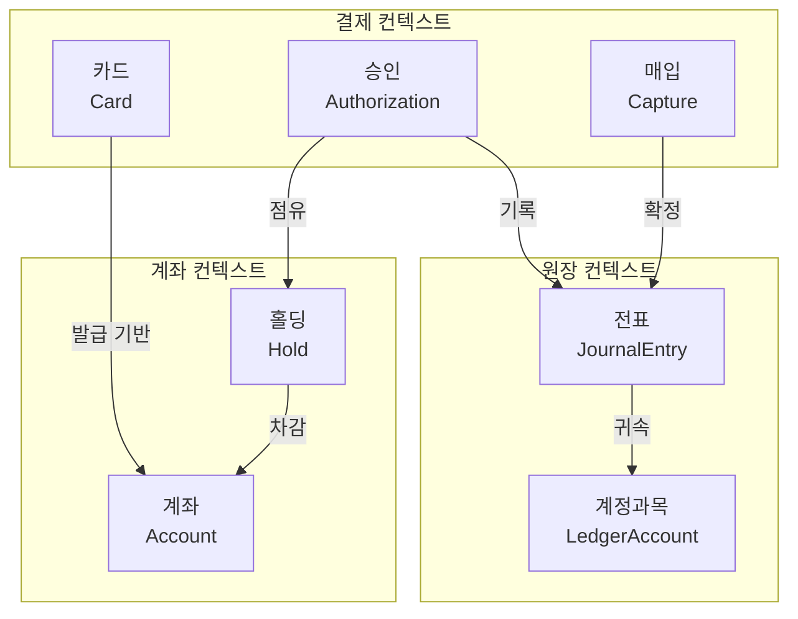
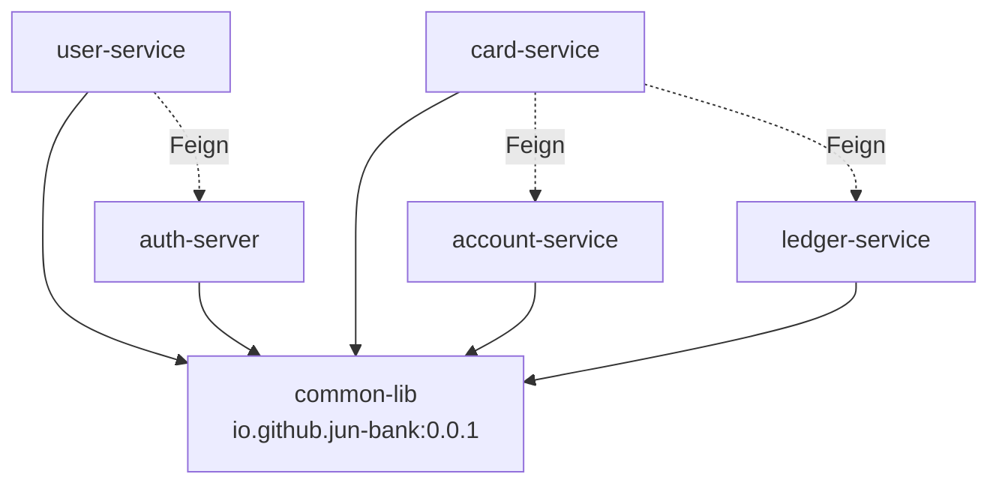
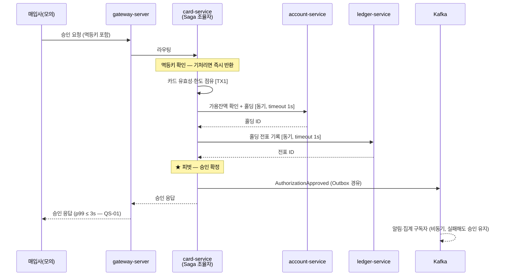
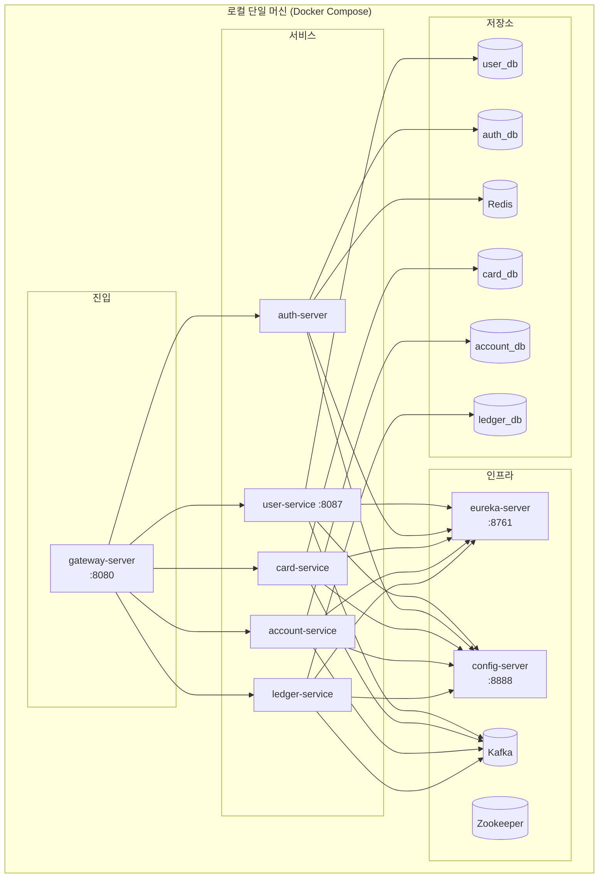

# 4+1 뷰 모델

> 추상화 레벨: ① 아키텍처 설계
> 출처: Philippe Kruchten, "Architectural Blueprints — The 4+1 View Model of Software Architecture" (1995)

---

## 개요

```
        ┌──────────────┐         ┌──────────────┐
        │   논리 뷰     │         │   개발 뷰     │
        │  (Logical)   │         │(Development) │
        │  기능·개념    │         │  코드 구조    │
        └──────┬───────┘         └──────┬───────┘
               │    ┌──────────────┐    │
               └───▶│  시나리오 뷰  │◀───┘
                    │  (Scenarios) │
                    │  = +1        │
               ┌───▶│  유스케이스   │◀───┐
               │    └──────────────┘    │
        ┌──────┴───────┐         ┌──────┴───────┐
        │  프로세스 뷰  │         │   물리 뷰     │
        │  (Process)   │         │ (Physical)   │
        │  런타임·동시성│         │  배포·인프라  │
        └──────────────┘         └──────────────┘
```

**"+1"이 시나리오 뷰**다. 나머지 네 뷰를 **연결하고 검증하는 역할**을 한다. 시나리오 하나를 골라 네 뷰를 관통시켜 보면, 뷰들이 서로 모순되는 지점이 드러난다.

---

## 1. 논리 뷰 (Logical View)

### 무엇을 그리는가

**시스템이 다루는 개념과 그들의 관계.** 기능 요구사항의 표현이다.

- 도메인 모델, 애그리게이트, 바운디드 컨텍스트
- 개념 간 관계 (연관, 포함, 의존)
- 주요 책임

### 누가 보는가

도메인을 이해하려는 사람. 기획자, 신규 합류 개발자.

### 표기법

클래스 다이어그램, 도메인 모델 다이어그램, 컨텍스트 맵

### jun-bank에서 그릴 것



> ⚠️ 위는 **예시 골격**이며 확정된 모델이 아니다. `domain/glossary.md`와 이벤트 스토밍 결과로 확정한다.

### 작성 시점

도메인 모델 확정 후. 용어사전(`domain/glossary.md`)이 먼저다.

---

## 2. 개발 뷰 (Development View)

### 무엇을 그리는가

**코드가 어떻게 조직되어 있는가.** 개발자가 "어디를 고쳐야 하나"에 답하는 뷰다.

- 저장소·모듈·패키지 구조
- 계층과 의존 방향
- 빌드 산출물, 라이브러리 의존

### 누가 보는가

코드를 수정하는 사람. 빌드·배포를 다루는 사람.

### jun-bank에서 그릴 것

**① 저장소 의존 관계**



**② 서비스 내부 패키지 구조 (헥사고날)**

```
com.jun_bank.<service>/
├── domain/<aggregate>/
│   ├── domain/          ← 인프라 의존 0
│   │   ├── model/           엔티티·값 객체
│   │   ├── event/           도메인 이벤트
│   │   └── exception/       도메인 예외
│   ├── application/
│   │   ├── port/in/         유스케이스 인터페이스
│   │   ├── port/out/        저장소·외부 인터페이스 (DIP)
│   │   ├── dto/             Command / Result
│   │   └── service/         오케스트레이션, 트랜잭션 경계
│   ├── infrastructure/  ← 위 port/out 을 구현
│   │   ├── persistence/     JPA 어댑터
│   │   ├── client/          Feign 어댑터
│   │   └── event/           Kafka 어댑터
│   └── presentation/
│       ├── api/             외부 공개 컨트롤러
│       └── internal/        서비스 간 내부 컨트롤러
└── global/                  공통 설정·보안·AOP
```

**의존 방향 규칙** (② 모듈 레벨):
```
presentation ──▶ application ──▶ domain
infrastructure ──▶ application(port) ──▶ domain
domain ──▶ (아무것도 의존하지 않음)
```

### 검증 방법

`domain/` 패키지의 import 문에 Spring·JPA가 하나도 없어야 한다. ArchUnit 같은 도구로 자동 검증 가능하다.

### 작성 시점

서비스 분할 재검토(ADR-0003) 후. 지금 그리면 곧 폐기된다.

---

## 3. 프로세스 뷰 (Process View)

### 무엇을 그리는가

**런타임에 무슨 일이 일어나는가.** 정적 구조가 아니라 **동작**이다.

- 프로세스·스레드, 동시성
- 서비스 간 호출 순서와 방향
- 동기/비동기 구분
- 타임아웃, 재시도, 락

### 누가 보는가

장애를 조사하는 사람. 성능을 개선하는 사람.

### jun-bank에서 그릴 것 — 결제 승인 (S3)



**이 뷰에서 반드시 표기할 것**:
- 동기/비동기 구분
- **타임아웃 값**
- 트랜잭션 경계 `[TX]`
- **피벗 지점**
- 보상 경로 (실패 시나리오는 별도 다이어그램)

### 작성 시점

트랜잭션 설계(`drafts/03-transaction-design.md`) 확정 후. **가장 먼저 그릴 뷰.**

---

## 4. 물리 뷰 (Physical View)

### 무엇을 그리는가

**소프트웨어가 하드웨어에 어떻게 배치되는가.** 배포 뷰라고도 한다.

- 노드(서버·컨테이너)와 그 위에 뜨는 것
- 네트워크 연결, 포트
- 데이터 저장소 위치
- 스케일 단위

### 누가 보는가

배포·운영하는 사람.

### jun-bank에서 그릴 것



> ⚠️ 위는 현재 저장소 구성으로 추정한 골격이다. `infrastructure` 저장소의 docker-compose 파일을 읽어 **실제와 대조한 뒤 확정**해야 한다.

**이 뷰가 답해야 할 질문**:
- 전부 띄우는 데 메모리가 얼마나 필요한가 (제약 TC-5, 품질 시나리오 QS-10)
- 무엇이 단일 장애점인가
- DB가 서비스별로 정말 분리되어 있는가 (ADR-0001의 전제)

### 작성 시점

`infrastructure` 저장소 확인 후 즉시 가능. **비교적 빨리 그릴 수 있는 뷰.**

---

## 5. 시나리오 뷰 (Scenarios) — "+1"

### 무엇을 그리는가

**중요한 유스케이스 몇 개**를 골라, 나머지 네 뷰를 관통시켜 본다.

### 왜 "+1"인가

이 뷰는 **독립적인 관점이 아니라 검증 장치**다. 시나리오 하나를 네 뷰에 통과시켜 보면:

- 논리 뷰에 없는 개념이 프로세스 뷰에 등장한다 → **모델 누락**
- 개발 뷰의 의존 방향과 프로세스 뷰의 호출 방향이 반대다 → **설계 모순**
- 물리 뷰에 없는 컴포넌트를 호출한다 → **배포 누락**

### 선정 기준

**아키텍처를 관통하는 소수**만 고른다. `architecture/02-drivers/README.md`의 "영향력 있는 기능 요구사항" 5개가 그대로 후보다.

| 우선순위 | 시나리오 | 관통하는 것 |
|---|---|---|
| **1** | **S3 결제 승인** | 인증·동시성·가용잔액·원장·외부연동·SLA |
| **2** | **S4 승인 타임아웃·망취소** | 멱등성·상태불명·보상 |
| 3 | S6 대사 | 배치·원장·이벤트 유실 탐지 |
| 4 | S7 취소·환불 | 원거래 참조·역분개 |
| 5 | S5 매입·정산 | 배치·대용량·부분 실패 |

### 작성 형식

각 시나리오마다:

```
## S3. 결제 승인

### 트리거
매입사로부터 승인 요청 전문 수신

### 사전 조건
- 카드가 발급되어 있고 유효하다
- 연결된 계좌의 가용잔액이 요청 금액 이상이다

### 정상 흐름
1. …

### 대안·예외 흐름
- 가용잔액 부족 → 거절 응답
- account-service 무응답 → 거절 (QS-04)
- 응답 유실 → 매입사가 망취소 (→ S4)

### 각 뷰에서의 확인
| 뷰 | 확인 결과 |
|---|---|
| 논리 | 등장하는 개념이 모두 도메인 모델에 있는가 |
| 개발 | 호출 방향이 의존 규칙을 위반하지 않는가 |
| 프로세스 | 타임아웃·트랜잭션 경계가 정의되어 있는가 |
| 물리 | 등장하는 컴포넌트가 모두 배포되어 있는가 |

### 관련 품질 시나리오
QS-01(응답시간), QS-02(동시성), QS-04(장애 시 안전 실패)
```

### 작성 시점

**가장 먼저.** 시나리오 뷰부터 그리면 나머지 뷰에 무엇이 필요한지가 드러난다.

---

## 요약 — 그리는 순서

```
① 시나리오 뷰 (S3 결제 승인)     ← 먼저. 무엇이 필요한지 드러난다
② 프로세스 뷰                    ← 트랜잭션·타임아웃이 붙는다
③ 물리 뷰                        ← infrastructure 저장소로 즉시 가능
④ 논리 뷰                        ← 도메인 모델 확정 후
⑤ 개발 뷰                        ← 서비스 분할 재검토(ADR-0003) 후
```

일반적으로는 논리 뷰부터 그리지만, **jun-bank는 이미 코드가 있고 도메인 모델이 재검토 대상**이므로 확정된 것부터 그리는 편이 낫다.
