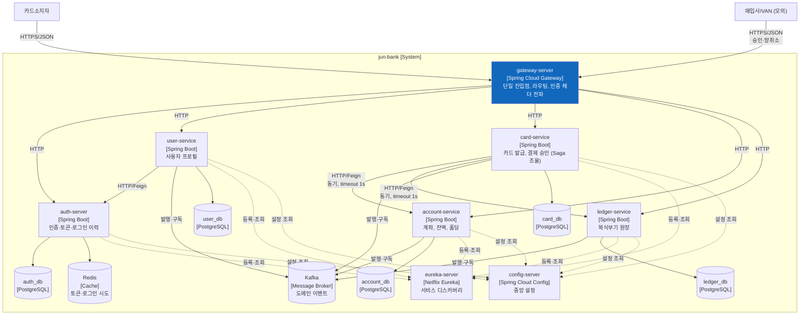
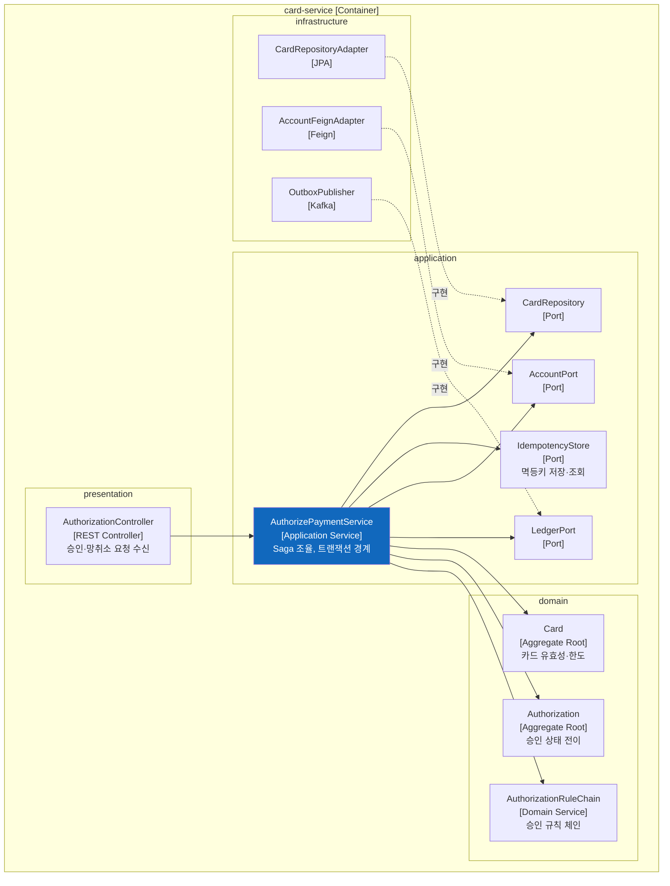

# C4 모델

> 추상화 레벨: ① 아키텍처 설계
> 출처: Simon Brown, C4 Model (https://c4model.com)

---

## 개요 — 지도의 배율

C4는 **줌 레벨**의 모델이다. 지도를 세계지도 → 국가 → 도시 → 거리 순으로 확대하듯, 소프트웨어를 네 단계로 확대해 그린다.

```
Level 1. Context     ┌──────────────────────────┐
                     │  시스템과 바깥 세계        │   누가 쓰고, 무엇과 연동하나
                     └────────────┬─────────────┘
Level 2. Container                ▼
                     ┌──────────────────────────┐
                     │  배포 가능한 단위들        │   무엇이 떠 있고 어떻게 통신하나
                     └────────────┬─────────────┘
Level 3. Component                ▼
                     ┌──────────────────────────┐
                     │  컨테이너 하나의 내부      │   어떤 책임 덩어리로 나뉘나
                     └────────────┬─────────────┘
Level 4. Code                     ▼
                     ┌──────────────────────────┐
                     │  클래스 수준              │   실제 타입과 관계
                     └──────────────────────────┘
```

**핵심 원칙**: 한 단계 내려갈 때마다 **하나의 요소만 골라 확대한다.** 모든 것을 다 확대하면 다시 뒤죽박죽이 된다.

---

## Level 1 — 시스템 컨텍스트 (Context)

### 무엇을 그리는가

**시스템 전체를 상자 하나**로 두고, 그 바깥의 **사람과 외부 시스템**만 그린다. 내부는 그리지 않는다.

### 답하는 질문

- 이 시스템을 **누가** 쓰는가?
- **무엇과** 연동하는가?
- 시스템의 **경계는 어디**인가?

### 누가 보는가

**비기술 이해관계자 포함 모두.** 가장 넓은 독자를 가진 다이어그램이다.

### jun-bank

```mermaid
graph TB
    Cardholder["카드소지자<br/>[Person]<br/>jun-bank 계좌·카드 보유 고객"]
    Operator["운영자<br/>[Person]<br/>대사 불일치·장애 처리"]

    JunBank["jun-bank<br/>[Software System]<br/>계좌·카드를 발급하고 결제를<br/>승인·정산·기록하는 리테일 은행"]

    Acquirer["매입사 / VAN<br/>[External System — 모의]<br/>가맹점 승인요청 중계,<br/>D+1 매입·정산 파일 송부"]

    Cardholder -->|계좌 조회, 이체,<br/>카드 관리| JunBank
    Operator -->|대사 결과 확인,<br/>실패 거래 처리| JunBank
    Acquirer -->|① 승인 요청 (실시간)<br/>② 망취소 전문| JunBank
    JunBank -->|승인/거절 응답| Acquirer
    Acquirer -->|③ 매입·정산 파일<br/>(D+1, 배치)| JunBank

    style JunBank fill:#1168bd,color:#fff
    style Acquirer fill:#999,color:#fff
```

**이 그림이 말하는 것**: jun-bank는 **발급사**다. 승인 요청을 **받는** 쪽이고, 정산 파일을 **받는** 쪽이다. 이 방향성이 아키텍처 전체를 결정한다 (제품 정의서 §2).

---

## Level 2 — 컨테이너 (Container)

### 무엇을 그리는가

시스템 안의 **독립 배포·실행 단위**. C4에서 "컨테이너"는 **Docker 컨테이너가 아니라** "실행되는 것"을 뜻한다 — 애플리케이션, 데이터베이스, 파일 시스템, 메시지 브로커 전부 포함이다.

### 답하는 질문

- 어떤 실행 단위가 있는가?
- 각각 무슨 기술로 만들어졌는가?
- 서로 **어떻게** 통신하는가? (프로토콜 명시)

### 누가 보는가

개발자, 운영자. **가장 자주 쓰이고 가장 유용한 레벨.**

### jun-bank



> ⚠️ 위는 **현재 저장소 구성으로 추정한 골격**이다. `transaction-service`·`transfer-service`는 서비스 분할 재검토(ADR-0003) 대상이라 의도적으로 뺐다. 확정 후 갱신한다.

**이 그림이 답해야 할 것**:
- **DB가 서비스별로 정말 분리되어 있는가** → ADR-0001의 전제
- 동기 호출 경로에 **타임아웃이 표기되어 있는가**
- 이벤트 발행이 **Outbox를 거치는가** (현재 그림에는 미표기 — 추가 필요)

---

## Level 3 — 컴포넌트 (Component)

### 무엇을 그리는가

**컨테이너 하나를 골라** 그 안의 주요 책임 덩어리를 그린다. 여기서 "컴포넌트"는 배포 단위가 아니라 **논리적 묶음**이다.

### 답하는 질문

- 이 서비스 안에 어떤 책임들이 있는가?
- 그들이 어떻게 협력하는가?

### 누가 보는가

이 서비스를 개발하는 사람.

### jun-bank — card-service 예시



**의존 방향에 주목**: `infrastructure`에서 `application`의 포트로 **점선 화살표가 올라간다.** 이게 DIP가 지켜지고 있다는 표시다 (study/01의 D).

### 작성 시점

**모든 서비스에 대해 그리지 않는다.** 복잡하거나 중요한 것만 — jun-bank에서는 `card-service`(결제 승인)와 `ledger-service`(원장) 정도.

---

## Level 4 — 코드 (Code)

### 무엇을 그리는가

클래스 다이어그램, ER 다이어그램 수준.

### 그려야 하는가

**대부분의 경우 그리지 않는다.** Simon Brown 본인도 "코드 레벨 다이어그램은 대개 필요 없다"고 말한다. 이유:

- **금방 낡는다** — 코드는 매일 바뀌는데 그림은 안 바뀐다
- **IDE가 더 잘 보여준다** — 클래스 다이어그램은 자동 생성이 가능하다
- 유지 비용이 가치를 넘는다

### 예외적으로 그릴 만한 경우

- **복잡한 상태 머신** — 결제 상태 전이 (승인→매입→정산, 각종 취소)
- **복식부기 원장 구조** — 전표·분개·계정과목의 관계
- 이해가 어려운 핵심 알고리즘

> jun-bank에서는 위 두 가지 정도만 그린다. 나머지는 코드가 문서다.

---

## 4+1 뷰와의 대응

| C4 레벨 | 대응하는 4+1 뷰 |
|---|---|
| Context | 시나리오 뷰(외부 관점), 물리 뷰(경계) |
| **Container** | **물리 뷰 + 개발 뷰 + 프로세스 뷰**가 합쳐짐 |
| Component | 개발 뷰, 논리 뷰 |
| Code | 논리 뷰 |

**Container 레벨이 여러 뷰를 겸한다**는 것이 C4의 실용성이자 한계다. 편하지만, "배포 구조"와 "코드 구조"와 "런타임 흐름"이 한 그림에 섞이면 복잡해진다. 그래서 **런타임 순서는 별도로 시퀀스 다이어그램(4+1 프로세스 뷰)으로 그린다.**

---

## 표기 규칙

1. **모든 요소에 세 가지를 쓴다**: 이름 / [유형] / 한 줄 설명
   ```
   card-service
   [Spring Boot]
   카드 발급, 결제 승인 (Saga 조율)
   ```
2. **모든 화살표에 라벨을 단다**: 무엇을 위해, 어떤 프로토콜로
   ```
   ──HTTP/Feign, 동기, timeout 1s──▶
   ```
3. **범례를 넣는다**: 사람 / 시스템 / 컨테이너 / 외부 시스템의 색 구분
4. **한 다이어그램에 한 레벨만** 그린다

---

## 현재 상태와 다음 작업

| 레벨 | 상태 | 다음 |
|---|---|---|
| Context | **초안 있음** (위) | 제품 정의서 §2 확정 후 확정 |
| Container | **초안 있음** (위) | `infrastructure` 저장소 대조 + 서비스 분할(ADR-0003) 후 확정 |
| Component | 예시만 | `card-service` 설계 확정 후 |
| Code | — | 결제 상태 머신, 원장 구조만 |

> **가장 먼저 할 일**: `infrastructure` 저장소의 docker-compose를 읽어 Container 다이어그램을 **실제와 대조**하는 것. 지금 것은 추정이다.
