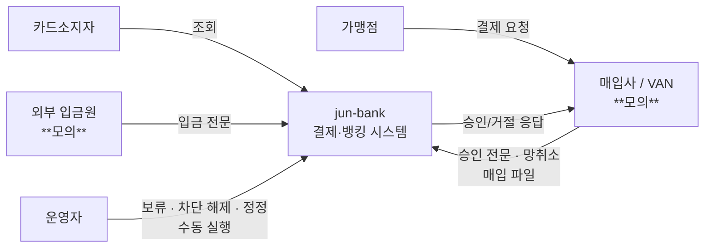

# 컨텍스트 뷰

- 작성일: 2026-08-05
- 독자: 전원 · 이해관계자
- 답하는 질문: **이 시스템은 누구와 무엇을 주고받나** · 무엇이 우리 책임 밖인가
- 답하지 않는 질문: 내부 구조(→ 컨테이너 뷰) · 데이터 소유(→ 데이터 뷰) · 순서(→ 런타임 뷰)

---

## 1. 그림

## 2. 요소

| 요소 | 무엇인가 | 우리 책임인가 |
|---|---|---|
| **카드소지자** | 계좌·카드 보유자 | 액터 |
| **가맹점** | 결제 발생 지점 | ❌ 우리와 직접 통신하지 않는다 |
| **매입사/VAN** | 승인 중계 · 매입/정산 파일 | ❌ **모의**(Phase 1) — 지연·타임아웃·중복·순서 역전을 **의도적으로 주입** |
| **외부 입금원** | 타행 이체 | ❌ **모의** |
| **운영자** | 보류·차단 해제·정정·수동 실행 | 액터. ⚠️ **권한 단계가 미정**(`study/09` G-2) |
| **jun-bank** | 승인·매입·환불·미수·정산·원장·대사 | ✅ |

## 3. 관계

| 출발 | 도착 | 무엇을 | 동기/비동기 | 실패하면 |
|---|---|---|---|---|
| VAN | 우리 | 승인 전문 | **동기** | 우리가 3초 초과 → 매입사 타임아웃 → **망취소 수신**(BR-13·22) |
| 우리 | VAN | 승인/거절 응답 | 동기 | 응답 유실 → 매입사가 성공 여부 모름 → 망취소 |
| VAN | 우리 | 매입 파일 | **비동기(파일)** | 파일 미도착 → **M1 미매입** 적재 · 레코드 이상 → **격리**(BR-50) |
| 외부 입금원 | 우리 | 입금 전문 | 동기 | 중복 배달 → `DepositReceipt` 멱등이 흡수 |
| 운영자 | 우리 | 관리 조작 | 동기 | — |

> ★ **모의 외부가 이상을 의도적으로 주입한다**(Phase 1 제품 정의). 그것이 **이 프로젝트의 시험 장치**다.

## 4. 이 뷰에서 읽어야 할 결정

| ADR | 어디에 드러나나 |
|---|---|
| **ADR-013** | 매입사와의 타임아웃 계층(25초 > 3초) |
| **ADR-005** | 외부와의 경계는 전부 이 뷰 안 — Outbox는 **내부** 경계다 |

## 변경 이력

| 버전 | 일자 | 내용 |
|---|---|---|
| v0.1 | 2026-08-05 | 최초 작성 |
