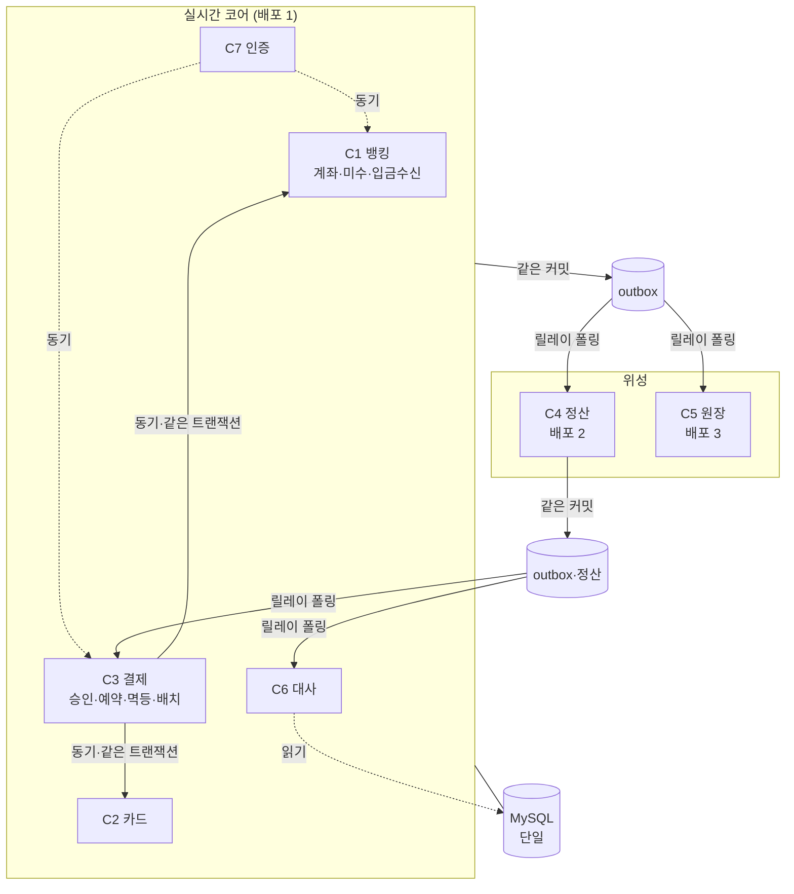

# 컨테이너 뷰

- 작성일: 2026-08-05
- 독자: 개발자 · 운영
- 답하는 질문: **배포 단위가 몇 개이고 어떻게 통신하나** · 무엇이 같은 트랜잭션인가
- 답하지 않는 질문: 모듈 내부(→ ADR-002) · 데이터 소유(→ 데이터 뷰) · 순서(→ 런타임 뷰)

---

## 1. 그림



## 2. 요소

| 배포 단위 | 담는 컨텍스트 | 왜 여기인가 |
|---|---|---|
| **실시간 코어** | C1 · C2 · C3 · **C6** · C7 | E1~E5가 **한 트랜잭션**을 요구(ADR-010) · **대사는 진짜 값을 봐야 한다** · C7은 R4가 동기 |
| **정산** | C4 | 집계를 받는다. 되돌아갈 것이 `settledBusinessDate` 하나 |
| **원장** | C5 | append-only 수신. 되돌아갈 것이 없다 |

> ★ **분할선은 "무엇이 나가는가"가 아니라 "무엇이 돌아와야 하는가"가 정했다**(DC-004).

## 3. 관계

| 출발 | 도착 | 무엇을 | 동기/비동기 | 실패하면 |
|---|---|---|---|---|
| C3 | C1 · C2 | 잔액·홀딩·한도 조작 | ★ **동기 · 같은 트랜잭션** | 롤백 — 부분 반영 없음 |
| 코어 | outbox | 이벤트 | **같은 커밋** | 사실도 같이 롤백 — **유실 불가**(ADR-005) |
| 릴레이 | C4 · C5 | 이벤트 전달 | **비동기 폴링** | 재시도 → 상한 초과 시 **DLQ + M17**(ADR-014) |
| C4 | **정산 outbox** | 이벤트 | ★ **같은 커밋** | 사실도 같이 롤백 — **유실 불가** |
| 릴레이 | C3 (R11) | `SettlementCompleted` | 비동기 폴링 | 재시도 → **DLQ + M17** |
| 릴레이 | C6 (R12) | `SettlementFailed` | 비동기 폴링 | 재시도 → **DLQ + M17** |
| C6 | DB | 대사 읽기 | ★ **같은 DB 직접 읽기** | — (사본이 아니다) |

## 4. 트랜잭션 경계가 어디까지인가 ★

```
E1 승인    C3 + C1 + C2   ← 코어 안. 한 커밋
E2 매입    C3 + C1 + C2   ← 코어 안
E3 회수    C1             ← 코어 안
E4 환불    C3 + C1        ← 코어 안
E5 정정    C1             ← 코어 안

원장 기표 · 정산 집계  ← ★ 경계 밖. Outbox 경유(BR-40)
```

> ★ **E1~E5가 전부 코어 안이다.** 배포 단위를 넘는 트랜잭션이 **없다**.

## 5. 자원 격리 (ADR-013)

| 풀 | 용도 |
|---|---|
| 자금 경로 | E1~E5 |
| 조회 전용 | 조회 API |
| **배치** | 대사·정산·만료 — **작게** |

**총 커넥션 = 인스턴스 수 × 풀 합계 < `max_connections`** (T-9)

## 6. 이 뷰에서 읽어야 할 결정

| ADR | |
|---|---|
| **ADR-010** | 배포 3개 · 분할 기준 |
| **ADR-005·014** | Outbox · 릴레이 운영 |
| **ADR-013** | 풀 격리 |
| **ADR-002** | 코어 내부 모듈 구조 |

## 변경 이력

| 버전 | 일자 | 내용 |
|---|---|---|
| v0.1 | 2026-08-05 | 최초 작성 — ADR-010(배포 3) 반영 |
