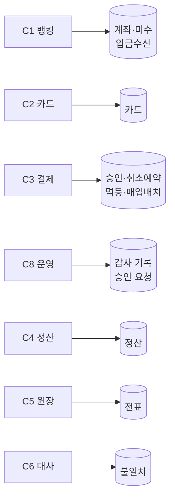
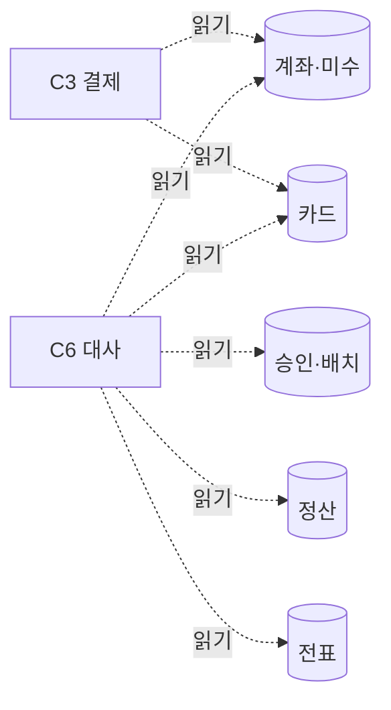

# 데이터 뷰

- 작성일: 2026-08-05
- 독자: 개발자 · DBA
- 답하는 질문: **누가 무엇을 소유하나** · ★ **누가 무엇을 읽나** · 어디에 저장되나
- 답하지 않는 질문: 스키마 상세(→ Phase 4) · 순서(→ 런타임 뷰)

> ★ **읽기 화살표를 따로 그린다.** 화살표가 *말하는 방향*만 보여주면 **읽기 의존이 안 보이고**,
> 나누는 순간 그것이 결함이 된다 — **DC-004의 교훈**이다.

---

## 1. 소유 (쓰기)

**소유자는 하나씩이다.** 다른 컨텍스트는 **쓰지 않는다.**

> ★ **용어 주의 (ADR-018 §4)**: 이 절의 *"소유자"* 는 **컨텍스트**(누가 쓰나)다. ADR-018의 *"소유 축"*(`ownerId` — **어느 고객의 것인가**)과는 **다른 개념**이다 — 같은 단어가 두 층에서 쓰인다.

## 2. ★ 읽기 — 여기가 분할을 정한다

| 읽는 쪽 | 읽는 것 | 왜 | 프로세스를 넘나 |
|---|---|---|---|
| **C3** | 계좌·카드 | 가용잔액·한도 판단 | ❌ 코어 안 |
| ★ **C6 대사** | **다섯 컨텍스트 전부** | M9~M17 계산 (★ M18은 대사가 아니라 **C8이 적재** — R16) | ⚠️ **프로세스는 안 넘지만 배포 소유는 넘는다** — 아래 |
| ★ **C1 · C3** | **승인 요청 (C8)** | BR-56 ①~③ 실행 결합 — R14 동기 호출(확인+소비, 같은 트랜잭션) | ❌ 코어 안. ★ ④·⑤(C4·C5)는 읽지 않는다 — **지시 이벤트 수신**(R15)이라 이 표의 대상이 아니다 |

> ⚠️ **정확히 하면**: C6 **프로세스**는 코어 안이지만, 읽는 것 중 **정산·전표는 배포 2·3의 소유 데이터**다.
> 지금은 단일 MySQL이라 직접 읽지만, **저장소가 실제로 분리되면 C6는 프로세스 경계를 넘게 된다.**
> 그때 필요한 것이 **읽기 전용 접근이거나 복제**인데 — ★ **복제는 ADR-007 W-4가 금지**한다(대사가 사본을 보면 안 된다).
> **저장소 분리는 이 제약을 먼저 푼 뒤에만 가능하다.**

> ★ **C6의 읽기가 ADR-004를 무너뜨린 것이다.** *"읽기 전용"* 은 **쓰기를 안 한다**는 뜻이지
> **읽을 수 있다**는 보장이 아니다. 같은 프로세스일 때는 자명해서 아무도 묻지 않았다.

## 3. 저장 위치

| 저장소 | 무엇 | 배포 단위 |
|---|---|---|
| **MySQL (코어)** | 계좌·미수·입금수신·카드·승인·예약·멱등·배치·불일치 · **outbox** | 코어 |
| **MySQL (정산)** | 정산 · ★ **outbox(역방향)** | 정산 |
| **MySQL (원장)** | 전표 (**append-only**) | 원장 |

> ⚠️ **C-04(예산 0)로 실행은 단일 인스턴스**다. **설계상 분리**돼 있고 실행이 합쳐져 있는 것이다(`constraints.md` §1.2).
>
> ★ **2026-08-06 — 그 "설계상 분리"의 형태가 정해졌다**: **한 MySQL 클러스터 + 배포별 스키마·계정**(**ADR-022**).
> 분리의 목적은 ★ **소유권 강제**(§1의 *"다른 컨텍스트는 쓰지 않는다"* 를 DB 권한으로)이고,
> ⚠️ **물리 인스턴스 분리는 하지 않는다** — 하려면 §2가 적어 둔 조건(**R9가 진짜 값을 얻는 다른 수단**)을
> **먼저** 풀어야 한다(ADR-022 DT-7). 순서를 뒤집으면 T4다.

## 4. ③ 의식적 예외 — 저장을 택한 합계 필드

| 필드 | 소유 | 등식 우변의 정본 | 탐지 |
|---|---|---|---|
| `Account.holdTotal` | C1 | 승인 `heldAmount` | **M9** |
| `Card.usage` | C2 | 승인 `limitContribution` (+`limitBasisDate`) | **M10** |
| `Account.dailyUsage` | C1 | 〃 | **M11** |
| `Settlement.captureTotal`·`refundTotal` | C4 | 승인 `capturedAmount`·`refundedTotal` (+`settledBusinessDate`) | **M15** |

> ★ **넷 다 "우변이 다른 컨텍스트"다.** 그래서 대사가 **양쪽을 다 읽어야** 하고,
> 그것이 §2의 읽기 화살표가 굵은 이유다.

## 5. 파티션 축

**계좌ID**(ADR-009 K-1·K-2). ⚠️ **축은 셋이다** — 매입 배치는 **파일 내 레코드 순번 범위**, 릴레이는 **계좌ID 해시 + 0번**. 표는 **ADR-008 §2**가 정본.

| 경계 | 계좌 파티션에서 닫히나 |
|---|---|
| E1 · E3 · E5 | ✅ |
| **E2 · E4** | ❌ **`CaptureBatch`가 파일 단위** — 미해결(ADR-009 §4) |

## 6. 이 뷰에서 읽어야 할 결정

| ADR | |
|---|---|
| **ADR-010** | C6를 코어에 둔 이유 = §2 |
| **ADR-009** | 파티션 축 |
| **ADR-003** | 상태 저장 + 원장 append-only |
| **ADR-011 · DC-005** | `AccountDailyMovement` 영업일별 이동 행 |

## 변경 이력

| 버전 | 일자 | 내용 |
|---|---|---|
| v0.3 | 2026-08-06 | ★ **§3에 ADR-022 연결** — *"설계상 분리"* 의 형태가 **한 클러스터 + 배포별 스키마·계정**으로 정해졌고 **목적은 소유권 강제**임을 명시. ⚠️ §2가 적어 둔 *"저장소 분리는 복제 금지 제약을 먼저 푼 뒤에만"* 조건이 **ADR-022 DT-7로 명문화**됐다 — 물리 분리는 그 순서 뒤다 |
| v0.2 | 2026-08-05 | **멀티테넌시 리뷰 루프 1 (L-09)** — C8 소유(감사 기록·승인 요청) · 읽기 표에 R14 행 · ★ **"소유자(컨텍스트)" ↔ "소유 축(고객)" 용어 충돌 주석**(ADR-018 §4의 약속 이행) |
| v0.1 | 2026-08-05 | 최초 작성 — ★ **읽기 화살표를 별도 절**로 (DC-004 교훈) |
