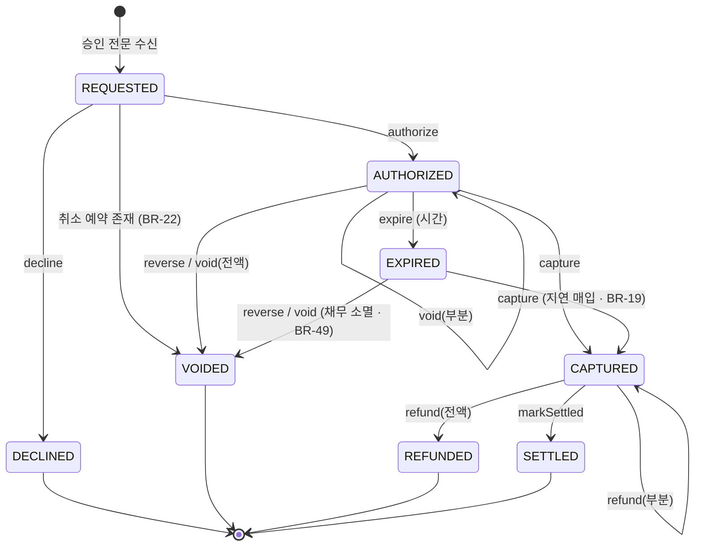

# 상태 머신: 승인

- 작성일: 2026-08-03
- 상태: 검토대기
- 대상 애그리게이트: `Authorization`
- 양식: `study/project-workflow/phase2/05-state-machine-format.md`
- 입력: `domain/aggregates/authorization.md` · `product/01-business-rules.md`

> **이 문서의 핵심은 §4 금지된 전이다.** 허용 전이는 구현하면서 자연히 드러나지만, 금지는 명시하지 않으면 아무도 막지 않는다.

---

## 1. 상태 목록

| 상태 | 코드명 | 뜻 | 종료 | 진입 조건 |
|---|---|---|---|---|
| 요청됨 | `REQUESTED` | 검증 중. **트랜잭션 안에서만 존재**하며 외부에 노출되지 않는다 | ✕ | 승인 전문 수신 |
| **성립** | `AUTHORIZED` | 승인번호 발번, 홀딩 점유 | ✕ | B3~B5 검증 전부 통과 (BR-15·05·04) |
| 거절됨 | `DECLINED` | 검증 실패 | **✓** | B3~B5 중 하나 실패 |
| **만료** | `EXPIRED` | 기한 내 미매입. **홀딩만 풀렸고 채무는 남는다** — 단 취소가 오면 소멸한다 (BR-49) | ✕ ⚠️ | 홀딩 기한 도래 (BR-03) |
| **매입됨** | `CAPTURED` | 확정 거래로 전환. 고객 계좌에서 출금됨 | ✕ | 매입 레코드 반영 (BR-16) |
| **무효** | `VOIDED` | 망취소 또는 전액 승인취소 | **✓** | BR-13·BR-22·BR-26 |
| 환불됨 | `REFUNDED` | 매입 후 전액 취소 | **✓** | BR-26 |
| 정산완료 | `SETTLED` | 영업일 순액에 반영 확정 | **✓** ⚠️ | 정산 완료 (BR-21) |

### 반직관적인 두 가지 ⚠️

**① 만료는 종료 상태가 아니다.**
`EXPIRED → CAPTURED`(지연 매입, BR-19)와 `EXPIRED → VOIDED`(만료 후 취소, BR-49)가 **둘 다** 허용된다. 홀딩 만료는 **자금 점유의 해제**일 뿐 결말이 아니다.

> **만료된 승인의 결말은 먼저 도착한 쪽이 정한다** (충돌 C9).
> 매입이 먼저 → 반영하고 `CAPTURED`. 뒤늦은 취소는 `refund()`로 강등.
> 취소가 먼저 → 채무 소멸하고 `VOIDED`. 뒤늦은 매입은 격리(**M8** — F12).

**② `SETTLED`는 종료 상태이고, 이후 환불이 와도 이 승인은 바뀌지 않는다.**
환불은 **별도 차감 거래**로 다음 영업일 정산에 반영된다(BR-43). 원거래를 되돌리면 마감된 영업일의 순액이 움직인다(BR-47과 같은 논리).

---

## 2. 전이도

---

## 3. 전이 표 ★

| # | 현재 상태 | 전이(조작) | 다음 상태 | 조건 | 부수 효과 | 근거 |
|---|---|---|---|---|---|---|
| T1 | `REQUESTED` | `authorize` | `AUTHORIZED` | 카드·한도·가용잔액 전부 통과 · **취소 예약 없음** | 홀딩 생성 · 승인번호 발번 · 한도 사용액 증가 | BR-04·05·15·17 |
| T2 | `REQUESTED` | `decline` | `DECLINED` | 검증 중 하나라도 실패 | **거절 사유 기록** | BR-15·36 |
| T3 | `REQUESTED` | `authorize` | `VOIDED` | **취소 예약(tombstone) 존재** | **홀딩을 만들지 않는다** · 예약 소진 | BR-22 |
| T4 | `AUTHORIZED` | `reverse` | `VOIDED` | — | 홀딩 해제 · 한도 사용액 복원 | BR-13·24 |
| T5 | `AUTHORIZED` | `void`(전액) | `VOIDED` | `취소액 = 승인액 − 누적취소액` | 홀딩 해제 · 한도 복원 · **역분개 없음** | BR-26 |
| T6 | `AUTHORIZED` | `void`(부분) | `AUTHORIZED` | INV-1 (`누적취소액 ≤ 승인액`) | 홀딩 부분 해제 · 한도 부분 복원 | BR-11·24·26 |
| T7 | `AUTHORIZED` | `expire` | `EXPIRED` | 기한 도래 **AND `frozen = false`** | 홀딩 해제 · 한도 복원. **채무 존속** | BR-03·24·28 |
| T8 | `AUTHORIZED` | `capture` | `CAPTURED` | `매입액 ≤ 승인액 − 누적취소액` (INV-3) | 출금 또는 **미수 적재** · 홀딩 **전액** 해제 · 전표 기표 | BR-16·18·20 |
| T9 | `EXPIRED` | `capture` | `CAPTURED` | 〃 | 〃. **한도 사용액은 복원된 채로 둔다** | BR-19·24 |
| T10 | `CAPTURED` | `refund`(전액) | `REFUNDED` | INV-1 | **역분개** · 자금 반환 · 한도 복원 **없음** | BR-24·26 |
| T11 | `CAPTURED` | `refund`(부분) | `CAPTURED` | INV-1 | 〃 | BR-11·26 |
| T12 | `CAPTURED` | `markSettled` | `SETTLED` | 정산 순액 산출 완료 | — | BR-21 |
| T13 | `EXPIRED` | `reverse` · `void`(전액) | `VOIDED` | — | **채무 소멸**. 홀딩·한도는 만료 시 이미 복원됐으므로 **재복원하지 않는다** | BR-49 |
| T14 | 종료 아닌 모든 상태 | `freeze` / `unfreeze` | **상태 불변** | 운영자 조작 | 자동 처리(만료·정산)·**매입 반영**에서 제외 | BR-28·50 |

> **T13의 함정은 이중 복원이다.** `AUTHORIZED`에서 취소하면 한도를 복원하지만(T4·T5), `EXPIRED`에서는 만료(T7)가 이미 복원해 놨다. 같은 `reverse()` 코드가 두 상태에서 다르게 동작해야 한다 — **복원은 상태 전이의 부수 효과가 아니라 `holdingFunds`가 참일 때만 일어나는 일**로 구현해야 안전하다.

> **T7과 T9를 함께 본다.** 만료 시 한도 사용액을 복원(T7)해 놓고 지연 매입(T9)에서 다시 차감하지 않는다. 차감하면 **이미 지나간 날의 한도를 오늘 소급 차감**하게 된다. 대신 그 금액은 **출금 또는 미수**로 실제 자금에서 회수된다 — 한도는 승인 통제 장치이지 채권 장부가 아니다.

---

## 4. 금지된 전이 ★★

> **거절 방식이 두 가지다.** 실시간 전문은 **응답 코드로 거절**하고, 매입 파일 레코드는 **격리 + 불일치 적재**한다(BR-09·27·32). 파일은 거절할 상대가 접속해 있지 않으므로 응답이라는 개념이 없다.

### 4.1 실시간 전문에 대한 금지 — 응답 코드로 거절

| # | 현재 상태 | 시도 | 왜 금지인가 | 위반 시 | 응답 |
|---|---|---|---|---|---|
| **F1** | `CAPTURED` | `reverse` | 망취소는 **승인 응답 유실**에 대한 조치다. 매입이 이미 확정된 건에는 성립하지 않는다 | 확정 거래가 무효화되어 매입사에는 매입, 우리에겐 무효 — **영구 불일치** | `AUTH_ALREADY_CAPTURED` |
| **F2** | `SETTLED` | `reverse` · `void` | 순액이 확정·지급됐다 | 마감된 영업일의 순액이 사후에 움직인다 (BR-47과 같은 위반) | `AUTH_ALREADY_SETTLED` |
| **F3** | `VOIDED` | `void` | 이미 무효 | 취소액이 이중 계상 | `AUTH_ALREADY_VOIDED` |
| **F4** | `REFUNDED` | `reverse` · `void` | 전액 환불로 잔여 채권이 0 | 없는 금액을 다시 되돌린다 | `AUTH_ALREADY_REFUNDED` |
| **F5** | `DECLINED` | `reverse` · `void` | 승인이 성립하지 않았다 — 되돌릴 홀딩도 채무도 없다 | 한도·홀딩이 **음수 방향으로 복원**된다 | `AUTH_NOT_AUTHORIZED` |
| **F6** | `CAPTURED` | `void` | 매입 후 취소는 **환불**이다 (BR-26) | 역분개 없이 취소가 처리되어 **원장과 계좌가 어긋난다** | 금지가 아니라 **`refund`로 강등** — §4.3 |
| **F7** | `AUTHORIZED` · `EXPIRED` | `refund` | 매입 전에는 반환할 자금이 없다 | 출금하지 않은 돈을 반환 — **잔액이 부풀어 오른다** | 금지가 아니라 **`void`로 강등** — §4.3 |
| **F8** | 모든 상태 | `authorize` | 승인은 **새 애그리게이트 생성**이다. 기존 건에 다시 성립할 수 없다 | 한 상관 식별자에 승인이 둘 | `DUPLICATE_AUTHORIZATION` (실제로는 멱등 레코드가 선차단 — BR-02) |
| **F9** | 종료 상태 (`DECLINED`·`VOIDED`·`REFUNDED`·`SETTLED`) | `freeze` | 조사할 진행 중 처리가 없다 | 운영자 목록에 죽은 건이 쌓인다 | `AUTH_TERMINAL` |

### 4.2 매입 파일 레코드에 대한 금지 — 격리 + 불일치 적재

| # | 현재 상태 | 시도 | 왜 금지인가 | 위반 시 | 처리 |
|---|---|---|---|---|---|
| **F10** | `CAPTURED` | `capture` | 매입은 1회만 (INV-2) | **이중 출금** | 격리 → **M7 후속 매입** (BR-32) |
| **F11** | `SETTLED` | `capture` | 〃. 게다가 순액이 확정됐다 | 이중 출금 + 마감일 순액 변동 | 격리 → **M7** |
| **F12** | `VOIDED` | `capture` | 무효화된 승인에는 채무가 없다. **만료 후 취소로 무효화된 경우도 같다** (BR-49) | 취소한 거래에서 **다시 출금** | 격리 → **M8 무효 승인 매입** (BR-51) |
| **F13** | `DECLINED` | `capture` | 승인하지 않은 거래 | 거절해 놓고 출금 — 최악의 고객 피해 | 격리 → **M8** (BR-51) |
| **F14** | `REFUNDED` | `capture` | 전액 환불된 건 | 반환한 돈을 다시 출금 | 격리 → **M8** (BR-51) |
| **F15** | `CAPTURED` | `capture` (**금액 초과**) | `매입액 > 승인액 − 누적취소액` (INV-3) | 승인하지 않은 금액을 출금 | 격리 → **M4 금액 초과 매입** |
| **F16** | `SETTLED` | `refund` | 원거래를 되돌리지 않는다 (BR-43) | 마감된 영업일 순액 변동 | **금지가 아니라 별도 차감 거래** — 다음 영업일 정산에 반영 |
| **F17** | **`frozen = true`인 모든 상태** | `capture` | 조사 중 출금은 되돌리기 어렵다 (BR-50) | 부정거래 조사 중 자금 유출 | 격리 → **불일치 아님.** 보류 해제 후 재처리 |

> **F13이 가장 위험하다.** 우리가 거절한 거래에서 출금이 일어나면 고객은 승인한 적 없는 돈을 잃는다. 그런데 이건 **우리 코드 버그가 아니라 매입사가 잘못 보낸 파일**로 발생한다 — 그래서 **격리가 자동 방어선**이어야 한다.
>
> **F17만 불일치를 만들지 않는다.** 나머지 격리는 전부 "무언가 어긋났다"는 신호지만, 보류 격리는 **우리가 의도한 지연**이다. 불일치로 적재하면 운영자가 자기가 만든 보류를 자기가 조사하게 된다. 대신 이 건은 대사에서 **M1(미매입)으로도 잡지 않는다** (BR-50) — 안 그러면 보류가 매일 새 불일치를 만든다.

### 4.3 금지가 아니라 강등되는 것 (BR-26)

| 도착한 요청 | 원거래 상태 | 실제 실행 | 왜 |
|---|---|---|---|
| 취소 | 미매입 (`AUTHORIZED`·`EXPIRED`) | `void()` | 확정 거래가 없으니 역분개도 없다 |
| 취소 | 매입됨 (`CAPTURED`) | **`refund()` 로 강등** | 이미 출금됐으므로 역분개가 필요하다 |
| 환불 레코드 | 미매입 (`AUTHORIZED`·`EXPIRED`) | **`void()` 로 강등** | 반환할 자금이 없다. 누적 취소액을 넘으면 격리(M5) |

> **강등은 애플리케이션 계층에서 일어난다.** 애그리게이트는 `void()`와 `refund()`를 각각 자기 사전조건으로만 판단한다. 분기 판단을 애그리게이트에 넣으면 "취소"라는 하나의 조작이 두 개의 다른 부수 효과를 갖게 되어, **어느 쪽이 실행됐는지 호출부가 모르게 된다.**

---

## 5. 전이 매트릭스

| 기호 | 뜻 |
|---|---|
| **O** | 허용 |
| **◎** | **멱등 무시** — 오류가 아니라 no-op. 최초 결과를 반환한다 |
| **X** | 금지 — §4에 등재 |
| **▲** | 다른 조작으로 **강등** (§4.3) |
| **-** | 도달 불가 — 이 상태에 그 메시지가 올 수 없다 |

| 현재 \ 조작 | `authorize` | `decline` | `reverse` | `void` | `expire` | `capture` | `refund` | `markSettled` | `freeze` |
|---|---|---|---|---|---|---|---|---|---|
| **`REQUESTED`** | O | O | - | - | - | - | - | - | - |
| **`AUTHORIZED`** | X (F8) | X | **O** (T4) | **O** (T5·T6) | **O** (T7) | **O** (T8) | ▲ (F7) | X | O |
| **`EXPIRED`** | X (F8) | X | **O** (T13) | **O** (T13) | ◎ | **O** (T9) | ▲ (F7) | X | O |
| **`CAPTURED`** | X (F8) | X | X (F1) | ▲ (F6) | X | X (F10·F15) | **O** (T10·T11) | **O** (T12) | O |
| **`DECLINED`** | X (F8) | ◎ | X (F5) | X (F5) | - | X (F13) | X | X | X (F9) |
| **`VOIDED`** | X (F8) | X | ◎ | X (F3) | - | X (F12) | X | X | X (F9) |
| **`REFUNDED`** | X (F8) | X | X (F4) | X (F4) | - | X (F14) | X | X | X (F9) |
| **`SETTLED`** | X (F8) | X | X (F2) | X (F2) | - | X (F11) | ▲ (F16) | ◎ | X (F9) |

> ⚠️ **이 표는 `frozen = false`를 전제한다.** 보류는 상태가 아니라 **모든 상태에 겹쳐지는 플래그**이며, 참이면 `expire`(BR-28)와 `capture`(BR-50)가 **상태와 무관하게** 막힌다. 보류를 상태로 넣으면 8개 상태가 16개로 늘어나 표가 두 배가 된다 — 실제로는 **두 칸에만 영향을 주는 직교 축**이다.

### 매트릭스를 읽는 법

- **`O` 14 · `X` 39 · `◎` 4 · `▲` 4 · `-` 11 = 72칸.** 금지가 허용의 **2.8배**인 것이 정상이다 — 결제 도메인은 "무엇을 못 하는가"가 안전을 만든다.
- **`◎`(멱등)는 4곳뿐이다.** 중복 망취소(BR-13) · 만료 배치 재실행 · 정산 배치 재실행 · 거절 재수신. 이 넷은 **외부가 같은 메시지를 두 번 보내는 것이 정상**인 경로다.
- **`-`는 `REQUESTED` 행과 종료 상태의 `expire` 열에 몰려 있다.** `REQUESTED`는 트랜잭션 안에서만 존재해 외부 메시지가 도달할 수 없고, 만료 배치는 `AUTHORIZED`만 조회한다.
- **`EXPIRED` 행에 `O`가 4개다.** 종료가 아닌 상태 중 가장 활발하다 — 만료된 승인은 **아직 결말이 정해지지 않은 상태**이기 때문이다.

---

## 6. 동시성

| 상황 | 처리 | 근거 |
|---|---|---|
| **같은 상관 식별자로 중복 승인 요청** | 멱등 레코드가 선차단 — 승인 애그리게이트에 도달하지 않고 **최초 결과를 반환** | BR-02 |
| **망취소 중복 수신** | `reverse()` 멱등 (매트릭스 `VOIDED` 행 ◎) | BR-13 |
| **망취소 선도착** | 취소 예약(tombstone)이 T1을 막고 T3으로 보낸다 | BR-22 |
| **취소와 매입 동시 도착** | **매입 선행 확정**, 취소를 `refund()`로 강등 | BR-26 · 충돌 C5 |
| **만료 배치와 매입의 경합** | 둘 다 `holdingFunds = false`로 수렴 — 순서 무관. 만료가 먼저면 T9(지연 매입), 매입이 먼저면 만료 대상에서 빠진다 | BR-19 |
| **만료된 승인에 취소와 매입이 모두 도착** | **먼저 도착한 쪽이 결말을 정한다** (충돌 C9). 취소 먼저 → `VOIDED`, 이후 매입은 M5 격리(F17). 매입 먼저 → `CAPTURED`, 이후 취소는 `refund()` 강등 | BR-19·49 |
| **보류 전환과 매입 반영의 경합** | 매입 트랜잭션이 `frozen`을 **읽은 뒤 커밋 전에** 보류가 걸리면 매입이 나간다. **보류 전환이 승인 애그리게이트의 락을 잡으므로** 둘 중 하나만 성공한다 — 매입이 이겼다면 운영자에게 "이미 매입됨"을 알린다 | BR-50 |
| **같은 매입 레코드 재처리** | `(파일ID, 레코드ID)` 멱등 — 애그리게이트에 도달하지 않는다 | BR-23 |
| **전이 중 프로세스 종료** | 승인 성립(T1)은 계좌·카드·승인·멱등이 **한 트랜잭션**이므로 전부 커밋되거나 전부 롤백된다. 매입(T8)은 **레코드 단위 커밋**이라 중단 지점부터 재개 | 애그리게이트 README · BR-23 |

> **경합의 승자를 미리 정해 두는 것이 핵심이다.** "매입이 이긴다"(BR-26)가 없으면 구현자가 그때그때 다르게 처리하고, 그 버그는 재현되지 않는다.

---

## 7. 시간 기반 전이

| 현재 상태 | 조건 | 다음 상태 | 누가 실행 | 주기 |
|---|---|---|---|---|
| `AUTHORIZED` | 홀딩 기한 도래 **AND `frozen = false`** | `EXPIRED` | 만료 처리 배치 | 미확정 — BR-03 |
| `CAPTURED` | 영업일 정산 완료 | `SETTLED` | 정산 배치 | 마감 후 1회 (BR-06) |

### 시간 전이에서 빠뜨리기 쉬운 것

| 항목 | 처리 |
|---|---|
| **보류 중인 건** | 만료 대상에서 **제외**한다. 조사 중 자동 해제는 자금 손실 위험 (BR-28 · 충돌 C1) |
| **만료된 건의 채무** | **소멸하지 않는다.** `EXPIRED`는 홀딩만 푼 상태이며 지연 매입(T9)이 온다 (BR-19) |
| **만료 배치가 며칠 밀린 경우** | 홀딩이 계속 잡혀 **가용잔액이 부당하게 낮게 유지된다.** 배치 지연 자체가 고객 피해이므로 감시 대상 |
| **보류 격리의 상한** | 격리는 무기한일 수 없다. **BR-28의 보류 최대 기간이 이 격리의 상한**이며, 넘기면 매입사와의 대사가 계속 어긋난 채 남는다 (BR-50) |
| 정산 배치 실패 | `CAPTURED`에 머문다. 재시도는 멱등 (정산 애그리게이트 BR-37) |

---

## 8. 의문

### 닫힌 의문

#### ~~AU3~~ 만료 상태에 취소가 도착하면 → **무효화하고 채무도 소멸** (BR-49 · T13)

| 선택지 | 내용 | 결과 |
|---|---|---|
| **(a)** | **무효화한다 — 채무도 소멸** | ✅ **채택** |
| (b) | 거절한다 — 이미 만료됨 | ❌ 기각 |
| (c) | 망취소는 받고 승인취소는 거절 | ❌ 기각 |

**(a)를 채택한 이유**

**취소는 "이 거래를 없던 것으로 한다"는 매입사의 확정 의사표시**이며, 우리 쪽 홀딩이 풀렸는지와 무관하다. BR-19가 말한 것은 *"만료라는 사실만으로는 채무가 소멸하지 않는다"* 이지 *"채무는 절대 소멸하지 않는다"* 가 아니다. **만료와 취소는 다른 사건이고, 취소가 더 강한 신호다.**

**(b)를 기각한 이유 — 대사가 영원히 어긋난다**

거절하면 매입사는 취소했다고 알고 우리는 채무가 남는다. 그 승인은 매입이 영영 오지 않으므로 **매일 M1(미매입)으로 잡히고, 아무도 고칠 수 없다.** 운영자가 손으로 정리하기 전까지 불일치 목록에 남는다 — BR-48의 재발견 추적이 그 노이즈를 매일 세게 된다.

**(c)를 기각한 이유 — 구분의 실익이 없다**

*망취소 = 응답 유실에 대한 강제 조치 / 승인취소 = 상태 확인 후 의도적 취소* 라는 성격 차이는 실재한다. 하지만 **만료 시점에서 둘의 결과가 같아야 할 이유가 더 크다** — 어느 쪽이든 매입사는 이 거래를 정산 대상에서 뺐다. 여기서 갈라 놓으면 매입사와 우리의 채권 목록이 조작 종류에 따라 달라진다.

**남는 함정: 이중 복원** (T13 주석)
`AUTHORIZED`에서 취소하면 한도를 복원하지만, `EXPIRED`에서는 만료가 이미 복원해 놨다. **복원을 상태 전이의 부수 효과로 짜면 두 번 복원된다.** `holdingFunds`가 참일 때만 복원하도록 구현해야 한다.

---

#### ~~AU4~~ 보류 중인 승인에 매입이 도착하면 → **격리하고 해제 후 재처리** (BR-50 · F18)

| 선택지 | 내용 | 결과 |
|---|---|---|
| (a) | 반영한다 — 보류는 만료·정산만 막는다 | ❌ 기각 |
| **(b)** | **격리한다 — 보류 해제 후 재처리** | ✅ **채택** |
| (c) | 상태만 `CAPTURED`로 넘기고 출금·기표는 보류 | ❌ 기각 |

**(b)를 채택한 이유**

**조사 중에 나간 출금은 되돌리기 어렵다.** 부정거래 조사라면 출금 자체가 피해이며, 나중에 환불하더라도 그 사이 고객 잔액이 비어 **다른 정상 결제가 거절된다.** BR-28이 만료·미수 상계를 막은 것과 같은 이유이고, 매입은 그중 **자금이 실제로 움직이는 유일한 경로**라 오히려 더 막아야 한다.

**(a)를 기각한 이유 — 보류의 목적이 사라진다**

보류는 "조사 중이니 이 건을 건드리지 마라"는 뜻이다. 자금이 나가는 조작만 예외로 두면 **가장 되돌리기 어려운 것만 통과**시키는 셈이다.

**(c)를 기각한 이유 — 계좌와 원장이 의도적으로 어긋난다**

상태는 `CAPTURED`인데 출금·기표가 안 된 구간이 생긴다. 그러면 **BR-41 내부 대사(계좌잔액 ↔ 원장 계정 잔액)가 그 기간 동안 정상적으로 어긋나고**, 대사에 "이건 예외"라는 조건을 넣어야 한다. 대사에 예외를 넣는 순간 대사가 잡아야 할 진짜 불일치도 함께 놓친다.

**부수 결정 두 가지**
- 보류 격리는 **불일치를 만들지 않는다.** 우리가 의도한 지연이므로 운영자가 자기 보류를 자기가 조사하게 된다.
- 이 건은 대사에서 **M1(미매입)으로도 잡지 않는다.** 안 그러면 보류가 매일 새 불일치를 만든다.

---

#### ~~AU5~~ 무효 승인에 대한 매입의 불일치 유형 → **M8 신설** (BR-51)

| 선택지 | 내용 | 결과 |
|---|---|---|
| **(a)** | **M8 신설 — 무효 승인 매입** | ✅ **채택** |
| (b) | 기존 M2(미승인 매입)로 흡수 | ❌ 기각 |
| (c) | 상태별로 M2(거절)·M5(취소)에 배분 | ❌ 기각 |

**(a)를 채택한 이유 — 원인과 조치가 다르다**

| | M2 미승인 매입 | **M8 무효 승인 매입** |
|---|---|---|
| 상황 | 승인 레코드를 **못 찾음** | 찾았는데 `DECLINED`·`VOIDED`·`REFUNDED` |
| 의심 원인 | 매입사 오발송 · 우리 쪽 유실 | **매입사가 우리 거절·취소 응답을 못 받음** |
| 조치 | 매입사에 원거래 조회 요청 | **해당 전문 로그 대조** |

M8은 **확인 가능한 원인**이 있다. 우리가 거절·취소 응답을 보냈고 매입사가 그걸 못 받았다면, 로그에 흔적이 남아 있다.

**(b)를 기각한 이유** — 한 유형으로 뭉치면 운영자가 매번 승인 상태를 다시 조회해 원인을 나눠야 한다. **분류가 조치를 좁히지 못하면 분류가 아니다.**

**(c)를 기각한 이유** — M5(취소 불일치)는 *"취소 레코드가 원거래와 안 맞는다"* 로, **취소 레코드가 주어**다. 여기서는 **매입 레코드가 주어**다. 주어가 다른 것을 같은 유형에 넣으면 유형의 정의가 흐려진다.

### 열린 의문

| # | 의문 | 영향 |
|---|---|---|
| **AU6** | 보류 격리 매입의 **재처리 방식** — 운영자가 건별 지시하는가, 보류 해제 시 자동 재투입되는가 | Phase 4 계약 · 미확정 수치 (BR-50) |
| **AU7** | `REQUESTED`를 상태로 **영속화할 것인가.** 현재는 트랜잭션 안에서만 존재하는 것으로 뒀는데, 그러면 승인 처리 중 프로세스가 죽었을 때 **아무 흔적도 남지 않는다** — 멱등 레코드가 그 역할을 하는지 Phase 3에서 확인 필요 | Phase 3 트랜잭션 설계 |

---

## 변경 이력

| 버전 | 일자 | 내용 |
|---|---|---|
| v0.2 | 2026-08-03 | **AU3·AU4·AU5 확정** — 만료 후 취소는 채무 소멸(T13·BR-49) · 보류 중 매입은 격리(F18·BR-50) · 무효 승인 매입은 M8로 분리(BR-51). 전이 14종 · 금지 17종. 보류를 상태가 아닌 **직교 플래그**로 명시. 열린 의문 AU6·AU7 |
| v0.1 | 2026-08-03 | 최초 작성 — 상태 8종, 허용 전이 13종, 금지 16종, 매트릭스 8×9. 거절 방식을 실시간(응답 코드) / 파일(격리+불일치)로 분리. 강등(BR-26)을 금지와 구분. 미해결 AU3~AU5 |
