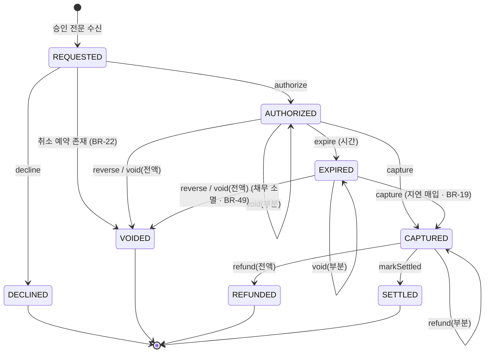

# 상태 머신: 승인

- 작성일: 2026-08-03
- 상태: 검토대기
- 대상 애그리게이트: `Authorization`
- 양식: `study/project-workflow/phase2/05-state-machine-format.md`
- 입력: `domain/aggregates/authorization.md` · `product/01-business-rules.md`

> **이 문서의 핵심은 §4 금지된 전이다.** 허용 전이는 구현하면서 자연히 드러나지만, 금지는 명시하지 않으면 아무도 막지 않는다.

---

## 1. 상태 목록

| 상태 | 코드명 | 뜻 | 종료 | 진입 조건 |
|---|---|---|---|---|
| 요청됨 | `REQUESTED` | 검증 중. **트랜잭션 안에서만 존재**하며 외부에 노출되지 않는다 | ✕ | 승인 전문 수신 |
| **성립** | `AUTHORIZED` | 승인번호 발번, 홀딩 점유 | ✕ | B3~B5 검증 전부 통과 (BR-15·05·04) |
| 거절됨 | `DECLINED` | 검증 실패 | **✓** | B3~B5 중 하나 실패 |
| **만료** | `EXPIRED` | 기한 내 미매입. **홀딩만 풀렸고 채무는 남는다** — 단 취소가 오면 소멸한다 (BR-49) | ✕ ⚠️ | 홀딩 기한 도래 (BR-03) |
| **매입됨** | `CAPTURED` | 확정 거래로 전환. 고객 계좌에서 출금됨 | ✕ | 매입 레코드 반영 (BR-16) |
| **무효** | `VOIDED` | 망취소 또는 전액 승인취소 | **✓** | BR-13·BR-22·BR-26 |
| 환불됨 | `REFUNDED` | 매입 후 전액 취소 | **✓** | BR-26 |
| 정산완료 | `SETTLED` | 영업일 순액에 반영 확정 | **✓** ⚠️ | 정산 완료 (BR-21) |

### 반직관적인 두 가지 ⚠️

**① 만료는 종료 상태가 아니다.**
`EXPIRED → CAPTURED`(지연 매입, BR-19)와 `EXPIRED → VOIDED`(만료 후 취소, BR-49)가 **둘 다** 허용된다. 홀딩 만료는 **자금 점유의 해제**일 뿐 결말이 아니다.

> **만료된 승인의 결말은 먼저 도착한 쪽이 정한다** (충돌 C9).
> 매입이 먼저 → 반영하고 `CAPTURED`. 뒤늦은 취소는 `refund()`로 강등.
> 취소가 먼저 → 채무 소멸하고 `VOIDED`. 뒤늦은 매입은 격리(**M8** — F12).

**② `SETTLED`는 종료 상태이고, 이후 환불이 와도 이 승인은 바뀌지 않는다.**
환불은 **별도 차감 거래**로 다음 영업일 정산에 반영된다(BR-43). 원거래를 되돌리면 마감된 영업일의 순액이 움직인다(BR-47과 같은 논리).

---

## 2. 전이도

---

## 3. 전이 표 ★

| # | 현재 상태 | 전이(조작) | 다음 상태 | 조건 | 부수 효과 | 근거 |
|---|---|---|---|---|---|---|
| T1 | `REQUESTED` | `authorize` | `AUTHORIZED` | 카드·한도·가용잔액 전부 통과 · **유효한 취소 예약 없음**(존재 AND 미만료 — 예약 §0) | 홀딩 생성 · 승인번호 발번 · **카드 한도 + 계좌 한도** 사용액 증가 (BR-44 — 두 층 모두) | BR-04·05·15·17 |
| T2 | `REQUESTED` | `decline` | `DECLINED` | 검증 중 하나라도 실패 | **거절 사유 기록** | BR-15·36 |
| T3 | `REQUESTED` | **`createVoidedByTombstone`** | `VOIDED` | **유효한 취소 예약 존재**(예약 §0) | **홀딩을 만들지 않고 한도도 쓰지 않는다** · 예약 소비 | BR-22 |
| T4 | `AUTHORIZED` | `reverse` | `VOIDED` | — | 홀딩 해제 · **카드·계좌 한도** 복원 | BR-13·24·44 |
| T5 | `AUTHORIZED` | `void`(전액) | `VOIDED` | `취소액 = 승인액 − 누적취소액` | 홀딩 해제 · **카드·계좌 한도** 복원 · **역분개 없음** | BR-26·44 |
| T6 | `AUTHORIZED` | `void`(부분) | `AUTHORIZED` | INV-1 (`누적취소액 ≤ 승인액`) | 홀딩 부분 해제 · **카드·계좌 한도** 부분 복원 | BR-11·24·26·44 |
| T7 | `AUTHORIZED` | `expire` | `EXPIRED` | 기한 도래 **AND `frozen = false`** | 홀딩 해제 · **카드·계좌 한도** 복원. **채무 존속** | BR-03·24·28·44 |
| T8 | `AUTHORIZED` | `capture` | `CAPTURED` | `매입액 ≤ 승인액 − 누적취소액` (INV-3) | 출금 또는 **미수 적재** · 홀딩 **전액** 해제 · 전표 기표 | BR-16·18·20 |
| T9 | `EXPIRED` | `capture` | `CAPTURED` | 〃 | 출금 또는 미수 적재 · **홀딩 해제 없음**(만료가 이미 풀었다 — `holdingFunds = false`) · 전표 기표 · **한도도 복원된 채로 둔다** | BR-19·24 |
| T10 | `CAPTURED` | `refund`(전액) | `REFUNDED` | **INV-7** 이고 결과가 `refundedTotal = withdrawnAmount` | **역분개** · `refundedTotal` 증가 · **자기 미수 소멸 후** 자금 반환(계좌 `refund()` 순서 — BR-34·43 ①) · 한도 복원 **없음** | BR-24·26·**43 ①** |
| T11 | `CAPTURED` | `refund`(부분) | `CAPTURED` | INV-1 · **INV-7** | 〃 | BR-11·26·**43 ①** |
| T12 | `CAPTURED` | `markSettled` | `SETTLED` | 정산 순액 산출 완료 | — | BR-21 |
| T13 | `EXPIRED` | `reverse` · `void`(전액) | `VOIDED` | — | **채무 소멸**. 홀딩·**두 층 한도** 모두 만료 시 이미 복원됐으므로 **재복원하지 않는다** | BR-49 |
| **T15** | `EXPIRED` | `void`(**부분**) | `EXPIRED` | INV-1 | `cancelledAmount`만 증가. **홀딩·한도 재복원 없음**(`holdingFunds = false`가 판정) | BR-11·26·49 |
| T14 | `REQUESTED` 외 모든 상태 | `freeze`(종료 아닐 때) / `unfreeze`(**종료 포함 전부**) | **상태 불변** | 운영자 조작 | **자동 만료**(BR-28)·**매입 반영**(BR-50)에서 제외. **정산은 막지 않는다** | BR-28·50 |

> ⚠️ **부수 효과 열에 `〃`(동일)를 쓰지 않는다.** 이 문서에서 `〃`가 **세 라운드 연속으로 결함을 만들었다** — T9가 T8의 홀딩 전액 해제를 복사했고(1차 치명), T11이 T10의 미수 소멸을 복사했다(3차). 앞 행과 정말 같아 보여도 **한 조건이 다르면 부수 효과도 다르다.**

> ★ **T9·T13이 공유하는 함정: 이미 풀린 것을 또 푼다.**
> 만료(T7)가 홀딩과 두 층 한도를 **이미** 복원해 놨는데, 지연 매입(T9)과 만료 후 취소(T13)가 그것을 모르고 다시 해제·복원하면 어떻게 되는가.
>
> | 대상 | 이중 처리 시 |
> |---|---|
> | **홀딩** | 계좌는 홀딩을 **합계(`holdTotal`)로만** 든다. 다시 빼면 `heldAmount ≤ holdTotal` 사전조건이 **다른 승인의 점유 덕분에 통과**하고 그 승인들의 점유가 깎인다 → 가용잔액 부풀림 → **초과 승인** (BR-04 위반) |
> | **한도** | 그날 한도가 실제보다 커진다 → 한도 초과 승인 |
>
> **해제·복원을 상태 전이의 부수 효과로 짜면 반드시 두 번 일어난다.** `holdingFunds = true`일 때만 실행되는 일로 구현해야 한다 — 둘 다 같은 플래그가 판정한다.

> **T7과 T9를 함께 본다.** 만료 시 한도 사용액을 복원(T7)해 놓고 지연 매입(T9)에서 다시 차감하지 않는다. 차감하면 **이미 지나간 날의 한도를 오늘 소급 차감**하게 된다. 대신 그 금액은 **출금 또는 미수**로 실제 자금에서 회수된다 — 한도는 승인 통제 장치이지 채권 장부가 아니다.

---

## 4. 금지된 전이 ★★

> **거절 방식이 두 가지다.** 실시간 전문은 **응답 코드로 거절**하고, 매입 파일 레코드는 **격리 + 불일치 적재**한다(BR-09·27·32·51). 파일은 거절할 상대가 접속해 있지 않으므로 응답이라는 개념이 없다.

### 4.1 실시간 전문에 대한 금지 — 응답 코드로 거절

| # | 현재 상태 | 시도 | 왜 금지인가 | 위반 시 | 응답 |
|---|---|---|---|---|---|
| **F1** | `CAPTURED` | `reverse` | 망취소는 **승인 응답 유실**에 대한 조치다. 매입이 이미 확정된 건에는 성립하지 않는다 | 확정 거래가 무효화되어 매입사에는 매입, 우리에겐 무효 — **영구 불일치** | `AUTH_ALREADY_CAPTURED` |
| **F2** | `SETTLED` | `reverse` · `void` | 순액이 확정·지급됐다 | 마감된 영업일의 순액이 사후에 움직인다 (BR-47과 같은 위반) | `AUTH_ALREADY_SETTLED` |
| **F3** | `VOIDED` | `void` | 이미 무효 | 취소액이 이중 계상 | `AUTH_ALREADY_VOIDED` |
| **F4** | `REFUNDED` | `reverse` · `void` | 전액 환불로 잔여 채권이 0 | 없는 금액을 다시 되돌린다 | `AUTH_ALREADY_REFUNDED` |
| **F5** | `DECLINED` | `void` | 승인이 성립하지 않았다 — 되돌릴 금액이 없다 | 한도·홀딩이 **음수 방향으로 복원**된다 | `AUTH_NOT_AUTHORIZED` |
| **F6** | `CAPTURED` | `void` | 매입 후 취소는 **환불**이다 (BR-26) | 역분개 없이 취소가 처리되어 **원장과 계좌가 어긋난다** | 금지가 아니라 **`refund`로 강등** — §4.3 |
| **F7** | `AUTHORIZED` · `EXPIRED` | `refund` | 매입 전에는 반환할 자금이 없다 | 출금하지 않은 돈을 반환 — **잔액이 부풀어 오른다** | 금지가 아니라 **`void`로 강등** — §4.3 |
| **F8** | **`REQUESTED` 외 모든 상태** | `authorize` · `createVoidedByTombstone` | 둘 다 **새 애그리게이트 생성** 조작이다. 기존 건에 다시 적용할 수 없다 | 한 상관 식별자에 승인이 둘 | `DUPLICATE_AUTHORIZATION` (실제로는 멱등 레코드가 선차단 — BR-02) |
| **F9** | 종료 상태 (`DECLINED`·`VOIDED`·`REFUNDED`·`SETTLED`) | `freeze` | 조사할 진행 중 처리가 없다 | 운영자 목록에 죽은 건이 쌓인다 | `AUTH_TERMINAL` |
| **F19** | `REQUESTED`·`DECLINED` 외 모든 상태 | `decline` | 거절은 **검증 단계의 결론**이다. 성립한 뒤에는 거절이 아니라 취소다 (`DECLINED`에서의 재수신은 ◎) | 성립한 승인이 거절로 뒤집혀 매입사와 상태가 갈린다 | `AUTH_ALREADY_DECIDED` |
| **F20** | `AUTHORIZED` · `EXPIRED` · `DECLINED` · `VOIDED` · `REFUNDED` | `markSettled` | 정산은 **매입된 건만** 대상이다 (BR-21 — 순액 = 매입 − 취소). `SETTLED`에서의 재호출은 ◎ | 매입되지 않은 금액이 순액에 들어가 **매입사에 과다 지급** | `AUTH_NOT_CAPTURED` |
| **F22** | `DECLINED` · `VOIDED` · `REFUNDED` | `refund` | 매입된 적이 없거나 이미 전액 환불됐다 | 반환할 자금이 없는데 잔액이 늘어난다 | `AUTH_NOT_CAPTURED` |
| **F21** | `CAPTURED` · `VOIDED` · `REFUNDED` · `SETTLED` | `expire` | 홀딩이 이미 없다 | 없는 홀딩을 해제해 **다른 승인의 점유가 깎인다** (T9 함정과 같은 기전) | `AUTH_NO_HOLDING` |

> ⚠️ **F9와 `unfreeze`는 비대칭이다.** `freeze`는 종료 상태에서 금지지만 **`unfreeze`는 종료 상태를 포함해 허용**한다(`REQUESTED` 제외 — 운영자가 손댈 수 없다). 보류 중인 `AUTHORIZED` 건에 망취소가 오면 `reverse`는 막히지 않으므로(보류는 `expire`·`capture`만 막는다) **`frozen = true`인 채로 종료 상태에 도달**한다. 이때 해제 경로가 없으면 F9가 막으려던 상황이 **뒷문으로 그대로 발생**한다.

### 4.2 매입 파일 레코드에 대한 금지 — 격리 + 불일치 적재

| # | 현재 상태 | 시도 | 왜 금지인가 | 위반 시 | 처리 |
|---|---|---|---|---|---|
| **F10** | `CAPTURED` | `capture` | 매입은 1회만 (INV-2). **금액과 무관하다** (BR-32) | **이중 출금** | 격리 → **M7 후속 매입** |
| **F11** | `SETTLED` | `capture` | 〃. 게다가 순액이 확정됐다 | 이중 출금 + 마감일 순액 변동 | 격리 → **M7** |
| **F12** | `VOIDED` | `capture` | 무효화된 승인에는 채무가 없다. **무효가 된 경로는 구분하지 않는다** — 망취소·승인취소·만료 후 취소(BR-49) 전부 같다 | 취소한 거래에서 **다시 출금** | 격리 → **M8 무효 승인 매입** (BR-51) |
| **F13** | `DECLINED` | `capture` | 승인하지 않은 거래 | 거절해 놓고 출금 — 최악의 고객 피해 | 격리 → **M8** (BR-51) |
| **F14** | `REFUNDED` | `capture` | 전액 환불된 건 | 반환한 돈을 다시 출금 | 격리 → **M8** (BR-51) |
| **F15** | **`AUTHORIZED` · `EXPIRED`** | `capture` (**금액 초과**) | `매입액 > 승인액 − 누적취소액` (INV-3) | **승인하지 않은 금액을 출금** | 격리 → **M4 금액 초과 매입** (BR-16 ③) |
| **F16** | `SETTLED` | `refund` | 원거래를 되돌리지 않는다 (BR-43 ②) | 마감된 영업일 순액 변동 | **금지가 아니라 차감 거래로 처리** — §4.3 |
| **F17** | **`frozen = true`인 모든 상태** | `capture` | 조사 중 출금은 되돌리기 어렵다 (BR-50) | 부정거래 조사 중 자금 유출 | 격리 → **불일치 아님.** 보류 해제 후 별도 재처리 배치가 반영하고 **격리 → 처리로 승격**(`promoteIsolated`) |
| **F18** | `CAPTURED` | `refund` (**상한 초과**) | `환불 누계 > withdrawnAmount` (INV-7 · BR-43 ①). **상한은 매입 시 확정된 불변값이다** — 환불로 커지지 않는다 (INV-8) | ★ **받지 않은 미수분까지 반환**된다. 게다가 미수는 계좌에 남아 이후 입금을 상계(BR-34)해 **같은 금액을 두 번 회수** | 격리 → **M5 취소 불일치** |

> **F13이 가장 위험하다.** 우리가 거절한 거래에서 출금이 일어나면 고객은 승인한 적 없는 돈을 잃는다. 그런데 이건 **우리 코드 버그가 아니라 매입사가 잘못 보낸 파일**로 발생한다 — 그래서 **격리가 자동 방어선**이어야 한다.
>
> **F18은 상태가 아니라 금액이 만드는 금지다.** 상태는 `CAPTURED`로 정상이고 INV-1(누적취소액 ≤ 승인액)도 통과한다. **잔액 부족으로 미수가 생겼다는 사실**만이 이 금지를 발동시키며, 그래서 승인이 `withdrawnAmount`를 보유해야 한다. ★ **상한을 `매입액 − 현재 미수`로 계산하면 환불이 상한을 키운다** — 나눠 환불해 실제 출금액을 넘길 수 있다(INV-8).
>
> **F17만 불일치를 만들지 않는다.** 나머지 격리는 전부 "무언가 어긋났다"는 신호지만, 보류 격리는 **우리가 의도한 지연**이다. 대신 이 건은 대사에서 **M1(미매입)으로도 잡지 않는다** (BR-50).
>
> **격리는 곧 불일치 적재다.** `isolate()`가 그 자리에서 `Discrepancy.recordOrTouch()`를 부른다(보류 격리 제외). 대사를 기다리면 정산이 지연·실패했을 때(BR-42) **격리가 통째로 묻힌다.**

### 4.3 금지가 아니라 다른 처리로 가는 것

| 도착한 요청 | 원거래 상태 | 실제 실행 | 왜 |
|---|---|---|---|
| 취소 | 미매입 (`AUTHORIZED`·`EXPIRED`) | `void()` | 확정 거래가 없으니 역분개도 없다 (BR-26) |
| 취소 | 매입됨 (`CAPTURED`) | **`refund()` 로 강등** | 이미 출금됐으므로 역분개가 필요하다 (BR-26) |
| 환불 레코드 | 미매입 (`AUTHORIZED`·`EXPIRED`) | **`void()` 로 강등** | 반환할 자금이 없다. 누적 취소액을 넘으면 격리(M5) |
| **환불 레코드** | **`SETTLED`** | ★ **원거래 불변 + 차감 거래로 처리** | 원거래를 되돌리면 마감된 순액이 움직인다(BR-43 ② · SF1). **매입 파일의 취소 레코드**(BR-33)로 접수되어 그날 `refundTotal`에 집계되고, **다음 영업일 순액에서 차감**된다 |

> **강등은 애플리케이션 계층에서 일어난다.** 애그리게이트는 `void()`와 `refund()`를 각각 자기 사전조건으로만 판단한다. 분기 판단을 애그리게이트에 넣으면 "취소"라는 하나의 조작이 두 개의 다른 부수 효과를 갖게 되어, **어느 쪽이 실행됐는지 호출부가 모르게 된다.**
>
> **마지막 행이 이 표에서 유일하게 승인을 건드리지 않는 경로다.** 그래서 `SETTLED`가 종료 상태로 성립한다 — 자금은 **다른 거래**를 통해 흐른다.

---

## 5. 전이 매트릭스

| 기호 | 뜻 |
|---|---|
| **O** | 허용 |
| **◎** | **멱등 무시** — 오류가 아니라 no-op. 최초 결과를 반환한다 |
| **X** | 금지 — §4에 등재 |
| **▲** | 다른 조작·거래로 **전환** (§4.3) |
| **-** | 도달 불가 — 이 상태에 그 메시지가 올 수 없다 |
| **O/X** | **조건부** — 같은 조작이 조건에 따라 갈린다 |

| 현재 \ 조작 | `authorize` | `createVoidedByTombstone` | `decline` | `reverse` | `void` | `expire` | `capture` | `refund` | `markSettled` | `freeze` | `unfreeze` |
|---|---|---|---|---|---|---|---|---|---|---|---|
| **`REQUESTED`** | O (T1) | **O** (T3) | O (T2) | - | - | - | - | - | - | - | - |
| **`AUTHORIZED`** | X (F8) | X (F8) | X (F19) | **O** (T4) | **O** (T5·T6) | **O** (T7) | **O/X** (T8 / F15) | ▲ (F7) | X (F20) | O (T14) | O (T14) |
| **`EXPIRED`** | X (F8) | X (F8) | X (F19) | **O** (T13) | **O** (T13·T15) | ◎ | **O/X** (T9 / F15) | ▲ (F7) | X (F20) | O (T14) | O (T14) |
| **`CAPTURED`** | X (F8) | X (F8) | X (F19) | X (F1) | ▲ (F6) | X (F21) | X (F10) | **O/X** (T10·T11 / F18) | **O** (T12) | O (T14) | O (T14) |
| **`DECLINED`** | X (F8) | X (F8) | ◎ | **◎** | X (F5) | - | X (F13) | X (F22) | X (F20) | X (F9) | O (T14) |
| **`VOIDED`** | X (F8) | X (F8) | X (F19) | ◎ | X (F3) | X (F21) | X (F12) | X (F22) | X (F20) | X (F9) | O (T14) |
| **`REFUNDED`** | X (F8) | X (F8) | X (F19) | X (F4) | X (F4) | X (F21) | X (F14) | X (F22) | X (F20) | X (F9) | O (T14) |
| **`SETTLED`** | X (F8) | X (F8) | X (F19) | X (F2) | X (F2) | X (F21) | X (F11) | ▲ (F16) | ◎ | X (F9) | O (T14) |

> ⚠️ **이 표는 `frozen = false`를 전제한다.** 보류는 상태가 아니라 **모든 상태에 겹쳐지는 플래그**이며, 참이면 `expire`(BR-28)와 `capture`(BR-50)가 **상태와 무관하게** 막힌다(F17). 보류를 상태로 넣으면 8개 상태가 16개로 늘어나 표가 두 배가 된다 — 실제로는 **두 칸에만 영향을 주는 직교 축**이다.
>
> **`markSettled`는 보류가 막지 않는다.** BR-28의 제외 목록에 정산이 없기 때문이다. 막으면 매입액은 그날 순액에 이미 집계됐는데 승인만 `CAPTURED`에 잔류해 **다음 영업일 집계에서 이중 계상될 위험**이 생긴다.

### 매트릭스를 읽는 법

- **`O` 19 · `O/X` 3 · `X` 48 · `◎` 5 · `▲` 4 · `-` 9 = 88칸.** 금지가 허용의 **2배**인 것이 정상이다 — 결제 도메인은 "무엇을 못 하는가"가 안전을 만든다.
- **모든 `X`에 §4 행 번호가 붙어 있다.** 번호 없는 `X`가 하나라도 있으면 구현자가 **금지 이유·응답·처리 방식을 찾을 수 없다.**
- **`O/X`(조건부) 3칸이 자금 사고의 급소다.** 상태는 정상인데 **금액이 금지를 만든다** — 초과 매입(F15) 둘, 초과 환불(F18) 하나.
- **`◎`(멱등) 5곳은 전부 "외부가 같은 메시지를 두 번 보내는 것이 정상"인 경로다.** 중복 망취소 2곳(`DECLINED`·`VOIDED` — BR-13의 *"성립하지 않았다면 상태 변화가 없다"*) · 만료 배치 재실행 · 정산 배치 재실행 · 거절 재수신.
- **`DECLINED` 행의 `reverse`가 `◎`인 것을 놓치기 쉽다.** 매입사가 응답을 못 받아 망취소를 보낼 때, 그 승인이 **거절 건일 확률은 성립 건일 확률만큼 정상**이다. 오류로 거절하면 매입사가 재시도하거나 미해소 건으로 남긴다.
- **`unfreeze`는 `REQUESTED`를 뺀 전 상태에서 `O`다.** `REQUESTED`는 트랜잭션 안에서만 존재해 운영자가 손댈 수 없으므로 `-`이고, **종료 상태를 포함한 나머지 전부**에서 허용된다 — 보류 목록에서 내리는 것은 언제나 가능해야 한다.

---

## 6. 동시성

| 상황 | 처리 | 근거 |
|---|---|---|
| **같은 상관 식별자로 중복 승인 요청** | 멱등 레코드가 선차단 — 승인 애그리게이트에 도달하지 않고 **최초 결과를 반환** | BR-02 |
| **망취소 중복 수신** | `reverse()` 멱등 (매트릭스 `VOIDED` 행 ◎) | BR-13 |
| **망취소 선도착** | **유효한** 취소 예약이 T1을 막고 T3으로 보낸다. 만료 시각이 지난 예약은 없는 것으로 본다(예약 §0) — 그러지 않으면 `REQUESTED`에서 나갈 길이 없다 | BR-22 |
| **취소와 매입 동시 도착** | **매입 선행 확정**, 취소를 `refund()`로 강등 | BR-26 · 충돌 C5 |
| **만료 배치와 매입의 경합** | 둘 다 `holdingFunds = false`로 수렴 — 순서 무관. 만료가 먼저면 T9(지연 매입), 매입이 먼저면 만료 대상에서 빠진다 | BR-19 |
| **만료된 승인에 취소와 매입이 모두 도착** | **먼저 도착한 쪽이 결말을 정한다** (충돌 C9). 취소 먼저 → `VOIDED`, 이후 매입은 **M8 격리**(F12). 매입 먼저 → `CAPTURED`, 이후 취소는 `refund()` 강등 | BR-19·49 |
| **보류 전환과 매입 반영의 경합** | 매입 트랜잭션이 `frozen`을 **읽은 뒤 커밋 전에** 보류가 걸리면 매입이 나간다. **보류 전환이 승인 애그리게이트의 락을 잡으므로** 둘 중 하나만 성공한다 — 매입이 이겼다면 운영자에게 "이미 매입됨"을 알린다 | BR-50 |
| **보류 중 종료 상태 도달** | 보류는 `expire`·`capture`만 막으므로 망취소는 통과해 `VOIDED`가 된다. 이때 `frozen`은 참인 채로 남으므로 **`unfreeze`가 종료 상태에서도 허용**되어야 목록에서 내릴 수 있다 (F9 주석) | BR-28 |
| **같은 매입 레코드 재처리** | `(파일ID, 레코드ID)` 멱등 — 애그리게이트에 도달하지 않는다 | BR-23 |
| **전이 중 프로세스 종료** | 승인 성립(T1)은 계좌·카드·승인·멱등이 **한 트랜잭션**이므로 전부 커밋되거나 전부 롤백된다. 매입(T8)은 **레코드 단위 커밋**이라 중단 지점부터 재개 | 애그리게이트 README · BR-23 |

> **경합의 승자를 미리 정해 두는 것이 핵심이다.** "매입이 이긴다"(BR-26)가 없으면 구현자가 그때그때 다르게 처리하고, 그 버그는 재현되지 않는다.

---

## 7. 시간 기반 전이

| 현재 상태 | 조건 | 다음 상태 | 누가 실행 | 주기 |
|---|---|---|---|---|
| `AUTHORIZED` | 홀딩 기한 도래 **AND `frozen = false`** | `EXPIRED` | 만료 처리 배치 | 미확정 — BR-03 |
| `CAPTURED` | 영업일 정산 완료 | `SETTLED` | 정산 배치 | 마감 후 1회 (BR-06) |

### 시간 전이에서 빠뜨리기 쉬운 것

| 항목 | 처리 |
|---|---|
| **보류 중인 건** | 만료 대상에서 **제외**한다. 조사 중 자동 해제는 자금 손실 위험 (BR-28 · 충돌 C1) |
| **만료된 건의 채무** | **소멸하지 않는다.** `EXPIRED`는 홀딩만 푼 상태이며 지연 매입(T9)이 온다 (BR-19) |
| **만료 배치가 며칠 밀린 경우** | 홀딩이 계속 잡혀 **가용잔액이 부당하게 낮게 유지된다.** 배치 지연 자체가 고객 피해이므로 감시 대상 |
| **보류 격리의 상한** | 격리는 무기한일 수 없다. **BR-28의 보류 최대 기간이 이 격리의 상한**이며, 넘기면 매입사와의 대사가 계속 어긋난 채 남는다 (BR-50) |
| 정산 배치 실패 | `CAPTURED`에 머문다. 재시도는 멱등 (정산 애그리게이트 BR-37) |

---

## 8. 의문

### 닫힌 의문

#### ~~AU3~~ 만료 상태에 취소가 도착하면 → **무효화하고 채무도 소멸** (BR-49 · T13)

| 선택지 | 내용 | 결과 |
|---|---|---|
| **(a)** | **무효화한다 — 채무도 소멸** | ✅ **채택** |
| (b) | 거절한다 — 이미 만료됨 | ❌ 기각 |
| (c) | 망취소는 받고 승인취소는 거절 | ❌ 기각 |

**(a)를 채택한 이유**

**취소는 "이 거래를 없던 것으로 한다"는 매입사의 확정 의사표시**이며, 우리 쪽 홀딩이 풀렸는지와 무관하다. BR-19가 말한 것은 *"만료라는 사실만으로는 채무가 소멸하지 않는다"* 이지 *"채무는 절대 소멸하지 않는다"* 가 아니다. **만료와 취소는 다른 사건이고, 취소가 더 강한 신호다.**

**(b)를 기각한 이유 — 대사가 영원히 어긋난다**

거절하면 매입사는 취소했다고 알고 우리는 채무가 남는다. 그 승인은 매입이 영영 오지 않으므로 **매일 M1(미매입)으로 잡히고, 아무도 고칠 수 없다.** 운영자가 손으로 정리하기 전까지 불일치 목록에 남는다 — BR-48의 재발견 추적이 그 노이즈를 매일 세게 된다.

**(c)를 기각한 이유 — 구분의 실익이 없다**

*망취소 = 응답 유실에 대한 강제 조치 / 승인취소 = 상태 확인 후 의도적 취소* 라는 성격 차이는 실재한다. 하지만 **만료 시점에서 둘의 결과가 같아야 할 이유가 더 크다** — 어느 쪽이든 매입사는 이 거래를 정산 대상에서 뺐다. 여기서 갈라 놓으면 매입사와 우리의 채권 목록이 조작 종류에 따라 달라진다.

**남는 함정: 이중 복원** (T13 주석)
`AUTHORIZED`에서 취소하면 한도를 복원하지만, `EXPIRED`에서는 만료가 이미 복원해 놨다. **복원을 상태 전이의 부수 효과로 짜면 두 번 복원된다.** `holdingFunds`가 참일 때만 복원하도록 구현해야 한다.

---

#### ~~AU4~~ 보류 중인 승인에 매입이 도착하면 → **격리하고 해제 후 재처리** (BR-50 · F17)

| 선택지 | 내용 | 결과 |
|---|---|---|
| (a) | 반영한다 — 보류는 만료·정산만 막는다 | ❌ 기각 |
| **(b)** | **격리한다 — 보류 해제 후 재처리** | ✅ **채택** |
| (c) | 상태만 `CAPTURED`로 넘기고 출금·기표는 보류 | ❌ 기각 |

**(b)를 채택한 이유**

**조사 중에 나간 출금은 되돌리기 어렵다.** 부정거래 조사라면 출금 자체가 피해이며, 나중에 환불하더라도 그 사이 고객 잔액이 비어 **다른 정상 결제가 거절된다.** BR-28이 만료·미수 상계를 막은 것과 같은 이유이고, 매입은 그중 **자금이 실제로 움직이는 유일한 경로**라 오히려 더 막아야 한다.

**(a)를 기각한 이유 — 보류의 목적이 사라진다**

보류는 "조사 중이니 이 건을 건드리지 마라"는 뜻이다. 자금이 나가는 조작만 예외로 두면 **가장 되돌리기 어려운 것만 통과**시키는 셈이다.

**(c)를 기각한 이유 — 계좌와 원장이 의도적으로 어긋난다**

상태는 `CAPTURED`인데 출금·기표가 안 된 구간이 생긴다. 그러면 **BR-41 내부 대사(계좌잔액 ↔ 원장 계정 잔액)가 그 기간 동안 정상적으로 어긋나고**, 대사에 "이건 예외"라는 조건을 넣어야 한다. 대사에 예외를 넣는 순간 대사가 잡아야 할 진짜 불일치도 함께 놓친다.

**부수 결정 세 가지**
- 보류 격리는 **불일치를 만들지 않는다.** 우리가 의도한 지연이므로 운영자가 자기 보류를 자기가 조사하게 된다.
- 이 건은 대사에서 **M1(미매입)으로도 잡지 않는다.** 안 그러면 보류가 매일 새 불일치를 만든다.
- **재처리는 원 배치를 다시 열지 않는다.** 별도 재처리 배치가 **격리 목록에 있을 때만** 반영하고 성공 즉시 **격리 → 처리로 승격**한다(`promoteIsolated`). *격리에 있다 = 미반영, 처리에 있다 = 반영됨*이 곧 멱등이므로, 두 번 지시하거나 파일이 재전송돼도 걸러진다.

---

#### ~~AU5~~ 무효 승인에 대한 매입의 불일치 유형 → **M8 신설** (BR-51)

| 선택지 | 내용 | 결과 |
|---|---|---|
| **(a)** | **M8 신설 — 무효 승인 매입** | ✅ **채택** |
| (b) | 기존 M2(미승인 매입)로 흡수 | ❌ 기각 |
| (c) | 상태별로 M2(거절)·M5(취소)에 배분 | ❌ 기각 |

**(a)를 채택한 이유 — 원인과 조치가 다르다**

| | M2 미승인 매입 | **M8 무효 승인 매입** |
|---|---|---|
| 상황 | 승인 레코드를 **못 찾음** | 찾았는데 `DECLINED`·`VOIDED`·`REFUNDED` |
| 의심 원인 | 매입사 오발송 · 우리 쪽 유실 | **매입사가 우리 거절·취소 응답을 못 받음** |
| 조치 | 매입사에 원거래 조회 요청 | **해당 전문 로그 대조** |

M8은 **확인 가능한 원인**이 있다. 우리가 거절·취소 응답을 보냈고 매입사가 그걸 못 받았다면, 로그에 흔적이 남아 있다.

**(b)를 기각한 이유** — 한 유형으로 뭉치면 운영자가 매번 승인 상태를 다시 조회해 원인을 나눠야 한다. **분류가 조치를 좁히지 못하면 분류가 아니다.**

**(c)를 기각한 이유** — M5(취소 불일치)는 *"취소 레코드가 원거래와 안 맞는다"* 로, **취소 레코드가 주어**다. 여기서는 **매입 레코드가 주어**다. 주어가 다른 것을 같은 유형에 넣으면 유형의 정의가 흐려진다.

### 열린 의문

| # | 의문 | 영향 |
|---|---|---|
| **AU6** | 재처리 배치의 **주기·트리거** — 운영자가 건별 지시하는가, 보류 해제 시 자동 재투입되는가 | Phase 4 계약 · 미확정 수치 (BR-50) |
| **AU7** | **`SETTLED` 환불의 차감 거래를 어느 애그리게이트가 소유하는가.** 매입 파일의 취소 레코드로 접수하기로 했으나(BR-33·43 ②), 그 레코드는 **어느 상태 머신에도 속하지 않아 추적이 약하다** | Phase 3 · STS3 |
| **AU9** | ★ **부분 환불 시 자기 미수는 어떻게 되는가** — 비례 소멸인가 유지인가. BR-43 ①은 **전액만** 정했다 (T11 부수 효과 미정) | 자금 |
| **AU10** | ★ **자기 미수가 이미 고객 입금으로 상계된 뒤 환불이 오면?** 고객은 `출금액 + 상환액`을 냈는데 상한은 `withdrawnAmount`뿐이라 덜 돌려받는다 (계좌 AC3) | 자금 |
| **AU8** | `REQUESTED`를 상태로 **영속화할 것인가.** 현재는 트랜잭션 안에서만 존재하는 것으로 뒀는데, 그러면 승인 처리 중 프로세스가 죽었을 때 **아무 흔적도 남지 않는다** — 멱등 레코드가 그 역할을 하는지 Phase 3에서 확인 필요 | Phase 3 트랜잭션 설계 |

---

## 변경 이력

| 버전 | 일자 | 내용 |
|---|---|---|
| v0.3 | 2026-08-04 | **듀얼 리뷰 반영(치명 2 · 높음 5 · 중간 6).** ★ T9의 `〃`가 T8의 홀딩 전액 해제를 복사해 **이중 해제 → 초과 승인** 경로를 만들던 것을 명시 분리 · ★ T10·T11에 **INV-7 환불 상한**(BR-43 ①)과 미수 소멸 추가, F18 신설 · F15를 `CAPTURED` → **`AUTHORIZED`·`EXPIRED`** 로 정정(초과 매입이 실제 도착 상태에서 무방비였다) · F12를 M8로 통일(BR-49 개정과 함께) · T14에서 **정산 제외 삭제**(BR-28에 없던 창작) · T3을 `createVoidedByTombstone`으로 분리 · `unfreeze` 열 추가 + 종료 상태 허용 · `DECLINED/reverse`를 X → **◎**(BR-13) · **모든 X에 §4 행 번호 부착**(F19·F20·F21 신설) · 한도를 카드/계좌 **두 층으로 분리 표기**(BR-44) · 조건부 칸 `O/X` 기호 도입 · 집계 정정 |
| v0.2 | 2026-08-03 | **AU3·AU4·AU5 확정** — 만료 후 취소는 채무 소멸(T13·BR-49) · 보류 중 매입은 격리(BR-50) · 무효 승인 매입은 M8로 분리(BR-51). 전이 14종 · 금지 17종. 보류를 상태가 아닌 **직교 플래그**로 명시 |
| v0.1 | 2026-08-03 | 최초 작성 — 상태 8종, 허용 전이 13종, 금지 16종, 매트릭스 8×9. 거절 방식을 실시간(응답 코드) / 파일(격리+불일치)로 분리. 강등(BR-26)을 금지와 구분. 미해결 AU3~AU5 |
