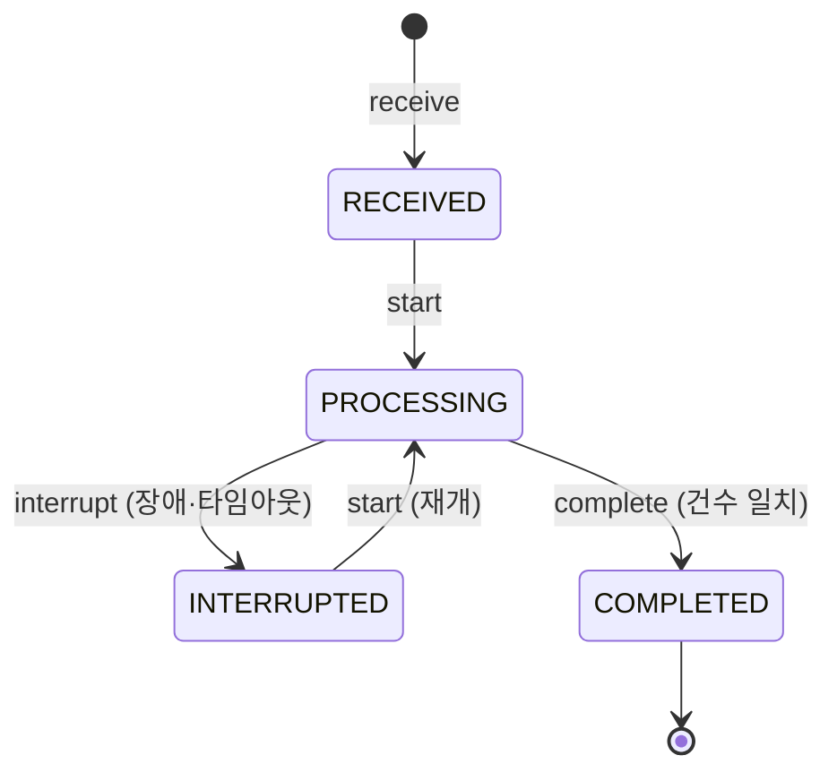

# 상태 머신: 매입 배치

- 작성일: 2026-08-04
- 상태: 검토대기
- 대상 애그리게이트: `CaptureBatch`
- 양식: `study/project-workflow/phase2/05-state-machine-format.md`

> **중단과 재개가 정상 경로다.** 이 상태 머신은 "실패하지 않는 배치"가 아니라 **"실패해도 정확한 배치"** 를 표현한다.

---

## 1. 상태 목록

| 상태 | 코드명 | 뜻 | 종료 | 진입 조건 |
|---|---|---|---|---|
| 수신됨 | `RECEIVED` | 파일이 들어왔고 아직 손대지 않음 | ✕ | 매입 파일 수신 (D1) |
| 처리중 | `PROCESSING` | 레코드를 하나씩 반영하는 중 | ✕ | `start()` |
| 중단됨 | `INTERRUPTED` | 장애·타임아웃으로 멈춤. **진행분은 보존된다** | ✕ | 장애 또는 타임아웃 |
| 완료됨 | `COMPLETED` | `처리 + 격리 = 전체` 가 성립 | **✓** | `complete()` |

> **`FAILED`가 없다.** 배치는 실패하는 것이 아니라 **중단**된다 — 파일은 그대로 있고 진행분도 남아 있으므로, 재개하면 이어서 처리된다. `FAILED`를 두면 "다시 못 하는 상태"라는 잘못된 신호를 준다.

---

## 2. 전이도



---

## 3. 전이 표

| # | 현재 | 전이 | 다음 | 조건 | 부수 효과 | 근거 |
|---|---|---|---|---|---|---|
| B1 | — | `receive` | `RECEIVED` | `fileId` 유일 (INV-1) | `totalRecords` 확정 | BR-23 |
| B2 | `RECEIVED` | `start` | `PROCESSING` | — | — | — |
| B3 | `INTERRUPTED` | `start` | `PROCESSING` | — | **처리된 레코드는 건너뛴다** | BR-23 |
| B4 | `PROCESSING` | `markProcessed` | 상태 불변 | **두 집합 어디에도 없음** (INV-2) | 레코드 반영 + 처리 집합 추가. **레코드 단위 커밋** | BR-16·23 |
| B5 | `PROCESSING` | `isolate` | 상태 불변 | **두 집합 어디에도 없음** (INV-2) | 격리 목록에 추가 + **`Discrepancy.recordOrTouch()` 호출**(보류 격리는 제외 — BR-50) | BR-27·32·50·51 |
| B6 | `PROCESSING` | `interrupt` | `INTERRUPTED` | — | **진행분 보존** | — |
| B7 | `PROCESSING` | `complete` | `COMPLETED` | **`\|처리\| + \|격리\| = totalRecords`** (INV-3) | — | — |
| B9 | `PROCESSING`·`INTERRUPTED`·`COMPLETED` | ★ **`reclassifyIsolated`** | **상태 불변** | 격리 사유 = 보류 **AND 원승인 종료 관측**(승인 종료 이벤트 — 시스템 조작) | 사유 → **M8 교체**(이력 보존) + `Discrepancy.recordOrTouch()` 호출(outbox — isolate와 같은 경로). ★ **BF11(승격은 완료 후만)과 비대칭인 근거**: 승격은 **자금 반영(E2)** 이라 격리 확정(완료) 후에만 — 재분류는 **무자금 속성 정정**이라 확정 전에도 안전하다(방향이 반대) | BR-49·50·51 |
| B8 | `COMPLETED` | **`promoteIsolated`** | **상태 불변** | 격리 목록에 있음 **AND 사유 = 보류 AND 보류 해제됨** (INV-5) | 격리 → 처리 **원자 이동**(사유는 이력 보존). 합계 불변이므로 INV-3 유지 | BR-50 |

> **B7의 조건이 이 문서에서 가장 중요하다.** 건수로 판정하지 않으면 **조용한 절단**을 못 잡는다. 파일 파서가 뒤쪽 1000건을 조용히 버려도 "에러 없이 돌았다"가 되고, 대사에서 M1(미매입) 1000건으로 뒤늦게 나타난다.

---

## 4. 금지된 전이 ★★

| # | 현재 | 시도 | 왜 금지인가 | 위반 시 | 처리 |
|---|---|---|---|---|---|
| **BF1** | `PROCESSING` | `complete` (**건수 불일치**) | INV-3 위반 | **부분 실패를 완료로 위장.** 최악의 실패 모드 — 아무도 모른다 | `BATCH_INCOMPLETE` + 중단 처리 |
| **BF2** | `COMPLETED` | `markProcessed` · `isolate` | 완료 후 레코드 **추가** (INV-4). **승격(B8)은 이동이라 해당 없다** | 건수가 어긋나 완료 판정이 무효화 | `BATCH_COMPLETED` |
| **BF3** | `COMPLETED` | `start` | 다 끝난 파일을 다시 연다 | **전 레코드 재처리 시도** — 멱등이 막아 주지만 무의미한 부하 | `BATCH_COMPLETED` |
| **BF5** | `RECEIVED` | `markProcessed` · `isolate` | 시작하지 않은 배치 | **상태 없이 자금이 움직인다** — 중단 시 어디까지 했는지 모른다 | `BATCH_NOT_STARTED` |
| **BF6** | `RECEIVED`·`INTERRUPTED` | `complete` | 처리 중이 아닌데 완료 선언 | 미처리 레코드를 남긴 채 완료 | `BATCH_NOT_PROCESSING` |
| **BF7** | 모든 상태 | `receive` (**같은 `fileId`**) | INV-1 위반 | **파일 전체 이중 처리** | `BATCH_DUPLICATE_FILE` — 최초 배치를 반환 |
| **BF8** | `PROCESSING` | `markProcessed`·`isolate` (**이미 처리 또는 격리된 레코드**) | INV-2 위반 | **이중 출금**, 그리고 격리 중복이 **건수를 부풀려 INV-3을 무력화** | 오류가 아니라 **건너뛴다** (◎) — 재개 시 정상 경로다 |
| **BF9** | `INTERRUPTED` | `markProcessed` · `isolate` | 재개(`start`)를 거치지 않았다 | 상태가 `PROCESSING`이 아닌데 자금이 움직여 **중단 시점 추적이 깨진다** | `BATCH_NOT_PROCESSING` |
| **BF4** | `RECEIVED`·`INTERRUPTED`·`COMPLETED` | `interrupt` | 처리 중이 아니다. `COMPLETED`는 특히 **끝난 것이 재처리 대상으로 되살아난다** | 중단 이력이 근거 없이 생기고, 완료가 취소된다 | `BATCH_NOT_PROCESSING` |
| **BF11** | `RECEIVED`·`PROCESSING`·`INTERRUPTED` | `promoteIsolated` | 완료되지 않은 배치에서는 격리 자체가 아직 확정이 아니다 | 진행 중 배치의 건수가 흔들려 INV-3 판정이 불안정 | `BATCH_NOT_COMPLETED` |
| **BF12** | `COMPLETED` | `promoteIsolated` (**보류 외 사유**) | M2·M4·M7·M8·M19 격리는 **반영되면 안 되는 레코드**다 (INV-5) | ★ 반영 안 된 레코드가 **"처리됨"으로 표시**되고 건수 판정은 통과 — 격리 사유와 이력이 소멸한다. 대사는 여전히 불일치라 말하고 배치는 처리됐다고 말한다 | `PROMOTE_NOT_ALLOWED` |

> ★ **격리 쪽 중복 방지가 INV-3의 전제다.** 처리 집합만 막고 격리를 열어 두면 같은 레코드를 여러 번 격리해 **`|처리| + |격리|`를 인위적으로 채울 수 있고**, 그러면 파일 뒤쪽을 통째로 못 읽어도 완료 판정이 통과한다 — BF1이 막으려던 실패가 **다른 문으로 그대로 들어온다.**

> **BF1과 BF8의 처리가 정반대인 이유.**
> BF8(중복 레코드)은 **재개할 때마다 반드시 일어나는 정상 경로**이므로 조용히 건너뛴다.
> BF1(건수 불일치)은 **일어나면 안 되는 일**이므로 시끄럽게 막는다.
> 둘을 같은 방식으로 처리하면, 조용히 넘어가는 쪽을 택했을 때 절단을 놓치고 시끄럽게 막는 쪽을 택했을 때 정상 재개가 불가능해진다.

---

## 5. 전이 매트릭스

| 현재 \ 조작 | `receive` | `start` | `markProcessed` | `isolate` | `interrupt` | `complete` | `promoteIsolated` | ★ `reclassifyIsolated` |
|---|---|---|---|---|---|---|---|---|
| **`RECEIVED`** | X (BF7) | **O** (B2) | X (BF5) | X (BF5) | X (BF4) | X (BF6) | X (BF11) | ◎ (격리 없음 — 무시) |
| **`PROCESSING`** | X (BF7) | ◎ | **O/◎** (B4 / BF8) | **O/◎** (B5 / BF8) | **O** (B6) | **O/X** (B7 / BF1) | X (BF11) | **O/◎** (B9 / 대상 없음) |
| **`INTERRUPTED`** | X (BF7) | **O** (B3) | X (BF9) | X (BF9) | X (BF4) | X (BF6) | X (BF11) | **O/◎** (B9 / 〃) |
| **`COMPLETED`** | X (BF7) | X (BF3) | X (BF2) | X (BF2) | X (BF4) | ◎ | **O/X** (B8 / BF12) | **O/◎** (B9 / 〃) |

**O 3 · O/◎ 5 · O/X 2 · X 19 · ◎ 3 = 32칸** (2026-08-06 `reclassifyIsolated` 열 신설 — B9)

> **조건부 칸이 이 배치의 안전장치다** — 재개의 무시 2(B4·B5) · 완료의 막기 1(B7) · 승격의 사유 제한 1(B8) · ★ 재분류의 무시 3(B9 — 이벤트 재전달) = **조건부 7칸(O/◎ 5 · O/X 2)**.
> `markProcessed`·`isolate`는 **이미 다룬 레코드면 조용히 건너뛴다**(재개의 정상 경로) — 시끄럽게 막으면 재개가 불가능해진다.
> `complete`는 **건수가 안 맞으면 시끄럽게 막는다**(INV-3) — 조용히 넘어가면 절단을 놓친다.
> 방향이 정반대이며, 하나라도 뒤집으면 정상 재개가 막히거나 조용한 절단이 통과한다.

### `COMPLETED` 행이 전부 닫혀 있는데 보류 격리는 어떻게 재처리하나 (BR-50)

**원 배치를 다시 열지 않는다.** `COMPLETED → PROCESSING` 재개방을 만들면 INV-4("완료 후 레코드 추가 없음")가 깨지고, **이미 마감·정산된 영업일의 배치가 다시 열릴 수 있다.**

```
재처리 배치가 레코드 하나를 처리할 때                        ⟨E2⟩
  ① 원 배치의 isolatedRecords 에 있는가?   없으면 이미 반영됨 → 건너뛴다
  ② 반영 — `Account.capture(...)` · `Authorization.capture(...)`
  ③ `CaptureBatch.promoteIsolated(recordId)`  격리 → 처리 로 원자 이동  ← B8
     ★ ②와 ③은 **같은 커밋**이다 (E2). 갈리면 ②만 반영된 채 배치는 "미반영"이라
       재시도가 같은 레코드를 또 출금한다 — 어떤 대사도 잡지 않는다
```

> ★ **승격이 곧 멱등이다.** "같은 집합을 공유한다"고만 정하면 **모순이 생긴다** — 그 레코드는 이미 `isolatedRecords`에 있어 재개 규칙에 따라 재처리 배치도 건너뛰게 된다. 반대로 별도 집합을 쓰면 재처리 배치 둘 사이의 중복을 못 막는다.
>
> **격리에 있다 = 미반영 · 처리에 있다 = 반영됨.** ③이 그 경계를 원자적으로 넘기므로 두 번 지시해도, 매입사가 파일을 재전송해도 ①에서 걸러진다. 합계가 안 바뀌어 INV-3도 그대로다.
>
> **B8이 `COMPLETED`에서 허용되는 유일한 조작이다.** 레코드 **추가**가 아니라 **이동**이므로 INV-4를 깨지 않는다.
>
> ⚠️ **그래서 사유 제한이 필수다**(INV-5 · BF12). `COMPLETED`에서 유일하게 열린 문이므로, 사유를 안 가리면 **미승인(M2)·초과(M4)·후속(M7)·무효(M8) 격리까지 "처리됨"으로 승격**된다. 반영되지 않은 레코드가 반영된 것으로 표시되고 건수 판정(INV-3)은 그대로 통과한다 — 이 문서가 방어선으로 삼은 **조용한 실패의 새 창구**다.

---

## 6. 동시성

| 상황 | 처리 |
|---|---|
| **같은 파일을 두 배치가 동시에 처리** | `fileId` 유니크 제약 + 배치 단위 락. 애플리케이션 로직만으로는 못 막는다 |
| **같은 레코드 재처리** | `(fileId, recordId)` 멱등 — 집합에 있으면 건너뛴다 (BF8) |
| **레코드 처리 중 프로세스 종료** | **레코드 단위 커밋**이므로 커밋된 것까지 보존. 재개 시 그다음부터 |
| **파일 전체를 한 트랜잭션으로 묶으면?** | 대용량에서 락이 과도하고, **중단 시 진행분이 전부 사라진다.** 레코드 단위 커밋이 맞다 |
| 배치와 실시간 승인의 경합 | 계좌·승인 애그리게이트 단위 락에서 해소 |
| **재처리 배치와 원 파일 재전송의 경합** | 둘 다 원 `(fileId, recordId)` 멱등 집합을 보므로 **먼저 커밋한 쪽만 반영**된다 |

---

## 7. 시간 기반 전이 ★

| 현재 | 조건 | 다음 | 누가 | 주기 |
|---|---|---|---|---|
| `PROCESSING` | **일정 시간 진척 없음** | `INTERRUPTED` | 감시 배치 | 미확정 |

> ⚠️ **이 전이가 없으면 `PROCESSING`에 영원히 갇힌다.**
> 배치 프로세스가 그냥 죽으면 `interrupt()`를 호출할 주체가 없다. 상태는 `PROCESSING`인데 아무도 처리하지 않는 상태가 되고, **재개도 안 되고 완료도 안 된다.** 그러면 그날 매입 전체가 대사에서 M1(미매입)으로 잡힌다.
>
> **진척 판정은 "시작 후 경과 시간"이 아니라 "마지막 레코드 커밋 이후 경과 시간"이어야 한다.** 전자로 하면 정상적으로 오래 걸리는 대용량 배치를 중단시킨다.

| 항목 | 처리 |
|---|---|
| 감시 배치 자체가 죽으면? | 다음 기동 시 스캔으로 회복. **감시의 감시는 두지 않는다** — 무한히 이어진다 |
| 재개 시도 횟수 상한 | 미확정 (BFS2) |

---

## 8. 의문

### 열린 의문

| # | 의문 | 영향 |
|---|---|---|
| **BFS1** | **파일이 손상되어 `totalRecords`를 못 읽으면?** INV-3(건수 판정)이 성립하지 않아 `COMPLETED`에 도달할 수 없다. `RECEIVED`에서 거부하고 매입사에 재전송을 요청하는가 | INV-3 · 애그리게이트 CB2 |
| **BFS2** | 재개 시도 **횟수 상한**과 운영자 통지 임계 | 미확정 수치 |
| **BFS3** | `PROCESSING` 진척 없음 판정 시간 | 미확정 수치 |
| **BFS4** | `COMPLETED` 배치의 **보관 기간**. `processedRecords` 집합이 파일당 수십만 건이면 누적 부담이 크다 | Phase 3 저장 설계 (CB1) |

---

## 변경 이력

| 버전 | 일자 | 내용 |
|---|---|---|
| v0.5 | 2026-08-06 | ★ **B9 신설** — `reclassifyIsolated`(보류 격리 중 원승인 종료 → M8 자동 재분류, 상태 불변·시스템 조작 — UC14-2 확정) · BF12에 M19 포함(UC10-1) · 매트릭스 28→32칸 |
| v0.4 | 2026-08-04 | 재점검 반영 — **B8에 보류 사유 제한 + BF12 신설**(사유를 안 가리면 반영 안 된 격리가 "처리됨"으로 승격돼 은폐) · 애그리게이트 §5 재처리 서술을 3단계로 교체(옛 "멱등 키 승계" 문장이 남아 모순이 그대로였다) |
| v0.3 | 2026-08-04 | post-fix 반영 — ★ **B8 `promoteIsolated` 신설**(격리 → 처리 원자 승격). "멱등 집합 공유"만으로는 재처리 배치가 자기 대상을 건너뛰는 모순이 있었다 · BF11 신설 · `COMPLETED`에서 유일하게 허용되는 조작임과 INV-4를 깨지 않는 근거 명시 |
| v0.2 | 2026-08-04 | 듀얼 리뷰 반영 — ★ **격리 중복 방지 추가**(INV-2를 두 집합 상호배타로. 없으면 격리 중복이 건수를 채워 INV-3이 무력화된다) · `isolate()`가 **불일치 적재를 호출**하는 지점 명시 · **BF9·BF10 신설**(미등재 X 보완) · 조건부 칸 `O/◎`·`O/X` 기호 도입 · **보류 격리 재처리를 멱등 승계 별도 배치로 확정**(§8) · 집계 정정 |
| v0.1 | 2026-08-04 | 최초 작성 — 상태 4종, 전이 7종, 금지 8종. `FAILED`를 두지 않는 근거, 중복 레코드(조용히 건너뜀)와 건수 불일치(시끄럽게 차단)의 처리 분리, `PROCESSING` 갇힘을 막는 감시 전이 명시 |
