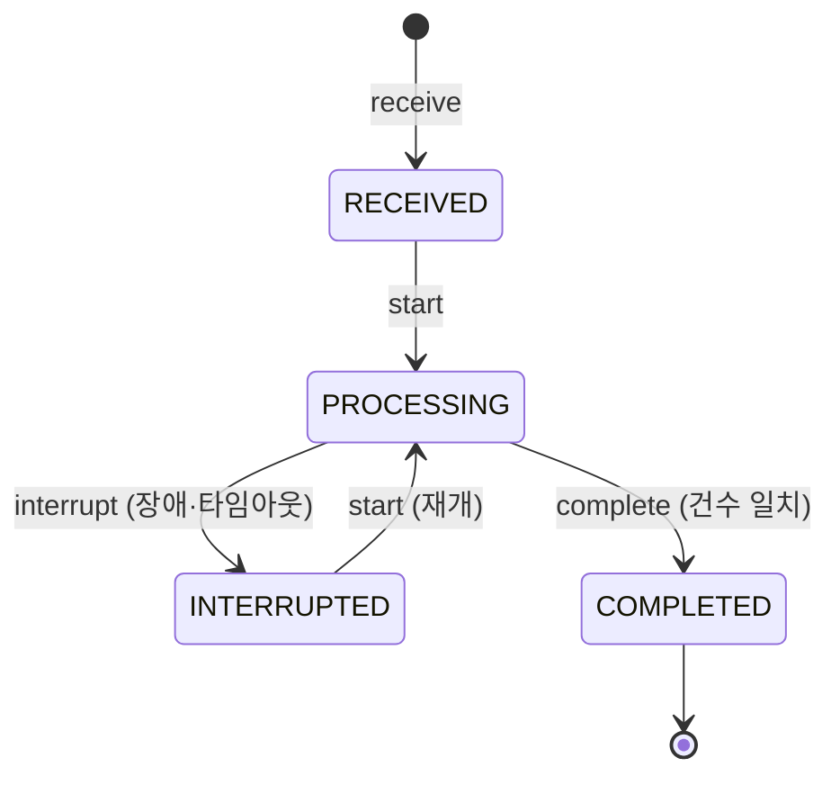

# 상태 머신: 매입 배치

- 작성일: 2026-08-04
- 상태: 검토대기
- 대상 애그리게이트: `CaptureBatch`
- 양식: `study/project-workflow/phase2/05-state-machine-format.md`

> **중단과 재개가 정상 경로다.** 이 상태 머신은 "실패하지 않는 배치"가 아니라 **"실패해도 정확한 배치"** 를 표현한다.

---

## 1. 상태 목록

| 상태 | 코드명 | 뜻 | 종료 | 진입 조건 |
|---|---|---|---|---|
| 수신됨 | `RECEIVED` | 파일이 들어왔고 아직 손대지 않음 | ✕ | 매입 파일 수신 (D1) |
| 처리중 | `PROCESSING` | 레코드를 하나씩 반영하는 중 | ✕ | `start()` |
| 중단됨 | `INTERRUPTED` | 장애·타임아웃으로 멈춤. **진행분은 보존된다** | ✕ | 장애 또는 타임아웃 |
| 완료됨 | `COMPLETED` | `처리 + 격리 = 전체` 가 성립 | **✓** | `complete()` |

> **`FAILED`가 없다.** 배치는 실패하는 것이 아니라 **중단**된다 — 파일은 그대로 있고 진행분도 남아 있으므로, 재개하면 이어서 처리된다. `FAILED`를 두면 "다시 못 하는 상태"라는 잘못된 신호를 준다.

---

## 2. 전이도

---

## 3. 전이 표

| # | 현재 | 전이 | 다음 | 조건 | 부수 효과 | 근거 |
|---|---|---|---|---|---|---|
| B1 | — | `receive` | `RECEIVED` | `fileId` 유일 (INV-1) | `totalRecords` 확정 | BR-23 |
| B2 | `RECEIVED` | `start` | `PROCESSING` | — | — | — |
| B3 | `INTERRUPTED` | `start` | `PROCESSING` | — | **처리된 레코드는 건너뛴다** | BR-23 |
| B4 | `PROCESSING` | `markProcessed` | 상태 불변 | 집합에 없음 (INV-2) | 레코드 반영 + 집합 추가. **레코드 단위 커밋** | BR-16·23 |
| B5 | `PROCESSING` | `isolate` | 상태 불변 | 집합에 없음 | 격리 목록에 추가 | BR-27·32·50·51 |
| B6 | `PROCESSING` | `interrupt` | `INTERRUPTED` | — | **진행분 보존** | — |
| B7 | `PROCESSING` | `complete` | `COMPLETED` | **`\|처리\| + \|격리\| = totalRecords`** (INV-3) | — | — |

> **B7의 조건이 이 문서에서 가장 중요하다.** 건수로 판정하지 않으면 **조용한 절단**을 못 잡는다. 파일 파서가 뒤쪽 1000건을 조용히 버려도 "에러 없이 돌았다"가 되고, 대사에서 M1(미매입) 1000건으로 뒤늦게 나타난다.

---

## 4. 금지된 전이 ★★

| # | 현재 | 시도 | 왜 금지인가 | 위반 시 | 처리 |
|---|---|---|---|---|---|
| **BF1** | `PROCESSING` | `complete` (**건수 불일치**) | INV-3 위반 | **부분 실패를 완료로 위장.** 최악의 실패 모드 — 아무도 모른다 | `BATCH_INCOMPLETE` + 중단 처리 |
| **BF2** | `COMPLETED` | `markProcessed` · `isolate` | 완료 후 레코드 추가 (INV-4) | 건수가 어긋나 완료 판정이 무효화 | `BATCH_COMPLETED` |
| **BF3** | `COMPLETED` | `start` | 다 끝난 파일을 다시 연다 | **전 레코드 재처리 시도** — 멱등이 막아 주지만 무의미한 부하 | `BATCH_COMPLETED` |
| **BF4** | `COMPLETED` | `interrupt` | 끝난 것을 중단할 수 없다 | 완료가 취소되어 재처리 대상이 됨 | `BATCH_COMPLETED` |
| **BF5** | `RECEIVED` | `markProcessed` · `isolate` | 시작하지 않은 배치 | **상태 없이 자금이 움직인다** — 중단 시 어디까지 했는지 모른다 | `BATCH_NOT_STARTED` |
| **BF6** | `RECEIVED`·`INTERRUPTED` | `complete` | 처리 중이 아닌데 완료 선언 | 미처리 레코드를 남긴 채 완료 | `BATCH_NOT_PROCESSING` |
| **BF7** | 모든 상태 | `receive` (**같은 `fileId`**) | INV-1 위반 | **파일 전체 이중 처리** | `BATCH_DUPLICATE_FILE` — 최초 배치를 반환 |
| **BF8** | `PROCESSING` | `markProcessed` (**이미 처리된 레코드**) | INV-2 위반 | **이중 출금** | 오류가 아니라 **건너뛴다** (◎) — 재개 시 정상 경로다 |

> **BF1과 BF8의 처리가 정반대인 이유.**
> BF8(중복 레코드)은 **재개할 때마다 반드시 일어나는 정상 경로**이므로 조용히 건너뛴다.
> BF1(건수 불일치)은 **일어나면 안 되는 일**이므로 시끄럽게 막는다.
> 둘을 같은 방식으로 처리하면, 조용히 넘어가는 쪽을 택했을 때 절단을 놓치고 시끄럽게 막는 쪽을 택했을 때 정상 재개가 불가능해진다.

---

## 5. 전이 매트릭스

| 현재 \ 조작 | `receive` | `start` | `markProcessed` | `isolate` | `interrupt` | `complete` |
|---|---|---|---|---|---|---|
| **`RECEIVED`** | X (BF7) | **O** (B2) | X (BF5) | X (BF5) | - | X (BF6) |
| **`PROCESSING`** | X (BF7) | ◎ | **O** (B4) / ◎ (BF8) | **O** (B5) | **O** (B6) | **O** (B7) / X (BF1) |
| **`INTERRUPTED`** | X (BF7) | **O** (B3) | X (BF5) | X (BF5) | ◎ | X (BF6) |
| **`COMPLETED`** | X (BF7) | X (BF3) | X (BF2) | X (BF2) | X (BF4) | ◎ |

**O 6 · X 14 · ◎ 4 = 24칸 (`-` 1 포함)**

> **`complete` 칸만 조건부다.** 같은 조작이 조건에 따라 `O`와 `X`로 갈리는 유일한 칸이며, 그 조건이 INV-3이다.

---

## 6. 동시성

| 상황 | 처리 |
|---|---|
| **같은 파일을 두 배치가 동시에 처리** | `fileId` 유니크 제약 + 배치 단위 락. 애플리케이션 로직만으로는 못 막는다 |
| **같은 레코드 재처리** | `(fileId, recordId)` 멱등 — 집합에 있으면 건너뛴다 (BF8) |
| **레코드 처리 중 프로세스 종료** | **레코드 단위 커밋**이므로 커밋된 것까지 보존. 재개 시 그다음부터 |
| **파일 전체를 한 트랜잭션으로 묶으면?** | 대용량에서 락이 과도하고, **중단 시 진행분이 전부 사라진다.** 레코드 단위 커밋이 맞다 |
| 배치와 실시간 승인의 경합 | 계좌·승인 애그리게이트 단위 락에서 해소 |

---

## 7. 시간 기반 전이 ★

| 현재 | 조건 | 다음 | 누가 | 주기 |
|---|---|---|---|---|
| `PROCESSING` | **일정 시간 진척 없음** | `INTERRUPTED` | 감시 배치 | 미확정 |

> ⚠️ **이 전이가 없으면 `PROCESSING`에 영원히 갇힌다.**
> 배치 프로세스가 그냥 죽으면 `interrupt()`를 호출할 주체가 없다. 상태는 `PROCESSING`인데 아무도 처리하지 않는 상태가 되고, **재개도 안 되고 완료도 안 된다.** 그러면 그날 매입 전체가 대사에서 M1(미매입)으로 잡힌다.
>
> **진척 판정은 "시작 후 경과 시간"이 아니라 "마지막 레코드 커밋 이후 경과 시간"이어야 한다.** 전자로 하면 정상적으로 오래 걸리는 대용량 배치를 중단시킨다.

| 항목 | 처리 |
|---|---|
| 감시 배치 자체가 죽으면? | 다음 기동 시 스캔으로 회복. **감시의 감시는 두지 않는다** — 무한히 이어진다 |
| 재개 시도 횟수 상한 | 미확정 (BFS2) |

---

## 8. 의문

### 열린 의문

| # | 의문 | 영향 |
|---|---|---|
| **BFS1** | **파일이 손상되어 `totalRecords`를 못 읽으면?** INV-3(건수 판정)이 성립하지 않아 `COMPLETED`에 도달할 수 없다. `RECEIVED`에서 거부하고 매입사에 재전송을 요청하는가 | INV-3 · 애그리게이트 CB2 |
| **BFS2** | 재개 시도 **횟수 상한**과 운영자 통지 임계 | 미확정 수치 |
| **BFS3** | `PROCESSING` 진척 없음 판정 시간 | 미확정 수치 |
| **BFS4** | `COMPLETED` 배치의 **보관 기간**. `processedRecords` 집합이 파일당 수십만 건이면 누적 부담이 크다 | Phase 3 저장 설계 (CB1) |

---

## 변경 이력

| 버전 | 일자 | 내용 |
|---|---|---|
| v0.1 | 2026-08-04 | 최초 작성 — 상태 4종, 전이 7종, 금지 8종. `FAILED`를 두지 않는 근거, 중복 레코드(조용히 건너뜀)와 건수 불일치(시끄럽게 차단)의 처리 분리, `PROCESSING` 갇힘을 막는 감시 전이 명시 |
