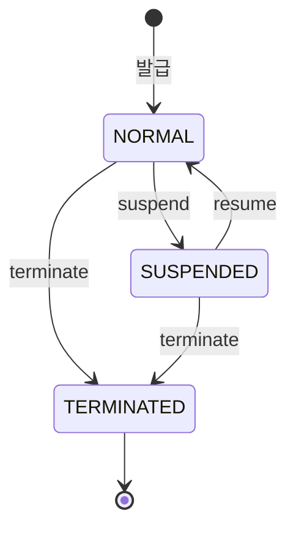

# 상태 머신: 카드

- 작성일: 2026-08-04
- 상태: 검토대기
- 대상 애그리게이트: `Card`
- 양식: `study/project-workflow/phase2/05-state-machine-format.md`

---

## 1. 상태 목록

| 상태 | 코드명 | 뜻 | 종료 | 진입 조건 |
|---|---|---|---|---|
| 정상 | `NORMAL` | 승인 가능 | ✕ | 발급 시 |
| 정지 | `SUSPENDED` | 분실·도난 신고. **신규 승인만 막힌다** | ✕ | 소지자 또는 운영자 요청 |
| 해지 | `TERMINATED` | 되돌릴 수 없음 | **✓** | 소지자 요청 |

### 유효기간은 상태가 아니다

`expiryDate` 경과는 **파생 판정**이지 상태 전이가 아니다. 셋 다 성립하기 때문이다:

| 조건 | 확인 |
|---|---|
| 시간이 지나면 **자동으로 참**이 된다 | 배치가 바꿔 줄 필요가 없다 |
| **되돌아오지 않는다** | 되돌리는 전이가 없다 |
| 다른 전이의 **조건이 되지 않는다** | 정지·해지와 독립적이다 |

> 상태로 만들면 `NORMAL`·`SUSPENDED` 각각에 만료 변종이 생겨 **3개 상태가 5개**가 된다. 얻는 것은 없다.
> `assertUsable(now)`가 매번 판정한다 (BR-15).

---

## 2. 전이도

---

## 3. 전이 표

| # | 현재 | 전이 | 다음 | 조건 | 부수 효과 | 근거 |
|---|---|---|---|---|---|---|
| C1 | `NORMAL` | `suspend` | `SUSPENDED` | — | 신규 승인 차단(**효과의 근거 = BR-15**). 한도 사용액은 그대로 | 애그리게이트 §5 |
| C2 | `SUSPENDED` | `resume` | `NORMAL` | — | — | 애그리게이트 §5 |
| C3 | `NORMAL`·`SUSPENDED` | `terminate` | `TERMINATED` | — | **되돌릴 수 없다** (INV-4) | — |
| C4 | `NORMAL`·`SUSPENDED` | `changeLimit` | 상태 불변 | `1회 ≤ 1일` (INV-3) | 기존 승인은 **무효화되지 않는다** | BR-46 |
| C5 | `NORMAL` | `useLimit` | 상태 불변 | PRE-1·PRE-2 **AND 유효기간 미경과** | `usage` 증가 (기준일 리셋 포함) | BR-05·15 |
| C6 | 모든 상태 | `restoreLimit` | 상태 불변 | **같은 기준일**(다르면 ◎ 무시) AND **`amount ≤ usage.amount`**(초과면 X — CF7) | `usage` 감소 | BR-24 |

> **C6이 모든 상태에서 허용된다.** 정지·해지된 카드의 승인이 취소될 수 있고, 그 복원을 막을 이유가 없다. 다만 **기준일이 다르면 복원하지 않는다** — 어제 한도는 이미 지나갔다.
>
> ⚠️ **상한(`amount ≤ usage.amount`)이 빠지면 `usage`가 음수가 된다.** 그러면 그날 한도가 실제보다 커져 **한도 초과 승인**이 난다. 애그리게이트 `restoreLimit()`은 이 조건을 갖고 있는데 전이 표에서 누락돼 있었다.
>
> ⚠️ **이 표는 카드 한도만 다룬다.** 계좌 한도(BR-44)는 계좌 애그리게이트의 `useAccountLimit()`·`restoreAccountLimit()`이 별도로 관리하며, **승인은 두 층을 모두 만족해야 성립한다.** 한 층만 복원하면 다른 층이 남아 정상 결제가 거절된다.

---

## 4. 금지된 전이 ★★

| # | 현재 | 시도 | 왜 금지인가 | 위반 시 | 응답 |
|---|---|---|---|---|---|
| **CF1** | `TERMINATED` | `resume` | 해지는 되돌릴 수 없다 (INV-4) | **죽은 카드의 부활** — 해지 시점 이후를 신뢰할 수 없다 | `CARD_TERMINATED` |
| **CF2** | `TERMINATED` | `suspend` | 이미 사용 불가 | 의미 없는 상태 변경 | `CARD_TERMINATED` |
| **CF3** | `TERMINATED` | `useLimit` | 해지 카드로 승인할 수 없다 | 해지한 카드에서 결제 | `CARD_TERMINATED` |
| **CF4** | `SUSPENDED` | `useLimit` | 정지 카드로 승인할 수 없다 (BR-15) | 분실 신고한 카드에서 결제 | `CARD_SUSPENDED` |
| **CF5** | `TERMINATED` | `changeLimit` | 쓰이지 않을 한도를 바꾼다 | — (무해하나 무의미) | `CARD_TERMINATED` |
| **CF6** | 모든 상태 | `useLimit` (**유효기간 경과**) | 만료된 카드 (BR-15) | 만료 카드에서 결제 | `CARD_EXPIRED` |
| **CF7** | 모든 상태 | `restoreLimit` (**`amount > usage.amount`**) | 복원할 사용액이 없다 | **`usage`가 음수** → 그날 한도가 부풀어 한도 초과 승인 | `LIMIT_RESTORE_EXCEEDS_USAGE` |
| **CF8** | `TERMINATED` | `terminate` | 이미 해지 | — | **오류가 아니라 무시**(◎) |

> ⚠️ **CF3·CF4는 카드가 막는 것이 아니라 승인 경로가 `assertUsable()`을 호출해서 막힌다.**
> **매입 경로는 `assertUsable()`을 호출하지 않는다** — 해지·정지 카드의 매입도 반영된다(BR-35). 이미 승인한 거래의 매입을 카드 상태를 이유로 거절할 수 없기 때문이다.
> 이 구분을 놓치면 **해지 직후의 정상 매입이 전부 격리**된다.

---

## 5. 전이 매트릭스

> **`assertUsable()`은 이 표에 없다.** 조회 조작이라 상태를 바꾸지 않으며, `useLimit`의 사전조건으로 승인 경로가 먼저 호출한다. 아래 `useLimit` 칸의 조건부 표기가 그 판정 결과다.

| 현재 \ 조작 | `suspend` | `resume` | `terminate` | `changeLimit` | `useLimit` | `restoreLimit` |
|---|---|---|---|---|---|---|
| **`NORMAL`** | **O** (C1) | ◎ | **O** (C3) | **O** (C4) | **O/X** (C5 / CF6) | **O/X** (C6 / CF7) |
| **`SUSPENDED`** | ◎ | **O** (C2) | **O** (C3) | **O** (C4) | X (CF4) | **O/X** (C6 / CF7) |
| **`TERMINATED`** | X (CF2) | X (CF1) | ◎ (CF8) | X (CF5) | X (CF3) | **O/X** (C6 / CF7) |

**O 6 · O/X 4 · X 5 · ◎ 3 = 18칸**

> **`useLimit`·`restoreLimit`이 조건부인 이유가 다르다.** `useLimit`은 **시간**(유효기간)이 금지를 만들고, `restoreLimit`은 **금액**(`usage` 상한, CF7)이 만든다. 상태만으로는 둘 다 판정할 수 없다.
>
> ⚠️ **`restoreLimit`에는 실패 경로가 둘인데 처리가 다르다.**
>
> | 상황 | 처리 | 왜 |
> |---|---|---|
> | **기준일 불일치** (어제 승인을 오늘 취소) | **◎ 조용히 무시** | 어제 한도는 이미 지나갔다. 오류가 아니라 **정상적으로 아무 일도 안 일어나는 경우**다 |
> | **금액 초과** (`amount > usage.amount`) | **X 거절** (CF7) | 일어나면 안 되는 일 — `usage`가 음수가 된다 |
>
> 둘을 같게 처리하면, 무시 쪽으로 통일하면 음수 `usage`를 놓치고 거절 쪽으로 통일하면 **날짜를 넘긴 정상 취소가 전부 실패**한다.

> `TERMINATED` 행에서 `restoreLimit`만 허용되는 것이 이 표의 요점이다 — **해지는 카드의 끝이지 그 카드로 한 거래의 끝이 아니다.**

---

## 6. 동시성

| 상황 | 처리 |
|---|---|
| **같은 카드로 동시 승인** | **카드 단위 낙관적 락.** `usage` 갱신이 경합한다 — 락 없이는 1일 한도가 초과된다 |
| 한도 사용과 복원의 경합 | 같은 락 안에서 처리 |
| **기준일 경계에서의 동시 요청** | 판단 시각을 **인자로 받아** 통일한다. 각자 `now()`를 호출하면 자정 근처에서 한쪽은 어제, 한쪽은 오늘로 갈린다 (BR-25) |
| 정지와 승인의 경합 | 정지가 카드 락을 잡으므로 하나만 성공. **정지가 졌다면 그 승인은 유효하다** — 분실 신고 이전 거래이므로 정상이다 |

---

## 7. 시간 기반 전이

| 현재 | 조건 | 다음 | 누가 | 주기 |
|---|---|---|---|---|
| — | — | — | — | **없음** |

**이 애그리게이트에는 시간이 일으키는 상태 전이가 없다.** 유효기간 경과와 한도 기준일 리셋은 **판정 시점의 계산**이지 저장된 상태의 변경이 아니다.

> **한도 기준일 리셋을 배치로 만들지 않는다.** 자정에 전 카드의 `usage`를 0으로 미는 배치는 **카드 수만큼 쓰기가 일어나고, 배치가 밀리면 어제 한도로 오늘을 판단**하게 된다. `usage`가 기준일을 함께 들고 **읽을 때 비교**하면 그 위험이 없다.

---

## 8. 의문

### 열린 의문

| # | 의문 | 영향 |
|---|---|---|
| **CDS1** | **정지 중인 카드의 한도 변경(C4)을 허용하는 것이 맞는가.** 무해하지만, 운영자가 정지된 카드를 만지고 있다는 신호를 놓칠 수 있다 | 감사 로그 설계 |
| **CDS2** | 유효기간 경과 카드의 **갱신(재발급)** 이 범위 안인가. 현재 제품 정의에 없다 | 제품 범위 |

---

## 변경 이력

| 버전 | 일자 | 내용 |
|---|---|---|
| v0.3 | 2026-08-04 | post-fix 반영 — `restoreLimit`의 **두 실패 경로를 분리 명시**(기준일 불일치 = ◎ 무시 / 금액 초과 = X 거절). 조건부 표기가 금액만 있는 것처럼 읽혀 **기준일이 다른 복원의 처리가 미정의**였다 |
| v0.2 | 2026-08-04 | 듀얼 리뷰 반영 — `restoreLimit` **상한 조건 추가**(누락 시 `usage` 음수 → 한도 초과 승인) + CF7 신설 · `useLimit`을 **유효기간 조건부(`O/X`)** 로 표기 · `assertUsable()`이 표에 없는 이유 명시 · **계좌 한도는 이 표 밖**임을 경고(BR-44) · C1·C2의 근거를 BR-15에서 애그리게이트 조작 표로 정정 · CF8 신설 · 집계 정정(O 6·O/X 4·X 5·◎ 3) |
| v0.1 | 2026-08-04 | 최초 작성 — 상태 3종, 전이 6종, 금지 6종. 유효기간을 상태가 아닌 파생 판정으로 확정. `restoreLimit`이 해지 후에도 허용되는 근거 명시 |
