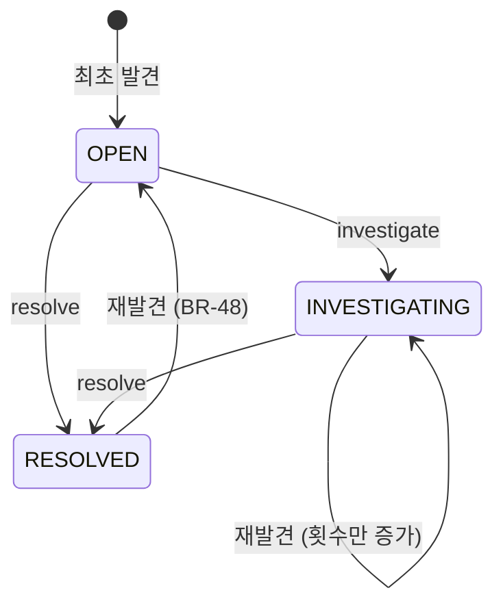

# 상태 머신: 불일치

- 작성일: 2026-08-04
- 상태: 검토대기
- 대상 애그리게이트: `Discrepancy`
- 양식: `study/project-workflow/phase2/05-state-machine-format.md`

> **이 상태 머신에는 종료 상태가 없다.** 처리완료조차 종료가 아니다 — 재발견되면 미처리로 돌아온다(BR-48). 그것이 이 문서의 요점이다.

---

## 1. 상태 목록

| 상태 | 코드명 | 뜻 | 종료 | 진입 조건 |
|---|---|---|---|---|
| 미처리 | `OPEN` | 발견됐고 아무도 보지 않았다 | ✕ | 최초 적재 또는 **재발견 복귀** |
| 조사중 | `INVESTIGATING` | 운영자가 붙잡았다 | ✕ | `investigate()` |
| 처리완료 | `RESOLVED` | 운영자가 처리 결과를 남겼다 | **✕ ⚠️** | `resolve()` |

### `RESOLVED`가 종료가 아닌 이유 ⚠️

**대사는 아무것도 고치지 않는다**(INV-1). 상류를 고치는 것은 사람이고, **사람이 잘못 판단할 수 있다.**

```
운영자가 "처리했다"고 기록  →  다음 대사에서 또 발견  →  실제로는 안 고쳐졌다
```

`RESOLVED`를 종료로 두면 **이 경우를 영원히 볼 수 없다.** BR-09가 자동 정정을 금지한 이유는 사람이 실제로 판단하게 하려는 것인데, 판단의 결과를 검증할 수 없으면 그 취지가 무너진다.

> **"고쳤다는데 또 나온다"가 눈에 보이는 신호로 남아야 한다** (BR-48).

---

## 2. 전이도



---

## 3. 전이 표

| # | 현재 | 전이 | 다음 | 조건 | 부수 효과 | 근거 |
|---|---|---|---|---|---|---|
| D1 | — | `recordOrTouch` (최초) | `OPEN` | 같은 `(유형, 범위, 대상)` 없음. **호출 주체 = 대사 배치 탐지 또는 매입 배치 격리** | `firstDetectedOn` 설정 · `detectionCount = 1` | BR-09·48·51 |
| D2 | `OPEN` | `investigate` | `INVESTIGATING` | 운영자 지정 | 담당자 기록 | BR-09 |
| D3 | `OPEN`·`INVESTIGATING` | `resolve` | `RESOLVED` | **`resolution ≠ null`** (INV-3) | 처리 결과 기록 | BR-09 |
| D4 | **`RESOLVED`** | `recordOrTouch` (재발견) | **`OPEN`** | — | `lastDetectedOn` 갱신 · **영업일이 바뀐 경우에만** `detectionCount` +1 · **`resolution` 보존** | **BR-48** |
| D5 | `OPEN`·`INVESTIGATING` | `recordOrTouch` (재발견) | 상태 불변 | — | `lastDetectedOn` 갱신 · **그 값이 바뀐 경우에만** `detectionCount` +1(영업일당 1회). **상태만 그대로일 뿐 no-op이 아니다** | BR-48 |

> **D4에서 `resolution`을 지우지 않는다.** *"지난번엔 이렇게 처리했는데 또 나왔다"* 가 다음 조사의 가장 중요한 단서다. 지우면 운영자가 같은 오판을 반복한다.

> **D3이 `OPEN`에서도 허용된다.** 조사를 거치지 않고 바로 처리해도 된다 — 원인이 명백한 불일치까지 조사 단계를 강제하면 운영자가 형식적으로 두 번 클릭하게 될 뿐이다. **막아야 할 것은 근거 없는 처리(INV-3)이지 빠른 처리가 아니다.**

---

## 4. 금지된 전이 ★★

| # | 현재 | 시도 | 왜 금지인가 | 위반 시 | 응답 |
|---|---|---|---|---|---|
| **DF1** | 모든 상태 | `resolve` (**`resolution` 없음**) | INV-3 위반 | **처리했는데 근거가 없다** — 나중에 아무도 판단을 재구성할 수 없다 | `RESOLUTION_REQUIRED` |
| **DF2** | 모든 상태 | **상류 데이터 변경** | INV-1 — 이 애그리게이트에 그런 조작이 아예 없다 | **틀린 값으로 덮어쓴다.** 원인이 우리 쪽인지 상대 쪽인지 모르는데 자동 정정하면 맞는 쪽을 망가뜨린다 | 조작 부재로 강제 (컴파일 단계) |
| **DF3** | `RESOLVED` | `investigate` | 처리된 건을 다시 조사하려면 **재발견을 통해 `OPEN`으로 돌아와야** 한다 | 재발견 없이 상태만 되돌려 `detectionCount`가 실제와 어긋난다 | `DISCREPANCY_RESOLVED` |
| **DF4** | `INVESTIGATING` | `investigate` | 두 사람이 같은 건을 조사하면 조치가 충돌한다. **같은 운영자의 재호출도 막는다** — 담당자가 이미 그 사람이므로 바꿀 것이 없다 | 한쪽이 고치는 동안 다른 쪽이 다르게 고친다 | `ALREADY_INVESTIGATING` |
| **DF5** | 모든 상태 | `recordOrTouch` (**새 건 생성**) | INV-2 — 같은 `(유형, 범위, 대상)`은 하나뿐 | 미해결 1건이 30일이면 30건. **목록이 신호를 잃는다** | 오류가 아니라 **기존 건 갱신으로 흡수** (D4·D5) |
| **DF6** | 모든 상태 | 삭제 | 불일치는 지워지지 않는다 | **은폐.** 대사 이력이 사라진다 | 조작 부재로 강제 |
| **DF7** | `RESOLVED` | `resolve` (**다른 `resolution`**) | 처리 결과를 덮어쓰면 **왜 그렇게 판단했는지가 사라진다** | 오판의 흔적이 지워져 재발견 시 같은 오판을 반복 | `DISCREPANCY_RESOLVED` — 재발견으로 `OPEN` 복귀 후 다시 처리 |

> **DF2와 DF6은 조작 목록의 부재로 강제된다.** 응답 코드가 아니라 **호출할 메서드가 없다.** 규칙을 문서에만 적으면 언젠가 누가 추가하지만, 조작이 없으면 추가하려는 순간 리뷰에 걸린다.

---

## 5. 전이 매트릭스

| 현재 \ 조작 | `investigate` | `resolve` | `recordOrTouch` |
|---|---|---|---|
| **`OPEN`** | **O** (D2) | **O** (D3) | **O**(상태 불변) (D5) |
| **`INVESTIGATING`** | X (DF4) | **O** (D3) | **O**(상태 불변) (D5) |
| **`RESOLVED`** | X (DF3) | X (DF7) | **O → `OPEN`** (D4) |

**O 6 · X 3 = 9칸**

> ⚠️ **`recordOrTouch` 칸에 `◎`를 쓰면 안 된다.** `◎`는 "no-op, 최초 결과 반환"인데 이 조작은 **`lastDetectedOn`과 `detectionCount`를 반드시 바꾼다**(BR-48). 상태가 안 변하는 것과 아무 일도 안 일어나는 것은 다르며, `◎`로 적으면 구현자가 그대로 무시해 재발견 추적이 통째로 사라진다.

> **`X`가 3개뿐인 것이 이 표의 특징이다.** 다른 애그리게이트와 달리 이 상태 머신의 방어선은 **금지 전이가 아니라 조작의 부재**(DF2·DF6)에 있다. 고칠 방법이 없으므로 막을 것도 적다.

---

## 6. 동시성

| 상황 | 처리 |
|---|---|
| **대사 배치와 운영자 처리의 경합** | 배치가 `recordOrTouch`로 `OPEN` 복귀시키는 동안 운영자가 `resolve` 중이면, **애그리게이트 락에서 하나만 성공**한다. 운영자가 이기면 다음 대사에서 다시 잡히므로 손실이 없다 |
| **두 운영자가 동시에 조사 착수** | DF4로 한쪽 거절 |
| **같은 대사 실행에서 같은 불일치 중복 탐지** | `(유형, 범위, 대상)` 유니크 제약 + **`lastDetectedOn` 비교**로 흡수. 같은 영업일이면 횟수가 오르지 않는다 (BR-48) |
| 대사 배치 재실행 | **멱등** — 같은 영업일이면 `detectionCount`가 오르지 않는다 (BR-48) |

---

## 7. 시간 기반 전이

| 현재 | 조건 | 다음 | 누가 | 주기 |
|---|---|---|---|---|
| — | — | — | — | **없음** |

**시간이 일으키는 상태 전이가 없다.** 불일치는 스스로 해결되지 않으며, 오래됐다는 이유로 닫히지도 않는다.

> **`OPEN`인 채 오래된 건을 자동으로 닫지 않는다.** 자동으로 닫으면 **아무도 안 본 것이 처리된 것으로 바뀐다** — DF6(삭제 금지)과 같은 은폐다. 대신 `firstDetectedOn`으로 지속 기간이 드러나므로, **오래된 건이 목록 위로 올라오게** 하면 된다.

| 시간과 관련된 것 | 처리 |
|---|---|
| 지속 기간 | `오늘 − firstDetectedOn` — 파생 값, 저장하지 않는다 |
| 통지 임계 | 미확정 (BR-48) — 며칠째 미해결이면 별도 통지 |

---

## 8. 의문

### 열린 의문

| # | 의문 | 영향 |
|---|---|---|
| **DCS1** | `INVESTIGATING`에서 **오래 방치**되면? 담당자가 붙잡아 놓고 잊으면 `OPEN`보다 더 안 보인다. **현재 `INVESTIGATING → OPEN` 경로가 아예 없다** — 조사 포기·담당자 변경 조작을 명세에 추가할 것인가 | 애그리게이트 조작 표 · 운영 정책 |
| **DCS3** | 내부 대사(BR-41) 불일치의 `subject` 단위 — 계정과목인가 계좌인가 (애그리게이트 DC2) | INV-2 유일성 키 |

---

## 변경 이력

| 버전 | 일자 | 내용 |
|---|---|---|
| v0.3 | 2026-08-04 | **DCS2 확정 — 발견 횟수는 영업일당 1회**(BR-48). D4·D5 부수 효과와 §6 동시성 2행 갱신, 배치 재실행이 멱등해졌다 |
| v0.2 | 2026-08-04 | 듀얼 리뷰 반영 — **명세에 없던 `release()` 제거**(DCS1으로 이관) · **`recordOrTouch`의 `◎`를 `O`로 정정**(no-op이 아니라 발견 횟수를 바꾼다 — `◎`로 두면 BR-48 추적이 사라진다) · **DF7 신설**(`RESOLVED`에서 다른 내용으로 재처리하면 오판 흔적이 지워진다) · D1에 **호출 주체 명시** · 집계 정정(9칸) |
| v0.1 | 2026-08-04 | 최초 작성 — 상태 3종(**종료 상태 없음**), 전이 6종, 금지 6종. `RESOLVED → OPEN` 재발견 복귀(BR-48)와 `resolution` 보존, 방어선이 금지가 아닌 조작 부재에 있다는 점 명시. `detectionCount` 계수 단위를 열린 의문으로 식별 |
