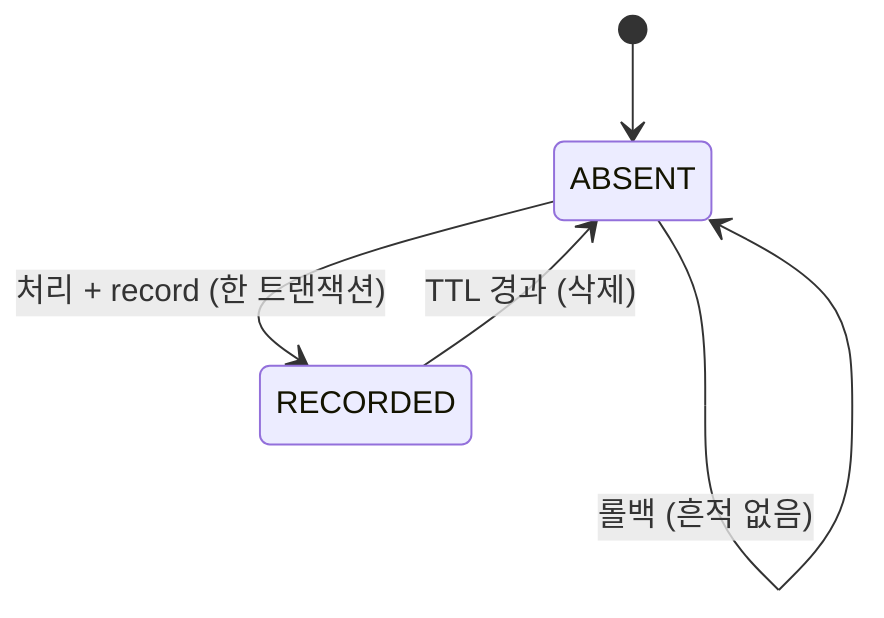

# 상태 머신: 멱등 레코드

- 작성일: 2026-08-04
- 상태: 검토대기
- 대상 애그리게이트: `IdempotencyRecord`
- 양식: `study/project-workflow/phase2/05-state-machine-format.md`

> 이 문서를 다 읽으면 **왜 상태가 둘뿐인데도 상태 머신이 필요한지, 그리고 유일한 금지 전이(IF2) 하나가 어떤 최악의 사고를 막는지**를 설명할 수 있어야 한다.

이 애그리게이트에는 `status` 필드가 없다.\
존재 자체가 상태다 — 레코드가 있으면 "이미 처리됐다", 없으면 "아직 안 했다"는 뜻이다.\
그래서 상태가 **둘뿐**이다.\
그래도 상태 머신을 쓰는 이유는 **"처리 중"이라는 구간을 어떻게 다룰지가 설계 결정**이기 때문이다.

---

## 1. 상태 목록

상태는 레코드의 존재 여부로 갈리는 둘뿐이며, 아래 표가 그 둘의 뜻과 진입 조건이다.

| 상태 | 코드명 | 뜻 | 종료 | 진입 조건 |
|---|---|---|---|---|
| 없음 | `ABSENT` | 이 키로 처리한 적이 없다 **또는 보관 기간이 지나 삭제됐다** | ✕ | 초기 · TTL 경과 후 |
| 기록됨 | `RECORDED` | 처리 완료 + 결과 보관 | ✕ | 처리와 **같은 트랜잭션**에서 생성 |

`EXPIRED`를 별도 상태로 두지 않은 것이 이 목록의 첫 결정이다.

> **만료는 `ABSENT`로의 복귀다.**\
> 만료는 **레코드가 사라지는 것**이므로 `ABSENT`와 같은 상태이며, 별도 상태로 두면 `ABSENT`와 완전히 같은 행이 하나 더 생긴다.\
> **의미가 같은 두 상태는 하나다.**

### `IN_FLIGHT`를 두지 않는다 ★

"처리 중" 상태를 만들면 자연스러워 보이지만, **두 가지가 동시에 깨진다.**\
아래 표가 그 둘이다.

| 문제 | 내용 |
|---|---|
| **고아 레코드** | 프로세스가 처리 중에 죽으면 `IN_FLIGHT`가 영원히 남는다. 그 키는 **재시도해도 "처리 중"이라 거절**되어 영구 차단된다 |
| **회수 로직이 필요해진다** | 타임아웃으로 `IN_FLIGHT`를 정리하는 배치가 필요하고, **그 타임아웃 안에 실제 처리가 끝나면 이중 처리**가 된다 |

대신 **기록과 처리를 한 트랜잭션에 넣는다** (BR-02 ID-5).\
아래 그림이 그 원자적 경계다.

```
없음 → [ 처리 + 기록 ] → 기록됨      ← 원자적. 중간 상태가 없다
         롤백되면 아무것도 안 남는다
```

> **중간 상태를 없애는 것이 중간 상태를 관리하는 것보다 안전하다.**\
> 프로세스가 죽으면 트랜잭션이 롤백되어 `ABSENT`로 돌아가고, 재요청은 정상적으로 처음부터 처리된다.

---

## 2. 전이도

두 상태 사이의 전이와 롤백·만료 경로를 한 그림으로 보인다.



---

## 3. 전이 표

허용되는 세 조작(`record`·`find`·`expire`)이 각각 어느 상태에서 무엇을 하는지 정리한다.

| # | 현재 | 전이 | 다음 | 조건 | 부수 효과 | 근거 |
|---|---|---|---|---|---|---|
| I1 | `ABSENT` | `record` | `RECORDED` | INV-1 · INV-3 | **대상 처리와 같은 트랜잭션** | BR-02 |
| I2 | `RECORDED` | `find` | 상태 불변 | — | **저장된 결과 반환** | BR-02 |
| I3 | `RECORDED` | `expire` | **`ABSENT`** | `now ≥ expiresAt` | **레코드 삭제** | BR-02 |

I1의 INV-1은 단순한 유일성이 아니다.\
키는 ★ **`(발신 기관, 키, 작업)`의 세 열이 유일**해야 한다(R-06 — 기관 축은 §6에서 다시 다룬다).

I2가 상태를 바꾸지 않는 것이 멱등의 본체다.\
`find`는 **재처리하지 않고 저장된 결과를 그대로 돌려준다**(BR-02).

---

## 4. 금지된 전이 ★★

막아야 하는 다섯 시도를 정리한다.\
핵심은 IF1과 IF2의 대비이므로, 표 뒤에 그 둘을 따로 설명한다.

| # | 현재 | 시도 | 왜 금지인가 | 위반 시 | 응답 |
|---|---|---|---|---|---|
| **IF1** | `RECORDED` | `record` (**같은 키·같은 payload**) | 이미 처리됐다 (INV-1) | 이중 처리 — **이중 승인** | 오류가 아니라 **저장된 결과 반환** (◎) |
| **IF2** | `RECORDED` | `record` (**같은 키·다른 payload**) | INV-3 위반 | ★ **다른 거래의 결과를 반환한다** | `IDEMPOTENCY_CONFLICT` — 거절 |
| **IF3** | `RECORDED` | 결과 갱신 | INV-2 — 결과는 바뀌지 않는다 | 재요청마다 다른 결과가 나와 **멱등이 아니게 된다** | 조작 부재로 강제 |
| **IF4** | `ABSENT` | 처리만 하고 `record` 생략 | 기록 없는 처리 | **재요청이 그대로 이중 처리된다** | 같은 트랜잭션 강제로 방지 |
| **IF5** | `RECORDED` | 삭제 (만료 전) | 보관 기간 안에는 결과가 남아 있어야 한다 | 재요청이 새 요청으로 처리되어 **이중 처리** | 조작 부재로 강제 |

IF2의 위반 결과를 구체적으로 옮기면 이렇다.\
키만 같고 payload가 다른데 저장된 결과를 돌려주면, **10만원 결제 응답을 100만원 요청에 돌려준다.**\
IF4의 위반 결과도 마찬가지다 — 기록을 생략하면 **이 애그리게이트의 존재 이유가 사라진다.**

> **IF1과 IF2의 차이가 이 문서의 핵심이다.**\
> 같은 요청의 재전송(IF1)은 **정상 경로**이므로 조용히 결과를 돌려준다.\
> 키만 같고 내용이 다른 요청(IF2)은 **키 재사용 사고**이므로 반드시 거절한다.\
> `requestFingerprint` 없이 키만 비교하면 둘을 구분할 수 없고, **다른 거래의 응답을 돌려주는** 최악의 결과가 된다.

만료는 금지 전이가 아니라 값의 문제라, 표에 넣지 않고 여기서 경고로만 남긴다.

> ⚠️ **만료 자체가 조용한 위험이다.**\
> 이건 금지 전이가 아니라 **설계 파라미터의 문제**다.\
> 만료 후 도착한 재요청은 정상적으로 새 요청이 되므로 상태 머신은 아무것도 막지 않는다 — **보관 기간이 취소 가능 기간(BR-26)보다 짧으면 그 순간 이중 처리가 가능해진다.**\
> 그래서 BR-02의 보관 기간이 BR-26에 의존한다(IRS1).\
> 막을 수 있는 것이 아니라 **값으로만 막는 위험**이라 §4가 아니라 여기 적는다.

---

## 5. 전이 매트릭스

현재 상태와 조작의 모든 조합을 한 표로 채워, 허용(O)·멱등 무시(◎)·거절(X)·불가(-)를 확인한다.

| 현재 \ 조작 | `find` | `record` (같은 payload) | `record` (다른 payload) | `expire` |
|---|---|---|---|---|
| **`ABSENT`** | **O** — 없음 반환 | **O** (I1) | **O** (I1) | - |
| **`RECORDED`** | **O** (I2) | ◎ (IF1) | **X** (IF2) | **O** (I3) |

칸을 세면 **O 5 · X 1 · ◎ 1 · - 1 = 8칸**이다.

> ⚠️ **만료 후 도착한 재요청은 `ABSENT` 행을 그대로 탄다** — 즉 **새 요청으로 처리된다.**\
> 상태 머신은 이것을 막지 않으며, 막을 수도 없다.\
> 위험은 금지 전이가 아니라 **보관 기간을 얼마로 잡느냐**에 있다(§7).

> **`X`가 하나뿐이다.**\
> 이 애그리게이트의 방어는 **전이를 막는 것이 아니라 존재 여부로 분기하는 것**이다.\
> 유일한 금지(IF2)가 가장 위험한 사고 — *다른 거래의 응답을 돌려주는 것* — 을 막는다.

---

## 6. 동시성 ★

> **이 애그리게이트에서는 동시성이 본체다.**\
> 멱등은 동시 요청을 막기 위해 존재한다.

동시 상황별 처리를 정리한다.\
첫 행(둘이 모두 "없음"을 본 경우)이 핵심이라, 그 상세는 표 뒤 산문으로 이연한다.

| 상황 | 처리 |
|---|---|
| **동시 요청 둘이 모두 `find`에서 "없음"** | ★ **애플리케이션 로직으로는 못 막는다** — 저장소 유니크 제약이 진짜 방어선이다(아래 산문) |
| **제약 위반으로 실패한 쪽** | 롤백 후 **`find`를 다시 수행**해 승자의 결과를 반환한다. 오류로 응답하면 정상 재시도를 실패로 만든다 |
| **처리 중 프로세스 종료** | 트랜잭션 롤백 → `ABSENT`. 흔적이 없으므로 재요청이 정상 처리된다 |
| **다른 작업 종류에 같은 키** | `operation`이 키의 일부이므로 충돌하지 않는다. 승인과 취소가 같은 상관 식별자를 쓸 수 있다 |

둘이 동시에 "없음"을 본 경우의 처리는 이렇다.\
★ **`(발신 기관, correlationId, operation)`에 저장소 유니크 제약이 반드시 필요하다** (BR-02 ID-4 · 2026-08-06 **R-06**).\
제약의 열은 **셋**이다 — 기관을 빼면 제약이 **남의 키 공간까지 막는다.**\
둘 다 처리에 들어가고, 커밋 시점에 하나가 제약 위반으로 실패한다.

> ⚠️ **"먼저 조회하고 없으면 처리한다"만으로는 절대 충분하지 않다.**\
> 조회와 기록 사이의 간격은 아무리 짧아도 0이 아니며, 결제 트래픽에서는 반드시 그 사이로 요청이 들어온다.\
> **유니크 제약이 진짜 방어선이고 조회는 최적화일 뿐이다.**

---

## 7. 시간 기반 전이

시간이 일으키는 전이는 만료 하나뿐이다.

| 현재 | 조건 | 다음 | 누가 | 주기 |
|---|---|---|---|---|
| `RECORDED` | `now ≥ expiresAt` | **`ABSENT`** (레코드 삭제) | 정리 배치 | 미확정 |

### 보관 기간이 다른 규칙에 의존한다

멱등키의 보관 기간은 스스로 정하는 값이 아니라, 취소 가능 기간에 매인다.\
아래 그림이 그 의존이다.

```
BR-26 취소 가능 기간  →  BR-02 멱등키 보관 기간
     (미확정)              (임시 30일)
```

**취소 가능 기간이 보관 기간보다 길면**, 만료 후 도착한 취소 재전송이 **새 요청으로 이중 처리**된다.\
상태 머신이 막을 수 있는 것이 아니라 **값으로만 막는 위험**이므로, 순서를 지켜 BR-26을 먼저 확정해야 한다.

---

## 8. 의문

### 열린 의문

아직 확정되지 않은 세 의문과 그 영향이다.

| # | 의문 | 영향 |
|---|---|---|
| **IRS1** | 보관 기간 — **BR-26 확정 후 재산정** (미확정 수치) | ★ 만료 후 재전송의 **이중 처리** 가능성 |
| **IRS2** | `requestFingerprint`의 **계산 범위** — 어느 필드까지 포함하는가. 너무 넓으면 무의미한 필드 차이로 정상 재전송이 IF2로 거절되고, 너무 좁으면 다른 거래를 같다고 판정한다 | Phase 4 계약 (애그리게이트 IR2) |
| **IRS3** | 유니크 제약 위반 후 **재조회까지의 대기** — 승자가 아직 커밋 전이면 결과가 안 보인다. 짧은 재시도인가, 트랜잭션 격리 수준으로 푸는가 | Phase 3 트랜잭션 설계 |

---

## 변경 이력

| 버전 | 일자 | 내용 |
|---|---|---|
| v0.5 | 2026-09-16 | **가독성 재작성**(작성법 분리/복원/이연 — 내용 무변) |
| v0.4 | 2026-08-06 | **R-06 기관 축 전파 일소**: **I1 조건**(`(발신 기관, 키, 작업)` 유일) · §동시성 **저장소 유니크 제약 열 = 셋**(기관을 빼면 제약이 남의 키 공간까지 막는다). 애그리게이트 v1.2(INV-1·`institution`)의 SM 착지 |
| v0.3 | 2026-08-04 | post-fix 반영 — **`EXPIRED` 상태 제거**(`ABSENT`와 의미가 완전히 같은 행을 중복 집계하고 있었다). 상태 3 → 2, 매트릭스 12 → 8칸. 만료는 `RECORDED → ABSENT` 전이다 |
| v0.2 | 2026-08-04 | 듀얼 리뷰 반영 — **IF5를 금지 표에서 내림**(만료 후 재처리는 금지 전이가 아니라 값으로만 막는 설계 위험이라 §7로 이동) · 그 자리에 **만료 전 삭제 금지**를 IF5로 재정의 · `EXPIRED` 행을 `ABSENT`와 동치로 명시 · 집계 정정 |
| v0.1 | 2026-08-04 | 최초 작성 — 상태 3종, 전이 3종, 금지 5종. **`IN_FLIGHT`를 두지 않는 근거**(고아 레코드·회수 타임아웃), 같은 payload 재전송(◎)과 키 재사용(X)의 구분, 유니크 제약이 진짜 방어선이라는 점 명시 |
