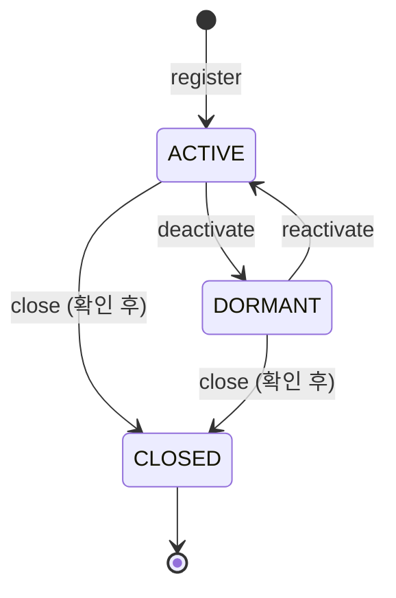

# 상태 머신: 회원

- 작성일: 2026-08-06
- 상태: 검토대기
- 대상 애그리게이트: `Member` (C7 인증)
- 양식: `study/project-workflow/phase2/05-state-machine-format.md`

---

## 1. 상태 목록

| 상태 | 코드명 | 뜻 | 종료 | 진입 조건 |
|---|---|---|---|---|
| 정상 | `ACTIVE` | 거래 관계가 살아 있다 | ✕ | 등록 시 · 휴면 해제 |
| 휴면 | `DORMANT` | 관계 관리상 비활성. ★ **실시간 승인 판정에는 들어가지 않는다**(D-12) | ✕ | 운영자 요청 |
| 해지 | `CLOSED` | 거래 관계 종료. **되돌릴 수 없다** | **✓** | 계좌 전부 해지 **확인 후**(F-25) |

### 이 상태는 승인 경로가 보지 않는다 ★ (선검증 D-12)

```
승인 경로: 카드 assertUsable() → 계좌 가용잔액 → 홀딩
           ★ "회원이 휴면인가" 조회가 없다   (ADR-013 T-10 · 내부 예산 2.5초 보호)
```

**효과는 카드·계좌의 상태 전이로 전달된다** — `MemberDeactivated`를 C1·C2가 받아 각자 전이한다. 승인은 **이미 보고 있는 것**(카드 상태 — BR-15)으로 막힌다.

> ⚠️ **그래서 창(window)이 있다.** 휴면 처리와 카드 정지 사이에 승인 하나가 통과할 수 있다. **받아들이는 이유**: 휴면은 위험 통제가 아니라 관계 관리다. 위험 통제(분실·도난·미수)는 카드 정지와 승인 차단이 **직접** 든다. 위험 통제가 회원 축으로 올라오는 요구가 생기면 이 결정을 다시 본다.

---

## 2. 전이도



---

## 3. 전이 표

| # | 현재 | 전이 | 다음 | 조건 | 부수 효과 | 근거 |
|---|---|---|---|---|---|---|
| **M1** | (생성) | `register` | `ACTIVE` | 주체 = **운영자 담당자**(BR-55) | `CustomerId` 발급 — **불변·재사용 없음**(INV-M3 · IS-1의 `ownerId` 값이 된다) | 애그리게이트 §5 |
| **M2** | `ACTIVE` | `deactivate` | `DORMANT` | 주체 = **담당자 + 그 고객의 계좌를 포함하는 유도 스코프**(BR-55) | ★ **회원이 카드·계좌를 직접 건드리지 않는다** — `MemberDeactivated`를 C1·C2가 받아 각자 전이한다(D-12). **어느 상태로 가는지는 그쪽이 정한다**(MB4) | D-12 |
| **M3** | `DORMANT` | `reactivate` | `ACTIVE` | 주체 = **담당자 + 유도 스코프**(BR-55) | `MemberReactivated`가 같은 경로로 전달된다 | D-12 |
| **M4** | `ACTIVE`·`DORMANT` | `requestClose` | **상태 불변** | 주체 = **담당자 + 유도 스코프**(BR-55) | ★ **C1에 계좌 전부 해지 여부 확인을 요청**하는 이벤트를 발행한다. **동기 조회를 하지 않는다**(F-25 — C7은 전 컨텍스트가 의존하는 OHS다) | F-25 |
| **M5** | `ACTIVE`·`DORMANT` | `close` | `CLOSED` | ★ **이번 요청에 대한 C1의 확인 수신**(INV-M2 · PRE-1) — 없으면 MF7 | `closureConfirmedRef` 기록 · **되돌릴 수 없다**(INV-M1) | F-25 |

> ★ **해지가 두 전이인 이유**(M4 → M5): *"계좌가 다 닫혔나"* 는 **C1의 사실**이다. C7이 세면 같은 판정이 두 곳에 생기고, C7이 C1을 **동기 호출**하면 전 컨텍스트가 의존하는 인증 경로에 C1 지연이 번진다(R4는 C7 → 전 컨텍스트 방향이다).
>
> ⚠️ **확인은 이번 요청의 것만 유효하다**(PRE-1). 영구 유효로 두면 확인 뒤 새 계좌를 연 고객이 그대로 해지되어 **소유자 없는 계좌**가 남는다 — `ownerId`가 가리키는 회원이 사라지면 BR-58의 소유자 조건을 판정할 수 없다.
>
> ⚠️ **M2·M3의 부수 효과를 "카드 정지"라고 적지 않았다.** 어느 상태로 가는지는 C1·C2의 계약이며, 여기서 단정하면 **같은 전이 규칙이 두 문서에 복사**된다(MB4).

---

## 4. 금지된 전이 ★★

| # | 현재 | 시도 | 왜 금지인가 | 위반 시 | 응답 |
|---|---|---|---|---|---|
| **MF1** | `CLOSED` | `deactivate` | 이미 관계가 끝났다 | 의미 없는 상태 변경 | `MEMBER_CLOSED` |
| **MF2** | `CLOSED` | `reactivate` | 해지는 되돌릴 수 없다 (INV-M1) | ★ **해지 고객의 부활** — 해지 이후 그 `CustomerId`의 소유 축이 불분명해진다 | `MEMBER_CLOSED` |
| **MF3** | `CLOSED` | `requestClose` | 닫을 것이 없다 | C1에 무의미한 확인 요청이 나간다 | `ALREADY_CLOSED` |
| **MF4** | `CLOSED` | `close` | 이미 해지 — **명시 거절**(CDS3 통일 원칙) | 재해지 무음 통과 = 상태 오인 | `ALREADY_CLOSED` |
| **MF5** | `DORMANT` | `deactivate` | 이미 휴면 — **명시 거절**(카드 CF9 논거) | 재처리 무음 통과 = 요청자가 이미 휴면인 줄 모른다 | `ALREADY_DORMANT` |
| **MF6** | `ACTIVE` | `reactivate` | 휴면 상태가 아니다 — **명시 거절**(카드 CF10 논거) | 해제 무음 통과 = *"휴면이었다가 풀렸다"* 는 오인 | `ALREADY_ACTIVE` |
| **MF7** | `ACTIVE`·`DORMANT` | `close` (**확인 없음**) | ★ **미해지 계좌·카드가 남은 채 소유자가 사라진다** (INV-M2 · F-25) | `ownerId`가 죽은 회원을 가리켜 **그 계좌의 조회 주체가 없어진다**(BR-58 판정 불가) | `ACCOUNTS_NOT_CLOSED` |

> ⚠️ **MF7이 이 문서의 핵심이다.** 나머지 여섯은 상태 오인을 막지만, MF7은 **다른 컨텍스트의 데이터가 고아가 되는 것**을 막는다. 그리고 그 판정은 **C7이 할 수 없다** — C1의 확인이 사전조건인 이유다.

---

## 5. 전이 매트릭스

> **`register`는 이 표에 없다.** 생성 전이라 "현재 상태"가 존재하지 않는다.

| 현재 \ 조작 | `deactivate` | `reactivate` | `requestClose` | `close` |
|---|---|---|---|---|
| **`ACTIVE`** | **O** (M2) | X (MF6) | **O** (M4) | **O/X** (M5 / MF7) |
| **`DORMANT`** | X (MF5) | **O** (M3) | **O** (M4) | **O/X** (M5 / MF7) |
| **`CLOSED`** | X (MF1) | X (MF2) | X (MF3) | X (MF4) |

**O 4 · O/X 2 · X 6 = 12칸** (◎ 없음 — CDS3 통일 원칙: 재호출은 전부 명시 거절)

> ★ **`close`가 조건부인 이유는 상태가 아니라 확인이다.** 회원 쪽 상태는 둘 다 정상이고, **C1의 확인이 없으면** 막힌다(MF7). `Operator`의 `transfer`가 대상 조직 때문에 조건부인 것과 같은 형태다.
>
> ★ **`DORMANT`에서도 해지할 수 있다.** 휴면은 관계의 중단이지 해지의 전 단계가 아니다 — 휴면 고객에게 정상 복귀를 강제하고 해지시키는 절차는 고객에게도 은행에도 이득이 없다.

---

## 6. 동시성

| 상황 | 처리 |
|---|---|
| **같은 회원에 동시 상태 변경** | **회원 단위 낙관적 락.** 휴면과 해지가 겹치면 하나만 성공한다 |
| **해지 확인과 신규 계좌 개설의 경합** | ★ **확인은 이번 요청의 것만 유효하다**(PRE-1). 확인 뒤 계좌가 열리면 `close()`가 다음 확인을 요구한다 — 확인을 영구 유효로 두면 **소유자 없는 계좌**가 생긴다 |
| **휴면 전파와 승인의 경합** | ★ **막지 않는다** — §1의 창을 받아들인 결과다(D-12). 위험 통제는 카드 정지·미수 차단이 직접 든다 |
| 전이 중 프로세스 종료 | 단일 애그리게이트 커밋이라 원자적이다. 확인 이벤트가 유실되면 **요청이 완결되지 않을 뿐** 상태는 안전한 쪽(`ACTIVE`·`DORMANT`)에 남는다 |

---

## 7. 시간 기반 전이

| 현재 | 조건 | 다음 | 누가 | 주기 |
|---|---|---|---|---|
| — | — | — | — | **없음** |

**v1에는 시간이 일으키는 상태 전이가 없다.** 휴면은 **조작**으로만 들어간다.

> ⚠️ **자동 휴면(무거래 기간 경과)은 실무 관행이지만 지금 넣지 않았다.** 배치를 두려면 **BR-54의 시스템 주체 예외 목록에 경로를 추가**해야 하고(그 목록이 정본이며, 목록에 없는 경로는 예외가 아니다) 기간 수치도 [미확정]이다 — `../aggregates/member.md` **MB3**.

---

## 8. 의문

### 열린 의문

**없다.** 회원 축의 의문(MB1 C1 확인 응답 계약 · MB2 자가 채널의 행위자 판정 · MB3 자동 휴면 배치 · MB4 카드·계좌의 구체 전이)은 애그리게이트 명세 `../aggregates/member.md` §9가 든다 — 자금에 직접 걸리지 않으므로 여기로 승격하지 않는다.

---

## 변경 이력

| 버전 | 일자 | 내용 |
|---|---|---|
| v0.1 | 2026-08-06 | 최초 작성 — C7 신설. 상태 3종 · 전이 5종(등록·휴면·해제·**해지 요청은 상태 불변**·해지) · 금지 7종 · 12칸. ★ **실시간 승인 판정 비포함**(D-12 — 효과는 카드·계좌 전이로 전달) · ★ **해지 = C1 확인 후**(F-25 — 역방향 동기 조회 금지, MF7) |
