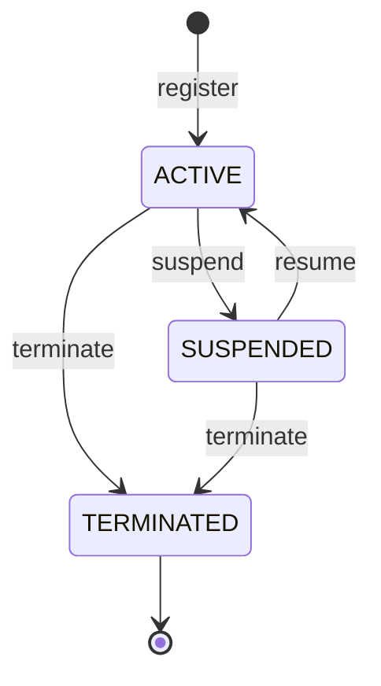

# 상태 머신: 운영자

- 작성일: 2026-08-06
- 상태: 검토대기
- 대상 애그리게이트: `Operator` (C7 인증)
- 양식: `study/project-workflow/phase2/05-state-machine-format.md`

---

## 1. 상태 목록

| 상태 | 코드명 | 뜻 | 종료 | 진입 조건 |
|---|---|---|---|---|
| 정상 | `ACTIVE` | 부여된 권한으로 일할 수 있다 | ✕ | 등록 시 · 정지 해제 |
| 정지 | `SUSPENDED` | 휴직·조사 등으로 **일시 중지**. ★ **유효 권한이 0**이지만 grant 레코드는 그대로다 | ✕ | 책임자 요청 |
| 해지 | `TERMINATED` | 퇴사·계정 폐기. **되돌릴 수 없다** | **✓** | 책임자 요청 |

### 권한 단계는 상태가 아니다

`RoleGrant`는 **별도 애그리게이트**이고 한 운영자가 여러 개를 동시에 가질 수 있다. 상태로 올리면 3개 상태가 **단계 조합의 수만큼** 늘어나고, 부여·회수마다 운영자가 전이한다.

| 확인 | |
|---|---|
| 상태는 **계정의 생사**만 든다 | `ACTIVE`가 곧 "권한이 있다"는 뜻이 아니다 — 등록 직후의 운영자는 권한이 하나도 없다 |
| 권한 유무는 **판정 시점 계산**이다 | `effective(operatorId, at)` — `role-grant.md` §4 |

> ★ **다만 상태는 판정의 첫 관문이다**: `status ≠ ACTIVE` 이면 유효 권한이 **0**이다(INV-P1). 상태 게이트가 grant보다 **먼저** 판정된다.

---

## 2. 전이도

---

## 3. 전이 표

| # | 현재 | 전이 | 다음 | 조건 | 부수 효과 | 근거 |
|---|---|---|---|---|---|---|
| **O1** | (생성) | `register` | `ACTIVE` | 대상 조직 존재·**`ACTIVE`**(INV-O2 ①) · 주체 = **책임자 + 그 조직을 포함하는 스코프**(BR-55) | `authzVersion = 1`. ★ **권한은 하나도 없다** — 등록은 계정 생성이지 부여가 아니다 | 애그리게이트 §5 |
| **O2** | `ACTIVE` | `suspend` | `SUSPENDED` | 주체 = **책임자 + 대상 포함 스코프**(BR-55) | ★ **유효 권한 즉시 0**(INV-P1) · **`authzVersion` 증가**(R4 전파 — D-8) · **grant 레코드는 건드리지 않는다**(가역이므로 회수가 아니다) | 애그리게이트 §5 |
| **O3** | `SUSPENDED` | `resume` | `ACTIVE` | 주체 = **책임자 + 대상 포함 스코프**(BR-55) | ★ **정지 전 권한이 그대로 돌아온다** — 회수하지 않았기 때문이다 · **`authzVersion` 증가** | 애그리게이트 §5 |
| **O4** | `ACTIVE`·`SUSPENDED` | `terminate` | `TERMINATED` | 주체 = **책임자 + 대상 포함 스코프**(BR-55) | **되돌릴 수 없다**(INV-P2) · ★ **보유한 전 grant에 회수 레코드**(`reason = TERMINATION` — D-9 · INV-P5) · ★ **그가 부여자인 유효 grant는 재검토 큐로**(자동 회수하지 않는다 — D-9) · **`authzVersion` 증가** | D-9 |
| **O5** | `ACTIVE`·`SUSPENDED` | `transfer` | **상태 불변** | 새 조직 존재·**`ACTIVE`**(아니면 OF7) · 주체 = **책임자 + 대상 포함 스코프**(BR-55) | `homeOrgId` 교체 · ★ **옛 소속 스코프의 grant 자동 회수**(`reason = TRANSFER` — D-9). **타 조직 스코프 grant는 남는다**(파견·겸직 — D-3) · 새 소속 권한은 **자동으로 생기지 않는다** · **`authzVersion` 증가** | D-9 |

> ★ **O5가 상태를 바꾸지 않는 것이 요점이다.** 소속은 **인사 사실**이고 스코프 정본은 grant다(D-3) — 이동만으로 권한이 넓어지지 않는다. 그런데도 **옛 스코프 grant를 회수**하는 이유는, 회수하지 않으면 *"그 조직 사람만 그 조직 것을 만진다"* 가 **인사 이동에서만 조용히 깨지기** 때문이다.
>
> ⚠️ **O2(정지)와 O4(해지)의 처리가 다르다.** 정지는 **상태 게이트**로만 막고(가역), 해지는 **레코드까지 회수**한다(불가역). 정지에서 회수해 버리면 해제 시 되돌릴 것이 없어 **전 권한을 다시 부여**해야 하고, 그 재부여는 다시 2인 승인 대상이 된다(BR-56 ⑥) — 휴직 복귀가 승인 절차 전체를 되풀이한다.
>
> ⚠️ **O4의 재검토 큐를 자동 회수로 바꾸면 안 된다.** 책임자 한 명의 퇴사가 그가 부여한 전원의 권한을 동시에 끊어 **업무가 멈춘다.** 큐는 사람이 판정한다(`revoke` 또는 `recertify`).

---

## 4. 금지된 전이 ★★

| # | 현재 | 시도 | 왜 금지인가 | 위반 시 | 응답 |
|---|---|---|---|---|---|
| **OF1** | `TERMINATED` | `suspend` | 이미 사용 불가 | 의미 없는 상태 변경 | `OPERATOR_TERMINATED` |
| **OF2** | `TERMINATED` | `resume` | 해지는 되돌릴 수 없다 (INV-P2) | **죽은 계정의 부활** — 해지 이후 행위를 귀속할 수 없다 | `OPERATOR_TERMINATED` |
| **OF3** | `TERMINATED` | `terminate` | 이미 해지 — **명시 거절**(카드 CF8·CDS3 통일 원칙) | 재해지 무음 통과 = 상태 오인 | `ALREADY_TERMINATED` |
| **OF4** | `TERMINATED` | `transfer` | 소속을 옮길 사람이 없다. ★ **`homeOrgId`가 바뀌면 해지 시점의 인사 사실이 사후에 고쳐진다** | 감사가 *"해지 당시 어느 소속이었나"* 를 못 낸다 | `OPERATOR_TERMINATED` |
| **OF5** | `SUSPENDED` | `suspend` | 이미 정지 — **명시 거절**(카드 CF9 논거) | 재정지 무음 통과 = **요청자가 이미 정지된 줄 모른 채 조치를 마쳤다고 믿는다** | `ALREADY_SUSPENDED` |
| **OF6** | `ACTIVE` | `resume` | 정지 상태가 아니다 — **명시 거절**(카드 CF10 논거) | 해제 무음 통과 = *"정지였다가 풀렸다"* 는 오인 | `ALREADY_ACTIVE` |
| **OF7** | `ACTIVE`·`SUSPENDED` | `transfer` (**대상 조직이 `CLOSED`**) | 폐쇄 조직에 신규 소속 금지 (INV-O2 ① · D-11) | 닫힌 조직에 사람이 매달린다 — 흡수(org-unit.md §4)와 이중 판정 | `ORG_UNIT_CLOSED` |

> ⚠️ **OF1~OF4는 "해지가 종료 상태"라는 한 문장의 네 얼굴이다.** 넷을 따로 적는 이유는, 하나로 뭉치면 **응답 코드가 뭉개져** 요청자가 무엇이 잘못됐는지 모르기 때문이다(승인 요청의 `ALREADY_*` 4종 분리와 같은 판정).
>
> ⚠️ **권한 부여·회수는 이 표에 없다.** `RoleGrant`의 조작이며 운영자 상태를 바꾸지 않는다 — 다만 **`TERMINATED`에 신규 부여는 금지**(INV-G4 · F-34)이고 그 판정은 `role-grant.md`가 든다.

---

## 5. 전이 매트릭스

> **`register`는 이 표에 없다.** 생성 전이라 "현재 상태"가 존재하지 않는다 (카드가 `발급`을 넣지 않는 것과 같다).

| 현재 \ 조작 | `suspend` | `resume` | `terminate` | `transfer` |
|---|---|---|---|---|
| **`ACTIVE`** | **O** (O2) | X (OF6) | **O** (O4) | **O/X** (O5 / OF7) |
| **`SUSPENDED`** | X (OF5) | **O** (O3) | **O** (O4) | **O/X** (O5 / OF7) |
| **`TERMINATED`** | X (OF1) | X (OF2) | X (OF3) | X (OF4) |

**O 4 · O/X 2 · X 6 = 12칸** (◎ 없음 — CDS3 통일 원칙: 재호출은 전부 명시 거절)

> ★ **`transfer`가 조건부인 이유는 상태가 아니라 대상 조직이다.** 운영자 쪽 상태는 둘 다 정상이고, **가는 곳이 닫혀 있으면** 막힌다(OF7). 상태만으로는 판정할 수 없는 칸이다.
>
> ★ **`SUSPENDED` 행의 `transfer`를 허용한 근거**: 정직 중 소속 변경이 실무에 있고, 이동은 **권한을 넓히지 않고 오히려 옛 스코프를 회수**한다(안전 방향). 다만 *"정지된 사람을 옮기고 있다"* 는 신호를 놓칠 수 있다 — **OPS1**.

---

## 6. 동시성

| 상황 | 처리 |
|---|---|
| **같은 운영자에 동시 상태 변경** | **운영자 단위 낙관적 락.** 정지와 해지가 겹치면 하나만 성공하고, 진 쪽은 상태를 다시 읽어 OF1·OF3으로 거절된다 |
| **상태 변경과 권한 부여의 경합** | ★ **부여가 대상 운영자 행을 잠근다**(`role-grant.md` §8 — 배타성 판정 + `authzVersion` 증가). 잠금이 없으면 **해지 커밋 직후 부여가 성공**해 죽은 계정에 권한이 붙는다 |
| **정지와 진행 중인 조작의 경합** | ★ **정지가 졌다면 그 조작은 유효하다** — 판정 시점에 권한이 있었다(AU-4 진입 시 1회). 카드 정지와 승인의 경합과 같은 판정이다 |
| **`transfer`와 그 조직의 `close` 경합** | 대상 조직 행을 공유 잠금으로 읽는다 — 진 쪽은 OF7 |
| 전이 중 프로세스 종료 | 단일 애그리게이트 커밋이라 원자적이다. ★ **단 `terminate`·`transfer`의 grant 회수는 같은 커밋**이어야 한다(D-9) — 갈리면 *"해지됐는데 권한이 살아 있는"* 구간이 남는다. 대장 경계 배정은 `operator.md` **OP1** |

---

## 7. 시간 기반 전이

| 현재 | 조건 | 다음 | 누가 | 주기 |
|---|---|---|---|---|
| — | — | — | — | **없음** |

**이 애그리게이트에는 시간이 일으키는 상태 전이가 없다.** 정지·해지는 전부 사람의 조작이다.

> ★ **시간이 움직이는 것은 상태가 아니라 권한이다** — `RoleGrant`의 `expiresAt` 경과가 그것이고, **배치가 아니라 판정 시점 계산**이다(`role-grant.md` §4). 만료 배치를 만들면 BR-54의 시스템 주체 예외 목록에 경로가 하나 늘고, **배치가 밀리는 동안 만료된 권한이 계속 통한다.**

---

## 8. 의문

### 열린 의문

| # | 의문 | 영향 |
|---|---|---|
| **OPS1** | **정지 중인 운영자의 소속 이동(O5)을 허용하는 것이 맞는가.** 안전 방향이지만(옛 스코프 회수), 운영자가 정지된 계정을 인사 처리 중이라는 신호를 놓칠 수 있다 — 카드 **CDS1**(정지 중 한도 변경)과 같은 계열의 의문이다 | 감사 로그 설계 · 운영 화면 |

> **운영자 축의 나머지 의문**(OP1 경계 배정 · OP2 캐시 수명 수치 · OP3 `linkedCustomerId` 채움)은 애그리게이트 명세 `../aggregates/operator.md` §9가 든다 — 자금에 직접 걸리지 않으므로 여기로 승격하지 않는다.

---

## 변경 이력

| 버전 | 일자 | 내용 |
|---|---|---|
| v0.1 | 2026-08-06 | 최초 작성 — C7 신설. 상태 3종 · 전이 5종(등록·정지·해제·해지 + ★ **`transfer`는 상태 불변**) · 금지 7종 · 12칸. 정지는 **상태 게이트**로만 막고 해지는 **레코드까지 회수**하는 비대칭(D-9)과 **재검토 큐**(자동 회수 아님)를 명시 |
