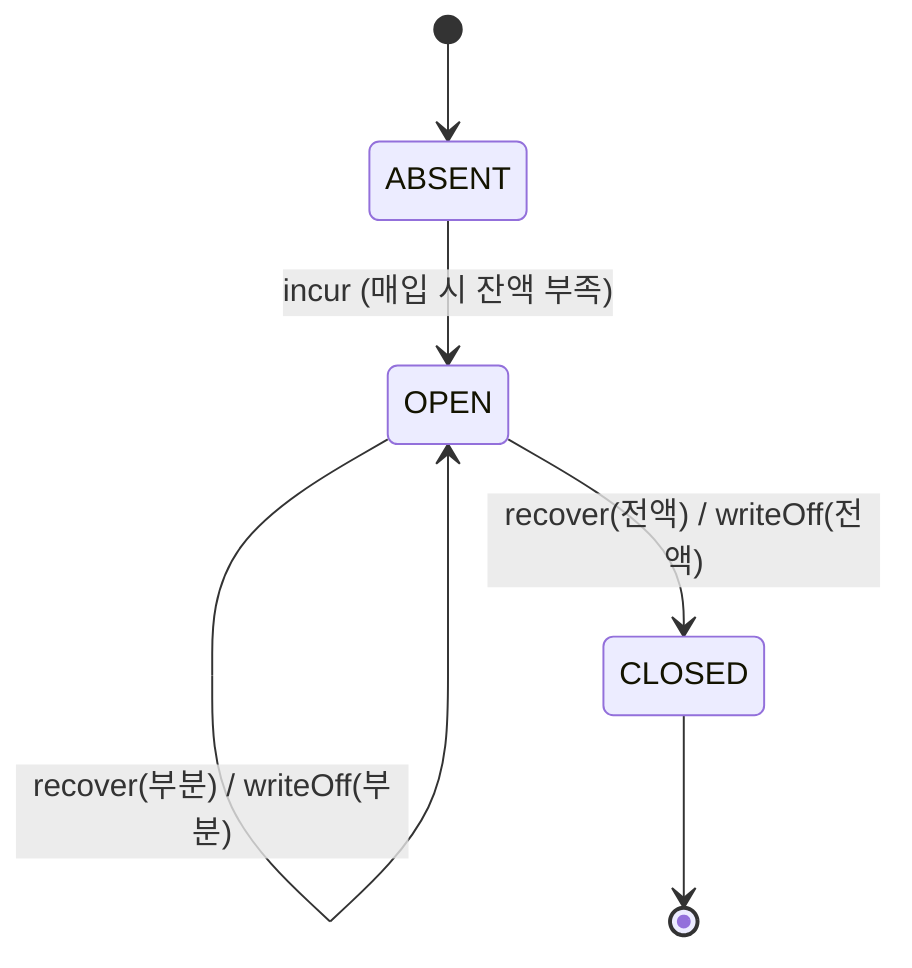

# 상태 머신: 미수

- 작성일: 2026-08-04
- 상태: 검토대기
- 대상 애그리게이트: `Receivable`
- 양식: `study/project-workflow/phase2/05-state-machine-format.md`
- 근거: **DC-001** (합계 필드의 소유와 검증)

> **상태가 둘뿐이라 이 문서의 값어치는 §4 금지 전이에 있다.** 특히 **VF1(종결된 채권의 재회수)** — 4차 리뷰가 치명으로 잡은 결함이며, 이전 구조에서는 그것을 막을 자리가 **어디에도 없었다.**

---

## 1. 상태 목록

| 상태 | 코드명 | 뜻 | 종료 | 진입 조건 |
|---|---|---|---|---|
| **없음** | `ABSENT` | 이 거래에 채권이 없다 | ✕ | 초기 |
| 미결 | `OPEN` | 잔여가 남아 있다 (`outstanding() > 0`) | ✕ | 매입 시 잔액 부족 (BR-20) |
| 종결 | `CLOSED` | `outstanding() == 0` — 회수·소멸·둘의 조합 | **✓** | 잔여가 0이 된 시점 |

### 왜 둘뿐인가

| 나누고 싶은 유혹 | 왜 안 나눴나 |
|---|---|
| 미결 / **부분회수** | **허용되는 조작이 같다.** 진행 정도는 `recoveredAmount`가 말한다 (양식 §4) |
| 종결 사유를 **회수완료 / 소멸** 로 | 전액 회수 · 전액 소멸 · **둘의 조합**이 모두 가능하다. 조합에서 답이 없어지고, 사유는 두 금액 필드에 이미 드러난다 |

> **보류(`frozen`)는 상태가 아니라 직교 플래그다.** `recover` **하나만** 막는다 — 상태로 올리면 2종이 4종이 되고 얻는 것이 없다 (README ⑥).

> ⚠️ **`CLOSED`에 삭제·정리 전이가 없다.** 미수는 채권 이력이므로 종결 후에도 남는다. 영원히 회수되지 않는 채권의 처리(대손)는 현 범위 밖 → **RCS2**.

---

## 2. 전이도

---

## 3. 전이 표

| # | 현재 | 전이 | 다음 | 조건 | 부수 효과 | 근거 |
|---|---|---|---|---|---|---|
| V1 | `ABSENT` | `incur` | `OPEN` | `amount > 0` · 같은 `(origin, sourceRef)` 없음 (INV-6) | 채권 생성 · `origin`·`sourceRef` 확정 · `incurredBusinessDate` 확정(FIFO 키) · 전표는 **`origin`별로 갈린다**(`CAPTURE` → 대) 매입사 미지급금 / `DEPOSIT_REVERSAL` → 대) 예치금) | BR-20·38 |
| V2 | `OPEN` | `recover` (**잔여 > 0 유지**) | `OPEN` | `frozen = false` AND `amount ≤ outstanding()` | `recoveredAmount` 증가 · 전표 `차) 예치금 / 대) 미수금` | BR-34 |
| V3 | `OPEN` | `recover` (**잔여 0이 됨**) | `CLOSED` | `frozen = false` AND `amount ≤ outstanding()` | `recoveredAmount` 증가 · **계좌가 자기 `receivableBlockLifted`를 재평가**(E3에 계좌가 있다 — 미수가 계좌 필드를 직접 바꾸지 않는다) | BR-34·45 |
| V4 | `OPEN` | `writeOff` (**잔여 > 0 유지**) | `OPEN` | **`amount > 0`** AND `amount ≤ outstanding()`. **`frozen`과 무관** | `writtenOffAmount` 증가 · 전표 `차) 매입사 미지급금 / 대) 미수금`. **자금 이동 없음** | BR-43 ① |
| V5 | `OPEN` | `writeOff` (**잔여 0이 됨**) | `CLOSED` | `amount > 0` AND `amount ≤ outstanding()`. **`frozen`과 무관** | `writtenOffAmount` 증가 · 전표 `차) 매입사 미지급금 / 대) 미수금` · **자금 이동 없음** · **계좌가 자기 차단 플래그를 재평가**(E4에 계좌가 있다) | BR-43 ①·45 |
| V6 | `OPEN` · `CLOSED` | `freeze` / `unfreeze` | **상태 불변** | 운영자 조작 (`freeze`는 `OPEN`만) | 회수 대상 선정에서 제외 / 복귀 | BR-28 |

> ⚠️ **부수 효과·조건 열에 `〃`를 쓰지 않는다** (애그리게이트 README). 위 표에서 전부 풀어 썼다 — 이 프로젝트에서 `〃`가 **네 라운드 연속으로 결함을 만들었다.**

> **V2·V3과 V4·V5가 같은 조작인데 조건이 다르다.**
>
> | | 무엇인가 | 자금이 움직이나 | 보류가 막나 |
> |---|---|---|---|
> | `recover` | 고객이 **갚았다** | ✅ 유입 자금이 채권으로 | ✅ (BR-28) |
> | `writeOff` | 환불로 **채무가 줄었다** | ❌ | ❌ — 우리 조사와 무관한 외부 사실 |
>
> **`writeOff`에 보류를 걸면 안 된다.** 조사가 끝날 때까지 **이미 없어진 채무가 장부에 남는다.**

---

## 4. 금지된 전이 ★★

| # | 현재 | 시도 | 왜 금지인가 | 위반 시 | 응답 |
|---|---|---|---|---|---|
| **VF1** | `CLOSED` | `recover` | ★ **종결된 채권은 회수할 것이 없다** (INV-4) | **없는 채권을 회수한다.** 고객이 낸 돈이 채권으로 흡수되어 잔액이 늘지 않는다 — 4차 리뷰가 치명으로 잡은 결함이며, **이전 구조에서는 막을 자리가 없었다** | `RECEIVABLE_CLOSED` |
| **VF2** | `CLOSED` | `writeOff` | 소멸시킬 잔여가 없다 (INV-4) | 소멸액이 발생액을 넘어 INV-1 위반 | `RECEIVABLE_CLOSED` |
| **VF3** | `OPEN` (**`frozen = true`**) | `recover` | 조사 중 자동 회수는 되돌리기 어렵다 (BR-28) | 조사 결과 채권이 무효였다면 **고객 돈을 부당하게 가져간 것** | 회수 **대상에서 제외** — 오류가 아니라 선정 단계에서 빠진다 |
| **VF4** | `OPEN` | `recover` (**`amount > outstanding()`**) | INV-1 위반 | 발생액보다 많이 회수 — 남는 돈의 귀속이 불명 | `RECOVER_EXCEEDS_OUTSTANDING` |
| **VF5** | `OPEN` | `writeOff` (**`amount > outstanding()`**) | INV-1 위반 | 소멸액이 발생액 초과 | `WRITEOFF_EXCEEDS_OUTSTANDING` |
| **VF6** | `OPEN` · `CLOSED` | `incur` (**같은 `(origin, sourceRef)`**) | 한 발생 원인의 부족분은 **채권 한 건**이다 (INV-6) | 같은 부족분이 두 채권이 되어 **이중 청구** | `RECEIVABLE_ALREADY_EXISTS` |
| **VF7** | `CLOSED` | `freeze` | 조사할 진행 중 회수가 없다 | 운영자 목록에 죽은 건이 쌓인다 | `RECEIVABLE_CLOSED` |
| **VF8** | 모든 상태 | **`amount` 변경 · 삭제** | INV-2 — 발생액은 불변이고 채권 이력은 지워지지 않는다 | 채권액이 사후에 바뀌면 감사 불가. 삭제는 **은폐** | 조작 부재로 강제 |
| **VF9** | `OPEN` · `CLOSED` | `writeOff` (**`amount = 0`**) | 소멸할 것이 없다 | — | **호출부가 걸러야 한다** — 승인 `refund()`는 *소멸액 > 0 이고 미수가 미결일 때만* 호출한다. 조건 없이 부르면 두 번째 환불에서 `CLOSED` 미수에 `writeOff(0)`이 가 **VF2로 정상 환불이 실패**한다 |

> ★ **VF1이 이 문서의 존재 이유다.** 이전 구조에서는 미수가 계좌 합계였고 회수 진행도가 승인에 있어서, *"이 채권은 이미 끝났다"* 를 판정할 주체가 없었다. 그래서 **정산 완료된 거래의 미수가 계속 회수됐다**(4차 Q3 — 치명). 지금은 **한 애그리게이트가 자기 종결을 안다.**
>
> **VF3만 오류가 아니다.** 보류는 정상 상태이고, 회수 **대상 선정 단계에서 걸러진다**(BR-34). 오류로 만들면 정상 입금 처리가 실패한다.
>
> **VF8은 조작 부재로 강제된다.** `amount`를 바꾸거나 채권을 지우는 메서드가 **아예 없다.** 규칙을 문서에만 적으면 언젠가 누가 추가하지만, 조작이 없으면 추가하려는 순간 리뷰에 걸린다.

---

## 5. 전이 매트릭스

| 현재 \ 조작 | `incur` | `recover` | `writeOff` | `freeze` | `unfreeze` |
|---|---|---|---|---|---|
| **`ABSENT`** | **O** (V1) | - | - | - | - |
| **`OPEN`** | X (VF6) | **O/X** (V2·V3 / VF3·VF4) | **O/X** (V4·V5 / VF5·VF9) | **O** (V6) | **O** (V6) |
| **`CLOSED`** | X (VF6) | X (VF1) | X (VF2·VF9) | X (VF7) | **O** (V6) |

**O 4 · O/X 2 · X 5 · - 4 = 15칸**

> ⚠️ **이 표는 `frozen`을 상태로 세지 않는다.** 보류는 `recover` **한 칸**에만 영향을 주는 직교 플래그다(VF3). 상태로 올리면 3행이 6행이 되고 다섯 칸은 그대로다.
>
> **`CLOSED` 행에서 `unfreeze`만 열려 있다.** 보류는 `recover`만 막고 `writeOff`는 막지 않으므로, **보류 중인 미수가 환불로 종결될 수 있다.** 그때 `frozen = true`인 채로 `CLOSED`에 도달하고, 해제 경로가 없으면 **보류 목록에서 내릴 방법이 없다.** 승인의 `freeze`/`unfreeze` 비대칭(F9)과 같은 이유다.
>
> **`X`가 5개인데 그중 4개가 `CLOSED` 행이다.** 이 상태 머신의 방어선은 **"끝난 채권은 아무도 못 건드린다"** 하나로 요약된다.

---

## 6. 동시성

| 상황 | 처리 |
|---|---|
| **회수 대상 조회와 회수의 경합** | **한 트랜잭션**(README E3). 조회 후 커밋 전에 다른 경로가 같은 미수를 회수하면 **미수 단위 락**에서 하나만 성공 |
| **회수와 소멸의 경합** | 둘 다 `outstanding()`을 줄인다. **INV-1이 나중 것을 막는다** — 초과분은 거절되고 재조회하면 정확한 잔여가 보인다 |
| **여러 미수에 걸친 배분 중 일부 실패** | E3가 한 커밋이므로 **전부 반영되거나 전부 롤백.** 부분 배분이 남지 않는다 (계좌 **RC-2**) |
| **보류와 회수의 경합** | 보류가 미수 락을 잡는다. **회수가 이겼다면 그 회수는 유효** — 보류 이전에 들어온 자금이므로 정상이다 |
| **환불과 회수의 동시 도착** | 환불은 승인+미수+계좌(E4), 회수는 계좌+미수들(E3). **미수와 계좌가 교집합**이므로 락이 직렬화한다 |
| **환불 안에서 소멸과 반환액 입금의 순서** | **소멸이 먼저다** (BR-34 예외 ②). 반환액도 계좌 유입이라 순서를 뒤집으면 자기 미수가 회수 대상에 들어가 `recover`가 잔여를 줄이고, 뒤이은 `writeOff`가 거절되어 **환불 전체가 롤백**된다 |
| 배분 대상 미수가 많을 때 | 락 보유 시간이 길어진다 → 대상 수 상한 (RCS3) |

> ⚠️ **E3와 E4가 미수에서 만난다.** 락 순서를 정해 두지 않으면 교착한다 — **미수를 (발생 영업일, 식별자) 순으로 먼저 잠그고** 계좌·승인을 나중에 잡는다. FIFO 정렬 키가 락 순서 키를 겸한다.

---

## 7. 시간 기반 전이

| 현재 | 조건 | 다음 | 누가 | 주기 |
|---|---|---|---|---|
| — | — | — | — | **없음** |

**시간이 일으키는 상태 전이가 없다.** 미수는 스스로 갚히지 않고, 오래됐다는 이유로 사라지지도 않는다.

> **오래된 미수를 자동으로 닫지 않는다.** 자동으로 닫으면 **회수하지 못한 채권이 회수된 것처럼 보인다** — 불일치를 자동 정정하지 않는 것(BR-09)과 같은 이유다. 대신 `incurredBusinessDate`로 **며칠째 미회수인지**가 드러난다.

| 시간과 관련된 것 | 처리 |
|---|---|
| 미회수 기간 | `오늘 − incurredBusinessDate` — 파생 값, 저장하지 않는다 |
| 대손(소멸시효) | **현 범위 밖** → RCS2 |
| 장기 미회수 통지 임계 | 미확정 → RCS4 |

---

## 8. 의문

### 열린 의문

| # | 의문 | 영향 |
|---|---|---|
| **RCS1** | **미수 보류와 승인 보류를 운영자가 어떻게 구분해 보나.** 둘은 이제 별개인데(BR-28), 화면에서 섞여 보이면 운영자가 잘못된 쪽을 푼다 | 운영 화면 · BR-28 |
| **RCS2** | **영원히 회수되지 않는 채권의 처리.** `OPEN`으로 무한히 쌓인다 — 대손 개념이 현 범위에 없다 | 제품 범위 · 원장 계정과목 |
| **RCS3** | 한 계좌의 미수가 많을 때 **배분 대상 수 상한** (E3 락 시간) | 미확정 수치 |
| **RCS4** | 장기 미회수 **통지 임계** | 미확정 수치 |
| **RCS5** | **`DEPOSIT_REVERSAL` 미수의 종결 경로** — 원거래 승인이 없어 `writeOff`가 없다. 회수 외에 닫히는 길이 있는가 (애그리게이트 RC4) | BR-38 |

---

## 변경 이력

| 버전 | 일자 | 내용 |
|---|---|---|
| v0.3 | 2026-08-04 | **DC-001 단계 12** — V1에 `(origin, sourceRef)` 사전조건과 **`origin`별 전표 분기** 명시 · V3·V5의 *"계좌 플래그 해제 판단"* 을 **"계좌가 자기 필드를 재평가"** 로 정정(미수가 남의 애그리게이트를 바꾸는 것으로 읽혔다) |
| v0.2 | 2026-08-04 | **DC-001 단계 10** — V3·V5의 `〃` 제거(네 번째 재발) · **VF9 신설**(`writeOff(0)`이 `CLOSED` 미수에 가 정상 환불을 실패시켰다) · VF6 키를 `(origin, sourceRef)`로 · E4 참여자에 계좌 추가 · 환불 내 소멸/입금 순서 명시 |
| v0.1 | 2026-08-04 | 최초 작성 (**DC-001 단계 4**) — 상태 3종(`ABSENT` 포함), 전이 6종, 금지 8종, 매트릭스 15칸. **VF1(종결된 채권의 재회수 금지)** 이 4차 치명의 재발 방지책이며 이전 구조에는 그 자리가 없었음을 명시. `recover`(보류가 막음)와 `writeOff`(보류 무관)의 구분, `CLOSED`에서 `unfreeze`만 열린 근거, E3·E4 락 순서를 FIFO 키로 겸하는 방침 |
