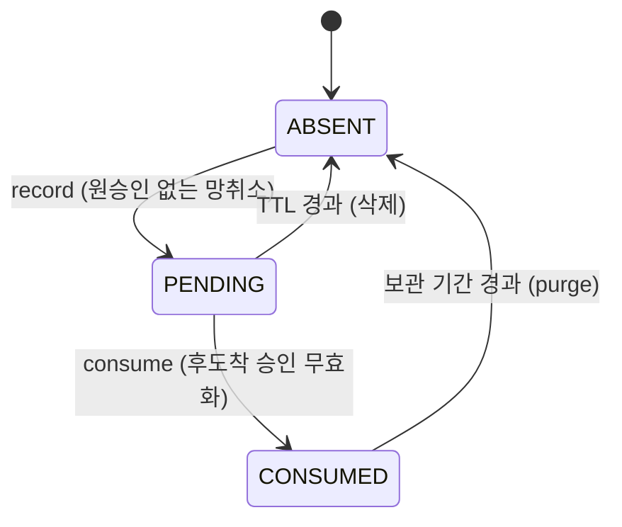

# 상태 머신: 취소 예약 (Tombstone)

- 작성일: 2026-08-04
- 상태: 검토대기
- 대상 애그리게이트: `ReversalTombstone`
- 양식: `study/project-workflow/phase2/05-state-machine-format.md`

> **이 애그리게이트는 두 장군 문제의 실물이다.** 망취소가 원 승인보다 먼저 도착할 수 있다는 사실 하나 때문에 존재한다(BR-22).

---

## 0. "유효한 예약"의 정의 ★

```
유효한 예약  =  레코드가 존재한다  AND  now < expiresAt
```

**만료 시각은 지났는데 정리 배치가 아직 안 돈 구간**이 반드시 존재한다. 그 레코드는 **살아 있지만 써서는 안 된다.**

| 이 정의를 안 쓰면 | 무슨 일이 일어나나 |
|---|---|
| 승인 T1 조건 "예약 **없음**" | 거짓 → 승인이 성립 못 함 |
| 승인 T3 조건 "예약 **존재**" | 참인데 소비는 RF2가 막음 → **`REQUESTED`에서 나갈 길이 없다** |

> **배치를 믿지 않는다.** `consume()`이 시각을 직접 판정하는 것과 같은 이유로, **승인 경로도 "존재"가 아니라 "유효"로 판정**해야 한다. 그러지 않으면 RTS2가 말한 TTL 경계 위험이 **경합이 아니라 배치 지연만으로도** 발생한다.

---

## 1. 상태 목록

| 상태 | 코드명 | 뜻 | 종료 | 진입 조건 |
|---|---|---|---|---|
| **없음** | `ABSENT` | 예약이 없다 — 초기 상태이자 **만료(삭제) 후 상태** | ✕ | 초기 · TTL 경과 후 |
| 대기 | `PENDING` | 뒤늦게 올 승인을 기다린다. **`now ≥ expiresAt`이면 살아 있어도 무효**(§0) | ✕ | `ABSENT`에서 원승인 없는 망취소 수신 (C8) |
| 소비됨 | `CONSUMED` | 후도착 승인을 무효화하는 데 쓰였다 | ✕ | `consume()` |

> **만료가 정상 결말일 수 있다.** 승인 전문이 아예 우리에게 도달하지 않았다면 무효화할 대상이 없다 — 예약은 쓰이지 않고 만료된다. **이것은 실패가 아니다.**
>
> ⚠️ **만료를 `EXPIRED` 상태로 두지 않고 `ABSENT`로 되돌린다.** 애그리게이트 `expire()`의 사후조건이 **레코드 삭제**이기 때문이다. 그래서 만료 뒤 같은 상관 식별자로 망취소가 오면 **새 예약이 생성된다** — 그것이 맞다, 새 취소 의사이므로. 존재하는 채로 두고 `record`를 무시하면 오래된 취소 의사가 관계없는 새 거래를 계속 막는다.

---

## 2. 전이도



---

## 3. 전이 표

| # | 현재 | 전이 | 다음 | 조건 | 부수 효과 | 근거 |
|---|---|---|---|---|---|---|
| R1 | `ABSENT` | `record` | `PENDING` | ★ **같은 기관의 같은 `correlationId`** 예약 없음 — `(발신 기관, correlationId)` 유일(INV-1 · 2026-08-06 **R-06**. 상관 식별자는 매입사가 채번한다. **기관 = ACL이 인증한 발신 기관** — X-6 기관 코드 일치 검증) | `expiresAt` 설정 | BR-22 |
| R2 | `PENDING` | `consume` | `CONSUMED` | 미만료 | **승인이 `VOIDED`로 성립.** 홀딩을 만들지 않는다 | BR-22 · 승인 T3 |
| R3 | `PENDING` | `expire` | **`ABSENT`** | `now ≥ expiresAt` | **레코드 삭제** | BR-22 |
| **R4** | `CONSUMED` | **`purge`** | **`ABSENT`** | 보관 기간 경과 (RTS1) | 레코드 삭제 | BR-22 |

### 소비는 승인 성립과 같은 트랜잭션이다

```
승인 전문 도착
  → 예약 조회 (있음)
  → [ 예약 consume + 승인 VOIDED 생성 ]  ← 한 트랜잭션
  → 응답
```

**나누면 그 사이에 예약이 소비됐는데 승인이 없는 순간이 생긴다.** 그때 같은 상관 식별자로 승인이 또 오면 **예약이 이미 소비되어 통과**한다 — 취소되었어야 할 홀딩이 되살아난다.

---

## 4. 금지된 전이 ★★

| # | 현재 | 시도 | 왜 금지인가 | 위반 시 | 응답 |
|---|---|---|---|---|---|
| **RF1** | `CONSUMED` | `consume` | **한 예약은 한 승인만 무효화한다** (INV-3) | 재전송된 정상 승인까지 무효화 — **취소되지 않았어야 할 거래가 죽는다** | `TOMBSTONE_CONSUMED` |
| **RF2** | `PENDING` (**만료 시각 경과, 정리 배치 미실행**) | `consume` | 보관 기간이 지났다 — 레코드가 남아 있을 뿐이다 | 오래된 취소 의사로 **한참 뒤의 새 승인**을 죽인다 | `TOMBSTONE_EXPIRED` |
| **RF3** | `PENDING` | `record` (★ **같은 기관의 같은 키** — R-06) | INV-1 위반 | 같은 기관의 같은 상관 식별자에 예약이 둘 → 중복 무효화 (★ **기관이 다르면 위반이 아니다** — 남의 승인을 무효화하지 않는다) | **오류가 아니라 무시** (◎) — 중복 망취소는 정상이다 (BR-13) |
| **RF4** | `CONSUMED` | `expire` | 만료가 아니라 **보관 기간 종료**다 — `purge`(R4)가 담당한다 | 소비 이력이 만료로 덮인다 — **왜 무효화됐는지 추적 불가** | `TOMBSTONE_CONSUMED` |
| **RF6** | `PENDING` | `purge` | 아직 소비되지 않았다 — 만료는 `expire`(R3)가 담당한다 | 살아 있는 예약이 사라져 **뒤늦은 승인을 못 막는다** | `TOMBSTONE_NOT_CONSUMED` |
| **RF5** | `CONSUMED` | `record` (**같은 키**) | 이미 소비된 예약이 남아 있는 동안은 새 예약을 만들지 않는다 (RTS1) | 소비 이력이 새 예약에 덮인다 | **무시** (◎) |

> **RF1이 이 문서에서 가장 위험하다.** 예약이 반복 소비되면 **정상 거래가 죽는다.** 망취소는 응답 유실 때 오는 것이라 매입사가 같은 상관 식별자로 재시도할 수 있고, 그중 하나는 정상 승인일 수 있다.

---

## 5. 전이 매트릭스

| 현재 \ 조작 | `record` | `consume` | `expire` | `purge` |
|---|---|---|---|---|
| **`ABSENT`** | **O** — 새 예약 생성 (R1) | - | - | - |
| **`PENDING`** | **O/◎** (만료 경과면 새 예약으로 대체 / 유효하면 ◎ — RF3) | **O/X** (R2 / RF2) | **O** (R3) | X (RF6) |
| **`CONSUMED`** | ◎ (RF5) | X (RF1) | X (RF4) | **O** (R4) |

**O 3 · O/X 1 · O/◎ 1 · X 3 · ◎ 1 · - 3 = 12칸**

> **중복 망취소는 정상 경로다**(BR-13) — 오류로 만들면 안 된다. 다만 **유효한** 예약이 이미 있으면 새로 만들지 않는다.
>
> ⚠️ **`PENDING`/`record`가 조건부인 이유가 §0이다.** 만료 시각이 지난(무효한) 예약에 새 망취소가 오는데 `◎`로 버리면, **새 취소 의사가 조용히 사라지고** 직후 정리 배치가 삭제하면 뒤늦은 승인을 막을 것이 없어진다. 만료 경과 상태에서는 **새 예약으로 대체**한다.
>
> **`PENDING/consume`이 조건부인 것이 RTS2의 실체다.** 만료 시각은 지났는데 정리 배치가 아직 안 돌았을 때, 그 레코드는 **존재하지만 써서는 안 된다.** `consume()`이 시각을 직접 판정해야 하며(배치를 믿으면 안 된다), 이 판정이 빠지면 오래된 취소 의사가 새 승인을 죽인다.

> **`ABSENT` 행이 초기 상태이자 만료 후 상태다.** 만료는 레코드 삭제이므로 별도 상태가 아니라 여기로 돌아오는 것이며, `record`는 정상적으로 새 예약을 만든다. 이 행을 "존재하며 전부 X"로 적으면 **만료 후 도착한 새 취소 의사를 영영 못 받는다.**

---

## 6. 동시성

| 상황 | 처리 |
|---|---|
| **망취소와 원승인이 거의 동시 도착** | ★ **`(발신 기관, correlationId)` 유니크 제약**(R-06 — 제약의 열은 **둘**이다. 기관을 빼면 제약이 남의 키 공간까지 막는다) + 승인 성립 트랜잭션에서 **예약 조회·소비를 함께** 수행. 승인이 먼저 커밋되면 예약은 만들어지지 않고 정상 망취소 경로(승인 T4)를 탄다 |
| **중복 망취소 동시 수신** | 유니크 제약으로 하나만 `record` 성공, 나머지는 `◎` |
| **예약 소비와 만료 배치의 경합** | 애그리게이트 락 — `consume`이 이기면 `CONSUMED`(만료 대상에서 빠짐), `expire`가 이기면 그 승인은 예약 없이 정상 성립한다 → RTS2 |

> ⚠️ **마지막 행이 실질 위험이다.** TTL 경계에서 만료가 근소하게 이기면 **취소되었어야 할 승인이 홀딩까지 잡고 성립한다.** TTL을 넉넉히 잡는 것 외에 구조적 해법이 없다.

---

## 7. 시간 기반 전이 ★

| 현재 | 조건 | 다음 | 누가 | 주기 |
|---|---|---|---|---|
| `PENDING` | `now ≥ expiresAt` | **`ABSENT`** (삭제) | 만료 처리 배치 | 미확정 |
| `CONSUMED` | 보관 기간 경과 | **`ABSENT`** (`purge` — R4) | 정리 배치 | 미확정 (RTS1) |


### TTL이 이 애그리게이트의 유일한 설계 변수다

| TTL이 짧으면 | TTL이 길면 |
|---|---|
| 뒤늦게 온 승인을 **못 막는다** (동시성 마지막 행) | 오래된 취소 의사가 **관계없는 새 승인을 죽일** 위험 |
| 취소되었어야 할 홀딩이 되살아난다 | 저장 부담 · 재사용 키 충돌 |

> **승인 전문의 최대 지연 시간보다 충분히 길어야 한다.** 매입사와 합의된 타임아웃 값이 그 하한이다 — Phase 4 계약 설계에서 확정한다.

---

## 8. 의문

### 열린 의문

| # | 의문 | 영향 |
|---|---|---|
| **RTS1** | **소비된 예약을 즉시 삭제하는가, 만료까지 남기는가.** 남기면 같은 상관 식별자의 **재요청을 계속 막을 수 있다** — 그것이 이득인지 과잉인지 판단 필요 (애그리게이트 RT2) | 재전송 처리 |
| **RTS2** | **TTL 경계 경합** — 만료가 근소하게 이겨 취소되었어야 할 승인이 성립하면, 사후에 잡을 방법이 있는가. 대사에서 M1(미매입)으로 나타날 뿐이다 | 대사 · 운영 |
| ~~RTS3~~ | ✅ **닫힘 (2026-08-06 — UC9-1 잔재 정정)**: TTL = **1시간 확정** (BR-22 [1차] NICEPAY — 확정 수치 표가 정본이었고 이 행이 갱신 누락이었다) | — |

---

## 변경 이력

| 버전 | 일자 | 내용 |
|---|---|---|
| v0.6 | 2026-08-06 | **R-06 기관 축 전파 일소**: **R1 조건**(`(발신 기관, correlationId)` 유일 — 상관 식별자는 매입사 채번) · **RF3 판정 문면**(기관이 다르면 위반이 아니다) · §동시성 유니크 제약 열 = 둘. 애그리게이트 v1.3(INV-1·`institution`)의 SM 착지 |
| v0.5 | 2026-08-06 | **RTS3 닫힘** — TTL 1시간(BR-22 확정 수치)이 정본, "미확정" 표기는 갱신 누락(UC-09 작성이 발견한 정본 간 불일치 UC9-1) |
| v0.4 | 2026-08-04 | 재점검 반영 — ★ **§0 "유효한 예약" 정의 신설**. 만료 경과·미삭제 구간에서 승인이 T1도 T3도 못 타 **`REQUESTED`에서 나갈 길이 없었다** · `PENDING/record`를 조건부로(무효 예약에 온 새 취소 의사가 조용히 버려졌다) · **R4 `purge` 신설**(§7의 `CONSUMED` 삭제에 실행 주체가 없었다), `CONSUMED`는 종료가 아님 |
| v0.3 | 2026-08-04 | post-fix 반영 — `EXPIRED`를 **`ABSENT`(초기 = 만료 후)** 로 통일. "부재"라고 고쳐 놓고 종료 상태로 계속 집계하고 있었다 |
| v0.2 | 2026-08-04 | 듀얼 리뷰 반영 — **`EXPIRED`를 "부재"로 정정**(애그리게이트 `expire()`는 삭제인데 상태 머신은 존재한다고 봐 `record` 처리가 문서마다 갈렸다). `EXPIRED/record`를 ◎ → **O(새 예약 생성)** · **RF5 신설**(RF3의 상태 범위 오참조 정정) · 집계 정정(9칸) |
| v0.1 | 2026-08-04 | 최초 작성 — 상태 3종, 전이 3종, 금지 4종. `EXPIRED`가 정상 결말임을 명시, 중복 망취소(`record` 전 상태 `◎`)와 반복 소비 금지(RF1)의 구분, TTL 경계 경합을 열린 위험으로 식별 |
