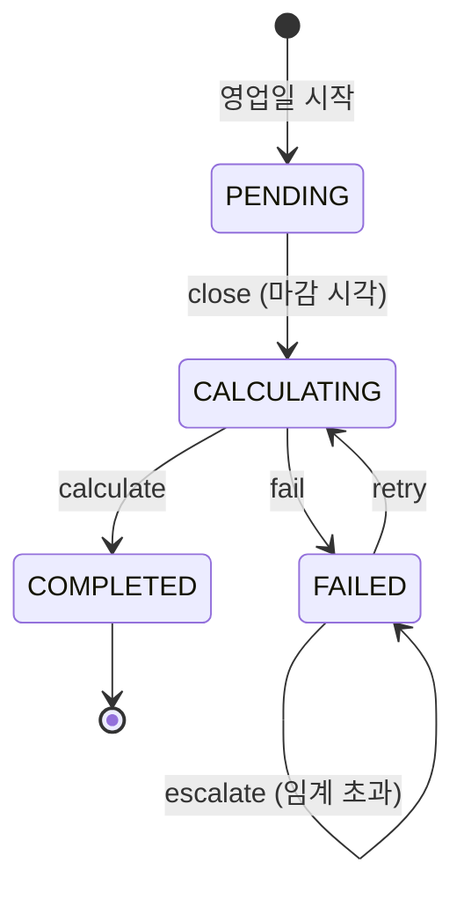

# 상태 머신: 정산

- 작성일: 2026-08-04
- 상태: 검토대기
- 대상 애그리게이트: `Settlement`
- 양식: `study/project-workflow/phase2/05-state-machine-format.md`

---

## 1. 상태 목록

| 상태 | 코드명 | 뜻 | 종료 | 진입 조건 |
|---|---|---|---|---|
| 마감대기 | `PENDING` | 그 영업일이 아직 열려 있다 | ✕ | 영업일 시작 |
| 산출중 | `CALCULATING` | 마감됐고 순액을 계산하는 중 | ✕ | 마감 시각 도래 (BR-06) |
| 완료 | `COMPLETED` | **순액 확정** | **✓** | `calculate()` 성공 |
| 실패 | `FAILED` | 산출 실패. **재시도 대상** | ✕ | `fail()` |

> **`FAILED`는 종료가 아니다.** 매입 배치가 `INTERRUPTED`인 것과 같은 이유다 — 재시도하면 된다. 다만 배치와 달리 **정산은 재산출이 멱등**(집계이므로)이라 재개 지점을 기억할 필요가 없다.

---

## 2. 전이도



---

## 3. 전이 표

| # | 현재 | 전이 | 다음 | 조건 | 부수 효과 | 근거 |
|---|---|---|---|---|---|---|
| S1 | `PENDING` | `close` | `CALCULATING` | 마감 시각 도래 | **이후 거래는 다음 영업일 귀속** | BR-06·14 |
| S2 | `CALCULATING` | `calculate` | `COMPLETED` | 집계 성공 | `netAmount` 확정 · 전표 기표 · 승인들 `SETTLED` | BR-21 |
| S3 | `CALCULATING` | `fail` | `FAILED` | 집계 실패 | `retryCount` 증가 | BR-37 |
| S4 | `FAILED` | `retry` | `CALCULATING` | `retryCount < 임계` | — | BR-37 |
| S5 | `FAILED` | `escalate` | 상태 불변 | `retryCount ≥ 임계` | **운영자 목록에 오름** | BR-37 |

### 재산출이 멱등한 이유 (BR-37)

```
calculate() 를 N회 실행 → netAmount 동일
```

정산은 **집계**다. 매입 반영처럼 상태를 누적하지 않으므로 몇 번을 계산해도 결과가 같다. **이것이 자동 재시도를 허용할 수 있는 근거**이며, 매입(BR-23)이 파일·레코드 멱등을 따로 둬야 했던 것과 대비된다.

> ⚠️ **단, `calculate()`의 부수 효과는 멱등이 아니다.** 전표 기표와 승인의 `markSettled`는 재실행하면 중복된다. **순액 산출(멱등)과 그 결과의 반영(비멱등)을 나누고**, 후자에 별도 방어가 필요하다 → STS1.

---

## 4. 금지된 전이 ★★

| # | 현재 | 시도 | 왜 금지인가 | 위반 시 | 응답 |
|---|---|---|---|---|---|
| **SF1** | `COMPLETED` | `calculate` | 확정된 순액은 바뀌지 않는다 (INV-4) | **마감된 영업일의 순액이 사후에 움직인다** — BR-47이 막으려던 바로 그것 | `SETTLEMENT_COMPLETED` |
| **SF2** | `COMPLETED` | `close` · `retry` · `fail` | 끝난 영업일 | 확정 후 재계산 경로가 열린다 | `SETTLEMENT_COMPLETED` |
| **SF3** | `PENDING` | `calculate` | **마감하지 않고 집계**하면 그 뒤에 들어온 거래가 빠진다 | **순액 누락** — 매입사에 덜 지급하고 대사에서야 발견 | `SETTLEMENT_NOT_CLOSED` |
| **SF4** | `PENDING` | `retry` · `fail` | 시도한 적이 없다 | `retryCount`가 근거 없이 증가 | `SETTLEMENT_NOT_CALCULATING` |
| **SF5** | `CALCULATING` | `close` | 이미 마감됐다 | 마감 시각이 덮어써져 **귀속 경계가 흔들린다** | `SETTLEMENT_ALREADY_CLOSED` |
| **SF6** | `FAILED` | `retry` (**임계 초과**) | 무한 재시도는 실패를 감춘다 | 운영자가 영원히 모른다 | `SETTLEMENT_RETRY_EXHAUSTED` → `escalate` |
| **SF7** | 모든 상태 | `close` (**같은 영업일 두 번**) | INV-1 위반 | 같은 날 정산이 둘 → **이중 지급** | `SETTLEMENT_DUPLICATE_DATE` |

> **SF3이 가장 조용한 실패다.** 마감 없이 집계해도 **에러가 나지 않는다** — 그냥 숫자가 작게 나올 뿐이다. "에러 없이 돌았다 ≠ 완료"의 전형이며, 그래서 `close`를 별도 전이로 뒀다. 마감과 집계를 한 조작으로 합치면 이 금지를 표현할 자리가 없어진다.

---

## 5. 전이 매트릭스

| 현재 \ 조작 | `close` | `calculate` | `fail` | `retry` | `escalate` |
|---|---|---|---|---|---|
| **`PENDING`** | **O** (S1) | X (SF3) | X (SF4) | X (SF4) | X |
| **`CALCULATING`** | X (SF5) | **O** (S2) | **O** (S3) | ◎ | X |
| **`FAILED`** | X (SF2) | X | X | **O** (S4) / X (SF6) | **O** (S5) |
| **`COMPLETED`** | X (SF2) | X (SF1) | X (SF2) | X (SF2) | X |

**O 5 · X 14 · ◎ 1 = 20칸**

> `retry` 칸이 `FAILED`에서 조건부다 — `retryCount < 임계`면 `O`, 넘으면 `X`이고 `escalate`로 간다.

---

## 6. 동시성

| 상황 | 처리 |
|---|---|
| **같은 영업일에 정산 배치 중복 기동** | `businessDate` 유니크 제약 (INV-1). 애플리케이션 락만으로는 부족하다 |
| **마감 직전에 도착한 매입** | 마감 시각을 기준으로 **귀속 영업일이 갈린다** (BR-14). 경계 판정은 **인자로 받은 시각**으로 통일 |
| 재시도 중 원 배치가 되살아남 | 상태가 `CALCULATING`이므로 두 번째 `retry`는 `◎`. 결과가 멱등이라 무해 |
| 정산과 환불의 경합 | 정산 완료 후 도착한 환불은 **원거래를 건드리지 않고** 다음 영업일 차감분으로 (BR-43) |

---

## 7. 시간 기반 전이 ★

| 현재 | 조건 | 다음 | 누가 | 주기 |
|---|---|---|---|---|
| `PENDING` | **마감 시각 도래** | `CALCULATING` | 정산 배치 | 영업일 1회 (BR-06, 임시 23:00) |
| `CALCULATING` | 즉시 (마감에 이어) | `COMPLETED`/`FAILED` | 정산 배치 | 〃 (임시 D+1 09:00) |
| `FAILED` | **재시도 간격 경과** | `CALCULATING` | 재시도 스케줄러 | 미확정 (BR-37) |

### 빠뜨리기 쉬운 것

| 항목 | 처리 |
|---|---|
| **비영업일** | 공휴일·주말은 정산하지 않는다. 다음 영업일에 **여러 날치가 각각의 `Settlement`로** 산출된다 — 합치지 않는다 (BR-25) |
| **`CALCULATING`에 갇히는 경우** | 배치가 죽으면 `fail()`을 호출할 주체가 없다. 매입 배치(BFS3)와 같은 감시가 필요하다 → STS2 |
| 미결 정산 허용 시간 | 미확정 (BR-37). 넘으면 운영자 통지 |

---

## 8. 의문

### 열린 의문

| # | 의문 | 영향 |
|---|---|---|
| **STS1** | **`calculate()`의 부수 효과(전표 기표·`markSettled`)를 어떻게 멱등하게 만드는가.** 순액 산출은 멱등이지만 반영은 아니다. 재시도가 전표를 두 번 만들면 BR-08 균형은 유지되면서 금액이 두 배가 된다 | Phase 3 트랜잭션 설계 · BR-37 |
| **STS2** | `CALCULATING` 진척 없음 감시 — 매입 배치와 같은 방식으로 둘 것인가 | 미확정 수치 |
| **STS3** | `captureTotal`을 정산이 **직접 집계**하는가, 결제(C3)가 계산해 보내는가. 전자면 정산이 매입 데이터를 읽어야 해 컨텍스트 경계를 넘는다 | 컨텍스트 맵 · 애그리게이트 ST2 |
| **STS4** | `FAILED`가 종료되지 않은 채 **다음 영업일 정산이 시작**되면? 미결 정산이 쌓이는 것을 허용하는가, 앞선 날이 미결이면 막는가 | 운영 정책 |

---

## 변경 이력

| 버전 | 일자 | 내용 |
|---|---|---|
| v0.1 | 2026-08-04 | 최초 작성 — 상태 4종, 전이 5종, 금지 7종. `close`와 `calculate`를 나눈 근거(SF3 조용한 누락), 순액 산출은 멱등이나 그 반영은 아니라는 구분(STS1) |
