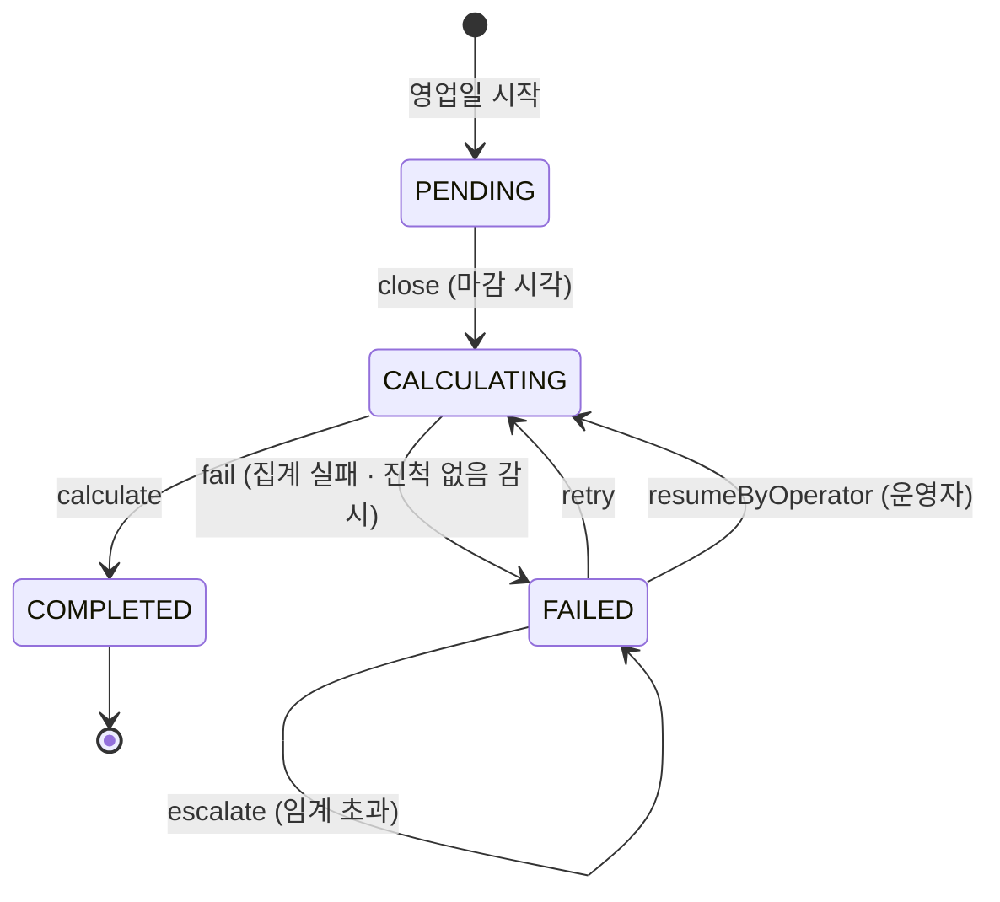

# 상태 머신: 정산

- 작성일: 2026-08-04
- 상태: 검토대기
- 대상 애그리게이트: `Settlement`
- 양식: `study/project-workflow/phase2/05-state-machine-format.md`

---

## 1. 상태 목록

| 상태 | 코드명 | 뜻 | 종료 | 진입 조건 |
|---|---|---|---|---|
| 마감대기 | `PENDING` | 그 영업일이 아직 열려 있다 | ✕ | 영업일 시작 |
| 산출중 | `CALCULATING` | 마감됐고 순액을 계산하는 중 | ✕ | 마감 시각 도래 (BR-06) |
| 완료 | `COMPLETED` | **순액 확정** | **✓** | `calculate()` 성공 |
| 실패 | `FAILED` | 산출 실패. **재시도 대상** | ✕ | `fail()` |

> **`FAILED`는 종료가 아니다.** 매입 배치가 `INTERRUPTED`인 것과 같은 이유다 — 재시도하면 된다. 다만 배치와 달리 **정산은 재산출이 멱등**(집계이므로)이라 재개 지점을 기억할 필요가 없다.

---

## 2. 전이도



---

## 3. 전이 표

| # | 현재 | 전이 | 다음 | 조건 | 부수 효과 | 근거 |
|---|---|---|---|---|---|---|
| S1 | `PENDING` | `close` | `CALCULATING` | 마감 시각 도래 | **이후 거래는 다음 영업일 귀속** | BR-06·14 |
| S2 | `CALCULATING` | `calculate` | `COMPLETED` | 집계 성공 | `netAmount` 확정 · **`SettlementCompleted` 발행까지**. 전표 기표와 승인 `markSettled`는 **이 전이 밖**이다 (BR-40) | BR-21·40 |
| S3 | `CALCULATING` | `fail` | `FAILED` | 집계 실패 **또는 진척 없음 감시**(§7) | `retryCount` 증가 | BR-37 |
| S4 | `FAILED` | `retry` | `CALCULATING` | **상태 = 실패** AND `retryCount < 임계` | — | BR-37 |
| S5 | `FAILED` | `escalate` | 상태 불변 | 상태 = 실패 AND `retryCount ≥ 임계` | **운영자 목록에 오름** | BR-37 |
| **S6** | `FAILED` | **`resumeByOperator`** | `CALCULATING` | **`retryCount ≥ 임계`** AND 운영자 식별자 + 사유 기록 | `retryCount = 0` | BR-37 |

### 재산출이 멱등한 이유 (BR-37)

```
calculate() 를 N회 실행 → netAmount 동일
```

정산은 **집계**다. 매입 반영처럼 상태를 누적하지 않으므로 몇 번을 계산해도 결과가 같다. **이것이 자동 재시도를 허용할 수 있는 근거**이며, 매입(BR-23)이 파일·레코드 멱등을 따로 둬야 했던 것과 대비된다.

> ★ **그래서 S2의 사후조건을 이벤트 발행에서 끊었다.** 전표 기표와 `markSettled`는 재실행하면 중복되므로, 한 전이의 부수 효과로 묶으면 **재시도가 곧 이중 기표**가 된다. BR-40이 이미 "원장 기표는 자금 이동과 별도 논리 단위"라고 요구한 분리이며, 이벤트를 받는 쪽이 **각자의 멱등**을 갖는다.
>
> | | 멱등인가 | 어디서 보장하나 |
> |---|---|---|
> | 순액 산출 | ✅ 집계이므로 | `calculate()` 자체 |
> | 전표 기표 | ❌ | 소비자 측 멱등 (Outbox·처리 이력) — STS1 |
> | 승인 `markSettled` | ❌ | 소비자 측 멱등 (`SETTLED`면 no-op) |

---

## 4. 금지된 전이 ★★

| # | 현재 | 시도 | 왜 금지인가 | 위반 시 | 응답 |
|---|---|---|---|---|---|
| **SF1** | `COMPLETED` | `calculate` | 확정된 순액은 바뀌지 않는다 (INV-4) | **마감된 영업일의 순액이 사후에 움직인다** — BR-47이 막으려던 바로 그것 | `SETTLEMENT_COMPLETED` |
| **SF2** | `COMPLETED` | `close` · `retry` · `fail` | 끝난 영업일 | 확정 후 재계산 경로가 열린다 | `SETTLEMENT_COMPLETED` |
| **SF3** | `PENDING` | `calculate` | **마감하지 않고 집계**하면 그 뒤에 들어온 거래가 빠진다 | **순액 누락** — 매입사에 덜 지급하고 대사에서야 발견 | `SETTLEMENT_NOT_CLOSED` |
| **SF4** | `PENDING` | `retry` · `fail` | 시도한 적이 없다 | `retryCount`가 근거 없이 증가 | `SETTLEMENT_NOT_CALCULATING` |
| **SF5** | `CALCULATING`·`FAILED` | `close` | 이미 마감됐다 | 마감 시각이 덮어써져 **귀속 경계가 흔들린다** | `SETTLEMENT_ALREADY_CLOSED` |
| **SF6** | `FAILED` | `retry` (**임계 초과**) | **자동** 재시도가 무한하면 실패를 감춘다 | 운영자가 영원히 모른다 | `SETTLEMENT_RETRY_EXHAUSTED` → `escalate` → **`resumeByOperator`로만 재개** |
| **SF7** | 모든 상태 | `close` (**같은 영업일 두 번**) | INV-1 위반 | 같은 날 정산이 둘 → **이중 지급** | `SETTLEMENT_DUPLICATE_DATE` |
| **SF8** | `PENDING`·`CALCULATING`·`COMPLETED` | `escalate` · `resumeByOperator` | 실패한 적이 없다 | 근거 없는 운영자 통지·재개 | `SETTLEMENT_NOT_FAILED` |
| **SF10** | `FAILED` | `resumeByOperator` (**임계 미만**) | 아직 **자동** 재시도가 남아 있다 | `retryCount = 0`으로 초기화되어 **SF6의 임계 자체를 우회**한다 | `SETTLEMENT_RETRY_REMAINING` |
| **SF11** | `FAILED` | `escalate` (**임계 미만**) | 아직 자동 재시도가 남아 있다 | 정상 재시도 중인 건이 운영자 목록에 올라 **진짜 미결이 묻힌다** | `SETTLEMENT_RETRY_REMAINING` |
| **SF9** | `FAILED` | `calculate` · `fail` | 재시도는 `retry`·`resumeByOperator`를 거쳐 `CALCULATING`으로 돌아간 뒤에만 | 실패 상태에서 바로 집계해 `retryCount`가 세어지지 않는다 | `SETTLEMENT_NOT_CALCULATING` |

> ★ **SF6이 막는 것은 "자동" 재시도뿐이다.** 임계를 넘으면 자동 경로는 닫히지만 **운영자 강제 재개(S6)는 열려 있다.** 이 구분이 없으면 `FAILED`가 사실상 종료 상태가 되어, 그날 순액이 영영 확정되지 않고 승인들이 `CAPTURED`에 잔류하며 대사 트리거(BR-42)까지 막힌다 — **문서가 "FAILED는 종료가 아니다"라고 선언한 것이 거짓이 된다.**

> **SF3이 가장 조용한 실패다.** 마감 없이 집계해도 **에러가 나지 않는다** — 그냥 숫자가 작게 나올 뿐이다. "에러 없이 돌았다 ≠ 완료"의 전형이며, 그래서 `close`를 별도 전이로 뒀다. 마감과 집계를 한 조작으로 합치면 이 금지를 표현할 자리가 없어진다.

---

## 5. 전이 매트릭스

| 현재 \ 조작 | `close` | `calculate` | `fail` | `retry` | `escalate` | `resumeByOperator` |
|---|---|---|---|---|---|---|
| **`PENDING`** | **O** (S1) | X (SF3) | X (SF4) | X (SF4) | X (SF8) | X (SF8) |
| **`CALCULATING`** | X (SF5) | **O** (S2) | **O** (S3) | ◎ | X (SF8) | X (SF8) |
| **`FAILED`** | X (SF5) | X (SF9) | X (SF9) | **O/X** (S4 / SF6) | **O/X** (S5 / SF11) | **O/X** (S6 / SF10) |
| **`COMPLETED`** | X (SF2) | X (SF1) | X (SF2) | X (SF2) | X (SF8) | X (SF8) |

**O 3 · O/X 3 · X 17 · ◎ 1 = 24칸**

> **`FAILED` 행에 나가는 길이 두 개다.** `retry`는 임계까지의 **자동** 경로, `resumeByOperator`는 임계 이후의 **수동** 경로. 후자가 없으면 `FAILED`가 사실상 종료 상태가 된다(SF6 주석).
>
> **`FAILED` 행의 세 칸이 `retryCount` 임계 하나로 갈린다.** `retry`는 임계 **미만**에서만, `escalate`·`resumeByOperator`는 임계 **이상**에서만 열린다. 겹치면 운영자가 임계 전에 카운트를 0으로 밀어 SF6을 우회하거나(SF10), 정상 재시도 중인 건이 운영자 목록에 올라 진짜 미결이 묻힌다(SF11).

---

## 6. 동시성

| 상황 | 처리 |
|---|---|
| **같은 영업일에 정산 배치 중복 기동** | `businessDate` 유니크 제약 (INV-1). 애플리케이션 락만으로는 부족하다 |
| **마감 직전에 도착한 매입** | 마감 시각을 기준으로 **귀속 영업일이 갈린다** (BR-14). 경계 판정은 **인자로 받은 시각**으로 통일 |
| 재시도 중 원 배치가 되살아남 | 상태가 `CALCULATING`이므로 두 번째 `retry`는 `◎`. 결과가 멱등이라 무해 |
| 정산과 환불의 경합 | 정산 완료 후 도착한 환불은 **원거래를 건드리지 않고** 다음 영업일 차감분으로 (BR-43) |

---

## 7. 시간 기반 전이 ★

| 현재 | 조건 | 다음 | 누가 | 주기 |
|---|---|---|---|---|
| `PENDING` | **마감 시각 도래** | `CALCULATING` | 정산 배치 | 영업일 1회 (BR-06, 임시 23:00) |
| `CALCULATING` | 즉시 (마감에 이어) | `COMPLETED`/`FAILED` | 정산 배치 | 〃 (임시 D+1 09:00) |
| `FAILED` | **재시도 간격 경과** AND `retryCount < 임계` | `CALCULATING` | 재시도 스케줄러 | 미확정 (BR-37) |
| **`CALCULATING`** | ★ **마지막 진척 이후 경과 시간 초과** | **`FAILED`** | 감시 배치가 **S3 `fail("진척 없음")` 을 호출** | 미확정 (STS2) |

### 빠뜨리기 쉬운 것

| 항목 | 처리 |
|---|---|
| **비영업일** | ★ **비영업일에는 `Settlement`가 생성되지 않는다.** `businessDate`는 영업일이고 유일 키이므로 토·일자 정산은 성립할 수 없다. 마감 이후·주말·공휴일 거래는 BR-14에 따라 **다음 영업일 `Settlement` 한 건에 귀속**되고 한 파일로 처리된다 (BR-25 검증 ②③) |
| **연휴 뒤 미결이 여럿일 때** | 대상은 "비영업일"이 아니라 **"영업일인데 배치가 밀려 미결인 날"** 이다. 이 경우 각 영업일의 `Settlement`를 **각각** 산출하고 합치지 않는다 → STS4 |
| **`CALCULATING`에 갇히는 경우** | 배치가 죽으면 `fail()`을 호출할 주체가 없다. **감시 배치가 그 호출자가 된다** — 새 전이가 아니라 **S3의 트리거가 하나 늘어난 것**이다(정산 배치 자신 / 감시 배치) — 판정 기준은 매입 배치와 같이 "시작 후 경과"가 아니라 **"마지막 진척 이후 경과"** 다. 임계값만 STS2로 남는다 |
| **감시가 없으면 `FAILED`보다 나쁘다** | `escalate`는 `FAILED`에서만 나오므로, `CALCULATING`에 갇히면 **운영자 목록에조차 오르지 않는다.** 정산은 영업일 1회 실행이라 다음 기동까지 아무도 모른다 |
| 미결 정산 허용 시간 | 미확정 (BR-37). 넘으면 운영자 통지 |

---

## 8. 의문

### 열린 의문

| # | 의문 | 영향 |
|---|---|---|
| **STS1** | **`calculate()`의 부수 효과(전표 기표·`markSettled`)를 어떻게 멱등하게 만드는가.** 순액 산출은 멱등이지만 반영은 아니다. 재시도가 전표를 두 번 만들면 BR-08 균형은 유지되면서 금액이 두 배가 된다 | Phase 3 트랜잭션 설계 · BR-37 |
| **STS2** | `CALCULATING` 진척 없음 **판정 시간** (트리거는 §7에 등재, S3에 연결됨) | 미확정 수치 |
| **STS3** | `captureTotal`을 정산이 **직접 집계**하는가, 결제(C3)가 계산해 보내는가. 전자면 정산이 매입 데이터를 읽어야 해 컨텍스트 경계를 넘는다 | 컨텍스트 맵 · 애그리게이트 ST2 |
| **STS4** | `FAILED`가 종료되지 않은 채 **다음 영업일 정산이 시작**되면? 미결 정산이 쌓이는 것을 허용하는가, 앞선 날이 미결이면 막는가 | 운영 정책 |
| **STS5** | 정산 완료 후 환불의 **차감 거래를 무엇이 소유하는가.** 매입 파일의 취소 레코드로 접수하기로 했으나(BR-33·43 ②), 그 레코드는 어느 상태 머신에도 속하지 않는다 | 승인 AU7 |

---

## 변경 이력

| 버전 | 일자 | 내용 |
|---|---|---|
| v0.4 | 2026-08-04 | 재점검 반영 — `FAILED/close`의 근거를 **SF2(COMPLETED 전용) → SF5**로 정정하고 SF5 범위 확장 · **SF11 신설**(임계 미만 `escalate`가 미정의 칸이었다) · 전이도의 감시 간선을 `fail`에 합침 · 애그리게이트에 임계 사전조건 반영 |
| v0.3 | 2026-08-04 | post-fix 반영 — 진척 감시를 **새 전이가 아니라 S3의 트리거**로 연결(번호·계약·집계 없이 전이라고 선언했었다) · **S6에 `retryCount ≥ 임계` 사전조건 추가** + SF10 신설(임계 미만에서 호출하면 카운트 초기화로 SF6을 우회) |
| v0.2 | 2026-08-04 | 듀얼 리뷰 반영 — ★ **`resumeByOperator`(S6) 신설**(임계 초과 후 탈출 경로가 없어 `FAILED`가 사실상 종료였다) · ★ **`CALCULATING` 진척 감시를 §7에 정식 등재**(README가 있다고 단언했으나 실제로는 열린 의문뿐이었다) · ★ **비영업일 서술을 BR-25에 맞게 정정**(토·일자 `Settlement`를 만들면 월요일 건과 대상이 겹쳐 이중 계상) · S2 사후조건을 **이벤트 발행에서 끊음**(BR-40) · `retry`·`escalate`에 상태 사전조건 · **SF8·SF9 신설**(미등재 X 보완) · 집계 정정 |
| v0.1 | 2026-08-04 | 최초 작성 — 상태 4종, 전이 5종, 금지 7종. `close`와 `calculate`를 나눈 근거(SF3 조용한 누락), 순액 산출은 멱등이나 그 반영은 아니라는 구분(STS1) |
