# 상태 머신 — 양식과 작성법

---

## 1. 목적

**어떤 전이가 허용되고, 무엇이 금지되는지를 한 곳에 모은다.**

상태 전이 규칙이 코드 여기저기에 `if (status == A || status == B)` 로 흩어지면, 규칙이 하나 바뀔 때 **모든 복사본을 찾아 고쳐야 하고 하나만 빠뜨려도 버그**다.

> **이 문서의 핵심은 "허용"이 아니라 "금지"다.**
> 허용되는 전이는 구현하면서 자연히 드러나지만, **금지된 전이는 명시하지 않으면 아무도 막지 않는다.** "정산 완료 건은 취소할 수 없다"가 문서에 없으면 코드에도 없다.

---

## 2. 독자

| 독자 | 이 문서에서 얻는 것 |
|---|---|
| 구현자 | 상태 enum과 전이 메서드 |
| 테스트 작성자 | **금지된 전이 목록** = 반드시 써야 할 테스트 |
| 유스케이스 작성자 | 대안·예외 흐름의 근거 |

---

## 3. 양식

> 상태를 갖는 애그리게이트마다 하나. `docs/domain/state-machines/<이름>.md`

```markdown
# 상태 머신: <애그리게이트명>

- 작성일: <YYYY-MM-DD>
- 상태: 작성중 | 검토대기 | 확정
- 대상 애그리게이트: `<AggregateName>`

---

## 1. 상태 목록

| 상태 | 코드명 | 뜻 | 종료 상태 | 진입 조건 |
|---|---|---|---|---|
| <이름> | `<STATE_NAME>` | <이 상태가 뜻하는 업무 상황> | 예/아니오 | <어떻게 이 상태가 되나> |

> **종료 상태(terminal)**: 더 이상 전이가 없는 상태. 반드시 표시한다.

---

## 2. 전이도

```mermaid
stateDiagram-v2
    [*] --> <초기상태>
    <상태A> --> <상태B>: <전이 이름>
    <상태B> --> [*]
```



---

## 3. 전이 표 ★

| # | 현재 상태 | 전이(조작) | 다음 상태 | 조건 | 부수 효과 | 근거 규칙 |
|---|---|---|---|---|---|---|
| T1 | <상태> | <조작명> | <상태> | <참이어야 할 것> | <함께 일어나는 일> | BR-<nn> |

---

## 4. 금지된 전이 ★★

> **이 표가 이 문서의 핵심이다.** 명시하지 않으면 강제할 수 없다.

| # | 현재 상태 | 시도되는 조작 | 왜 금지인가 | 위반 시 결과 | 반환할 오류 |
|---|---|---|---|---|---|
| F1 | <상태> | <조작> | <업무적 이유> | <데이터가 어떻게 틀어지나> | <에러 코드> |

---

## 5. 전이 매트릭스

> 전체를 한눈에. `O` = 허용, `X` = 금지, `-` = 무의미

| 현재 \ 조작 | <조작1> | <조작2> | <조작3> |
|---|---|---|---|
| **<상태1>** | O | X | - |
| **<상태2>** | X | O | O |

---

## 6. 동시성

| 상황 | 처리 |
|---|---|
| **같은 조작이 동시에 두 번** | <멱등 처리 / 락 / 거절> |
| **다른 조작이 동시에** | <어느 쪽이 이기나> |
| 전이 중 프로세스 종료 | <복구 방법> |

---

## 7. 시간 기반 전이

> 사람이 아니라 **시간이 일으키는 전이**. 빠뜨리기 쉽다.

| 현재 상태 | 조건 | 다음 상태 | 누가 실행 | 주기 |
|---|---|---|---|---|
| <상태> | <n일 경과> | <상태> | <배치/스케줄러> | |

---

## 8. 미해결

| # | 의문 | 영향 |
|---|---|---|

---

## 변경 이력
```

---

## 4. 작성법

### 상태 도출

**상태는 "지금 무엇이 허용되는가"가 달라지는 지점에서 나뉜다.**

| 나쁜 상태 설계 | 좋은 상태 설계 |
|---|---|
| `ACTIVE`, `INACTIVE` (너무 뭉뚱그림) | `PENDING`, `APPROVED`, `CAPTURED`, `SETTLED` |
| `STEP1`, `STEP2` (업무 의미 없음) | 업무 용어 그대로 |

**질문**: 이 두 상태에서 **허용되는 조작이 같은가?** 같다면 나눌 이유가 없다.

### 금지된 전이 채우는 법

**전이 매트릭스를 그리고 `O`가 아닌 칸을 전부 검토한다.**

```
        승인  매입  취소  환불
PENDING  O    X     X     X      ← X 3개를 §4에 등재
APPROVED X    O     O     X      ← X 2개를 §4에 등재
SETTLED  X    X     X     O      ← X 3개를 §4에 등재
```

각 `X`마다:
- **왜 금지인가** — 업무적 이유
- **위반 시 결과** — 구체적으로 무엇이 틀어지는가
- **반환할 오류** — 어떤 에러 코드로 거절하는가

> `X`가 많을수록 좋은 문서다. **금지가 빠짐없이 적혀 있다는 뜻**이기 때문이다.

### 시간 기반 전이

**가장 자주 빠뜨리는 부분.** 사람이 일으키지 않는 전이가 반드시 있다.

| 예 |
|---|
| 일정 기간 후 자동 만료 |
| 마감 시각 도래로 마감 처리 |
| 응답 없음이 지속되어 타임아웃 |

각각에 대해 **누가 실행하는가**(배치? 스케줄러?)와 **주기**를 적는다. 이게 Phase 3의 배치 설계 입력이 된다.

### 동시성

**같은 대상에 두 조작이 동시에 오면 어떻게 되는가**를 미리 정한다.

| 상황 | 흔한 처리 |
|---|---|
| 같은 조작 중복 | **멱등 처리** — 두 번째는 첫 결과 반환 |
| 상충하는 조작 | **낙관적 락** — 버전 충돌로 한쪽 거절 |
| 순서가 중요한 조작 | **비관적 락** 또는 직렬화 |

정하지 않으면 구현자가 그때그때 다르게 처리하게 되고, **재현 안 되는 버그**가 된다.

### 구현으로 이어지는 법

상태 머신 문서는 **enum + 전이 메서드**로 거의 그대로 옮겨진다.

```java
public enum <상태> {
    PENDING  { public <상태> approve() { return APPROVED; } },
    APPROVED { public <상태> capture() { return CAPTURED; } },
    SETTLED  { /* 종료 상태 — 아무것도 오버라이드하지 않는다 */ };

    // 기본은 전부 금지. 허용되는 것만 각 상수가 오버라이드한다
    public <상태> approve() { throw illegal("승인"); }
    public <상태> capture() { throw illegal("매입"); }
}
```

**기본을 "금지"로 두는 것**이 핵심이다. 그러면 문서의 §4(금지된 전이)가 코드에서 자동으로 강제된다.

---

## 5. 흔한 실수

| # | 실수 | 왜 문제인가 | 고치는 법 |
|---|---|---|---|
| 1 | **금지된 전이를 안 적음** | 코드에서 강제할 수 없다 | 매트릭스의 모든 `X`를 등재 |
| 2 | **시간 기반 전이 누락** | 만료·마감이 구현에서 빠진다 | §7을 반드시 채운다 |
| 3 | **동시성 미정의** | 재현 안 되는 버그 | 상황별 처리를 미리 정한다 |
| 4 | **상태를 너무 잘게 쪼갬** | 전이가 폭발한다 | 허용 조작이 같으면 합친다 |
| 5 | **종료 상태 미표시** | 종료 후에도 전이가 시도된다 | 표에 명시 |
| 6 | **기술 상태를 섞음** (`PROCESSING`, `QUEUED`) | 도메인 상태가 아니다 | 업무 상태만 남긴다 |
| 7 | **전이 조건을 안 적음** | 무조건 전이하는 줄 안다 | 조건 칸을 채운다 |

---

## 6. 완료 기준

- [ ] 모든 상태에 **업무적 의미**가 적혀 있다
- [ ] **종료 상태**가 표시돼 있다
- [ ] **전이 매트릭스**가 채워져 있다
- [ ] 매트릭스의 **모든 `X`가 §4 금지 표에 등재**돼 있고, 각각 이유·결과·에러 코드가 있다
- [ ] **시간 기반 전이**가 §7에 있다 (없으면 "없음"이라고 명시)
- [ ] **동시성 처리**가 정의돼 있다
- [ ] 모든 전이에 **근거 규칙(BR-nn)** 이 연결돼 있다
- [ ] 상태·조작 이름이 **용어사전과 일치**한다
